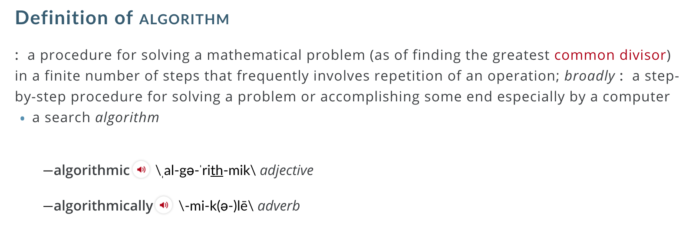

class: center, middle

# ☙ ALGORITHMS ☙

## A human-friendly introduction

### by Boris ([github.com/bcherny](https://github.com/bcherny))

---
class: center, middle
## What?
---
class: center, middle

---
class: center, middle

---
class: center, middle
### For example:

**Making a recipe**
---
class: center, middle
### For example:

Making a recipe

**Tying your shoe**
---
class: center, middle
### For example:

Making a recipe

Tying your shoe

**Peeling an apple**
---
class: center, middle
### For example:

Making a recipe

Tying your shoe

Peeling an apple

**Folding a paper airplane**
---
class: center, middle
### For example:

Making a recipe

Tying your shoe

Peeling an apple

Folding a paper airplane

**Buying groceries on a shopping list**
---
class: center, middle
### For example:

Making a recipe

Tying your shoe

Peeling an apple

Folding a paper airplane

Buying groceries on a shopping list

**Ranking web pages by which one is most relevant to a search term**
---
class: center, middle
### First thing first:
## Complexity
---
class: middle

```js
for (var i = 0; i < 10; i++) {
  ...
}
```
---
class: middle

```js
for (var i = 0; i < 10; i++) {
  for (var i = 0; i < 10; i++) {
    ...
  }
}
```
---
class: middle

```js
for (var i = 0; i < 10; i++) {
  for (var i = 0; i < 10; i++) {
    for (var i = 0; i < 10; i++) {
      ...
    }
  }
}
```
---

## Which loop is the fastest?

```js
// Loop 1:
for (var i = 0; i < 10; i++) {
  ...
}
```

```js
// Loop 2:
for (var i = 0; i < 10; i++) {
  for (var i = 0; i < 10; i++) {
    ...
  }
}
```

```js
// Loop 3:
for (var i = 0; i < 10; i++) {
  for (var i = 0; i < 10; i++) {
    for (var i = 0; i < 10; i++) {
      ...
    }
  }
}
```
---
class: center, middle
## Ok, the other loops are slower.

### But by how much?
---
```js
// Loop 1:
for (var i = 0; i < 10; i++) {
  ...
}
```

```js
// Loop 2:
for (var i = 0; i < 10; i++) {
  for (var i = 0; i < 10; i++) {
    ...
  }
}
```

```js
// Loop 3:
for (var i = 0; i < 10; i++) {
  for (var i = 0; i < 10; i++) {
    for (var i = 0; i < 10; i++) {
      ...
    }
  }
}
```
---
```js
// n iterations
for (var i = 0; i < n; i++) {
  ...
}
```

```js
// n*n iterations
for (var i = 0; i < n; i++) {
  for (var i = 0; i < n; i++) {
    ...
  }
}
```

```js
// n*n*n iterations
for (var i = 0; i < n; i++) {
  for (var i = 0; i < n; i++) {
    for (var i = 0; i < n; i++) {
      ...
    }
  }
}
```
---
```js
// O(n)
for (var i = 0; i < n; i++) {
  ...
}
```

```js
// O(n²)
for (var i = 0; i < n; i++) {
  for (var i = 0; i < n; i++) {
    ...
  }
}
```

```js
// O(n³)
for (var i = 0; i < n; i++) {
  for (var i = 0; i < n; i++) {
    for (var i = 0; i < n; i++) {
      ...
    }
  }
}
```
---
class: center, middle
## BIG O NOTATION
---
class: center, middle
### More examples...
---
class: middle
```js
// O(?)
function(n) {
  return 42
}
```
---
class: middle
```js
// O(1)
function(n) {
  return 42
}
```
---
class: middle
```js
// O(?)
function(n) {
  var a = 0
  while(n > 0) {
    a = a + 1
    n = n - 1
  }
  return a
}
```
---
class: middle
```js
// O(n)
function(n) {
  var a = 0
  while(n > 0) {
    a = a + 1
    n = n - 1
  }
  return a
}
```
---
class: middle
```js
// O(?)
function(n) {
  for (var a = 0; a < n; a++) {...}
  for (var b = 0; b < n; b++) {...}
}
```
---
class: middle
```js
// O(n)
function(n) {
  for (var a = 0; a < n; a++) {...}
  for (var b = 0; b < n; b++) {...}
}
```
---
class: center, middle

## Other common Big Os

`O(1)`

`O(n)`

`O(n²)`

`O(log(n))`

`O(n*log(n))`

`O(Cⁿ)`

`O(n!)`
---
class: center, middle

---
class: center, middle
### Makes sense?

---
### Another example

```js
function overflow(n) {
  var array = ['wakka']
  for (var i = 0; i < n; i++) {
    array = array.concat(array)
  }
  return array
}
```
---
### Another example

```js
function overflow(n) {
  var array = ['wakka']
  for (var i = 0; i < n; i++) {
    array = array.concat(array)
  }
  return array
}
```

```js
overflow(1)  // ['wakka', 'wakka']
overflow(5)  // ['wakka' x32]
overflow(10) // ['wakka' x1024]
overflow(20) // ['wakka' x1048576]
```

...What's the complexity?
---
class: center, middle
It's linear in `n`, so the time complexity is
## `O(n)`

But that doesn't really tell the whole story, does it?
---
class: center, middle
It's
## `O(n)`

In **time**, and

## `O(2ⁿ)`

in **space**.
---
class: center, middle
## Real Problems
---
### #1

```js
function sum(array) {
  // ...
}

sum([1, 2, 3])        // 6
sum([-2, 8, 0, 12])   // 18
```
---
### #1

**Algorithm**:

Add each item in the array to the result.

**Pseudocode**:

```js
function sum(array) {
  // INITIALIZE the result R to 0
  // FOR EACH number IN array:
  //   add number to R
}
```

**Sanity check**:

- `[1, 2, 3]` ✔ Ok
- `[-2, 8, 0, 12]` ✔ Ok

**Complexity**:

Time: `O(?)`

Space: `O(?)`
---
### #1

**Algorithm**:

Add each item in the array to the result.

**Pseudocode**:

```js
function sum(array) {
  // INITIALIZE the result R to 0
  // FOR EACH number IN array:
  //   add number to R
}
```

**Sanity check**:

- `[1, 2, 3]` ✔ Ok
- `[-2, 8, 0, 12]` ✔ Ok

**Complexity**:

Time: `O(n)`

Space: `O(1)`

---
### #1

```js
function sum(array) {
  let result = 0
  for (let i = 0; i < array.length; i++) {
    result += array[i]
  }
  return result
}

//  Time: O(n)
// Space: O(1)
```

---
### #1 (2nd version)

```js
function sum(array) {
  return array.reduce(
    function(result, n) { return result + n },
    0
  )
}

//  Time: O(n)
// Space: O(1)
```
---
### #1 (3rd version)

```js
function sum(array) {
  if (array.length === 0) {
    return 0
  }
  return array[0] + sum(array.slice(1))
}

//  Time: O(n)
// Space: O(n)
```

Thought process:

> There are 2 cases to consider when summing an array:

> 1. The sum of an **empty array** is `0`.

> 2. The sum of a **non-empty array** is the first item plus the sum of the rest of the items.

---
class: center, middle

---

### #2

```js
function isSorted(array) {
  // ...
}

isSorted([-9, -5, 0, 3, 9])         // true
isSorted([3, 9, -3, 10])            // false
```
---
### #2

**Algorithm**:

If for each item in the array, the item is less than the next item, then the array is sorted.

**Pseudocode**:

```js
function isSorted(array) {
  // FOR EACH item IN array:
  //   IF item > next item
  //   THEN array is not sorted
  // OTHERWISE, array is sorted
}
```

**Sanity check**:

- `[-9, -5, 0, 3, 9]` ✔ Ok
- `[3, 9, -3, 10]` ✔ Ok

**Complexity**:

Time: `O(?)`

Space: `O(?)`

---
### #2

**Algorithm**:

If for each item in the array, the item is less than the next item, then the array is sorted.

**Pseudocode**:

```js
function isSorted(array) {
  // FOR EACH item IN array:
  //   IF item > next item
  //   THEN array is not sorted
  // OTHERWISE, array is sorted
}
```

**Sanity check**:

- `[-9, -5, 0, 3, 9]` ✔ Ok
- `[3, 9, -3, 10]` ✔ Ok

**Complexity**:

Time: `O(n)`

Space: `O(1)`

---
### #2

```js
function isSorted(array) {
  for (let i = 0; i < array.length; i++) {
    let item = array[i]
    let next = array[i + 1]
    if (next !== undefined && item > next) {
      return false
    }
  }
  return true
}

//  Time: O(n)
// Space: O(1)
```
---
### #2 (2nd version)

```js
function isSorted(array) {
  return array.every(function(item, i) {
    let item = array[i]
    let next = array[i + 1]
    if (next === undefined) {
      return true
    }
    return next > item
  })
}

//  Time: O(n)
// Space: O(1)
```
---
### #2 (3rd version)

```js
function isSorted(array) {
  if (array.length === 0) {
    return true
  }
  if (array[1] < array[0]) {
    return false
  }
  return isSorted(array.slice(1))
}

//  Time: O(n)
// Space: O(1)*
```
---
class: center, middle

---
### #3

```js
function filter(array, fn) {
  // ...
}

filter([1, 2, 3, 4], function(n) { return n > 0 }) // [1, 2, 3, 4]
filter([1, 2, 3, 4], function(n) { return n < 3 }) // [1, 2]
```
---
### #3

**Algorithm**:

Check each item in the array against the predicate function; if the function returns `true`, then add the item to a "results" array.

**Pseudocode**:

```js
function filter(array, fn) {
  // INITIALIZE an empty array R
  // FOR EACH item IN array:
  //   IF fn(item) is true
  //   THEN add item to R
}
```

**Sanity check**:

- `[1, 2, 3, 4], n > 0` ✔ Ok
- `[1, 2, 3, 4], n < 3` ✔ Ok

**Complexity**:

Time: `O(?)`

Space: `O(?)`
---
### #3

**Algorithm**:

Check each item in the array against the predicate function; if the function returns `true`, then add the item to a "results" array.

**Pseudocode**:

```js
function filter(array, fn) {
  // INITIALIZE an empty array R
  // FOR EACH item IN array:
  //   IF fn(item) is true
  //   THEN add item to R
}
```

**Sanity check**:

- `[1, 2, 3, 4], n > 0` ✔ Ok
- `[1, 2, 3, 4], n < 3` ✔ Ok

**Complexity**:

Time: `O(n)`

Space: `O(n)`
---
### #3

```js
function filter(array, fn) {
  let result = []
  for (let i = 0; i < array.length; i++) {
    let current = array[i]
    if (fn(current)) {
      result.push(current)
    }
  }
  return result
}

//  Time: O(n)
// Space: O(n)
```
---
### #3 (2nd version)

```js
function filter(array, fn) {
  return array.reduce(function(result, item) {
    if (fn(item)) {
      return result.concat(item)
    } else {
      return result
    }
  }, [])
}

//  Time: O(n)
// Space: O(n)
```
---
### #3 (3rd version)

```js
function filter(array, fn) {
  if (array.length === 0) {
    return []
  }
  let head = []
  if (fn(array[0])) {
    head = [array[0]]
  }
  return head.concat(filter(array.slice(1), fn))
}

//  Time: O(n)
// Space: O(n²)*
```
---
class: center, middle

---
### #4

```js
function fib(n) {
  ...
}

fib(0)        // 0
fib(1)        // 1
fib(10)       // 55
fib(20)       // 6765
```
---
### #4

**Algorithm**:

Starting with `0` and `1`, add each pair of 2 numbers until we get to the `n`th number; return the left number from the final pair.

**Pseudocode**:

```js
function fib(n) {
  // INITIALIZE L to 0
  // INITIALIZE R to 1
  // FOR EACH number from 0 to n:
  //   INITIALIZE TEMP to L + R
  //   UPDATE L to R
  //   UPDATE R to TEMP
  // RETURN L
}
```

**Sanity check**:

- `0` ✔ Ok
- `0, 1` ✔ Ok
- `0, 1, 1, 2, 3, 5, 8, 13, 21, 34, 55` ✔ Ok

**Complexity**: Time: `O(?)`, Space: `O(?)`
---
### #4

**Algorithm**:

Starting with `0` and `1`, add each pair of 2 numbers until we get to the `n`th number; return the left number from the final pair.

**Pseudocode**:

```js
function fib(n) {
  // INITIALIZE L to 0
  // INITIALIZE R to 1
  // FOR EACH number from 0 to n:
  //   INITIALIZE TEMP to L + R
  //   UPDATE L to R
  //   UPDATE R to TEMP
  // RETURN L
}
```

**Sanity check**:

- `0` ✔ Ok
- `0, 1` ✔ Ok
- `0, 1, 1, 2, 3, 5, 8, 13, 21, 34, 55` ✔ Ok

**Complexity**: Time: `O(n)`, Space: `O(1)`
---
### #4

```js
function fib(n) {
  let left = 0
  let right = 1
  for (let i = 0; i < n; i++) {
    let temp = left + right
    left = right
    right = temp
  }
  return left
}

//  Time: O(n)
// Space: O(1)
```
---
### #4 (2nd version)

```js
function fib(n) {
  switch (n) {
     case 0: return 0
     case 1: return 1
    default: return fib(n - 1) + fib(n - 2)
  }
}

//  Time: O(2ⁿ)
// Space: O(n)
```

Thought process:

> There are 3 cases to consider when computing a Fibonacci number:
> 1. The 0th fib number is `0`
> 2. The 1st fib number is `1`
> 3. Every other fib number is the sum of the 2 numbers before it
---
### #4 (3rd version)

```js
function _fib(n, left, right) {
  switch (n) {
     case 0: return 0
     case 1: return right
    default: return _fib(n - 1, right, left + right)
  }
}

function fib(n) {
  return _fib(n, 0, 1)
}

//  Time: O(n)
// Space: O(1)
```
---
### #4 (4th version)

```js
function memoize(fn) {
  let cache = new Map
  return function(_) {
    if (!cache.has(_)) {
      cache.set(_, fn(_))
    }
    return cache.get(_)
  }
}

let fib = memoize(function(n) {
  switch (n) {
     case 0: return 0
     case 1: return 1
    default: return fib(n - 1) + fib(n - 2)
  }
})

//  Time: O(n)
// Space: O(n)
```
---
### More Problems

**`min`**: Returns the smallest number in the given array (eg. `min([3, 2, 1]) === 1`)

**`factorial`**: Returns a number that is the factorial of the given number (eg. `factorial(6) === 720`).

**`isPrime`**:  Returns `true` or `false`, indicating whether the given number is prime (eg. `isPrime(10000000000000) === false`).

**`isBalanced`**: Takes a string and returns `true` or `false` indicating whether its curly braces are balanced.

```js
isBalanced('}{')                      // false
isBalanced('{{}')                     // false
isBalanced('{}{}')                    // true
isBalanced('foo { bar { baz } boo }') // true
isBalanced('foo { bar { baz }')       // false
isBalanced('foo { bar } }')           // false
```