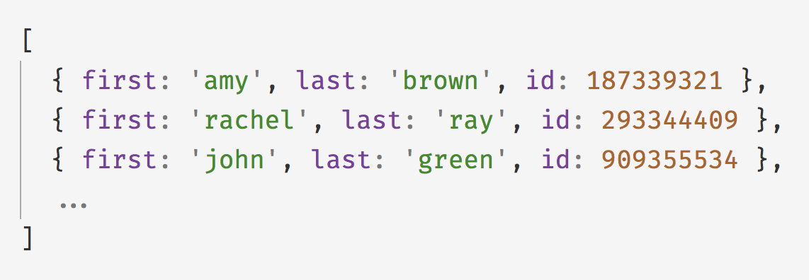
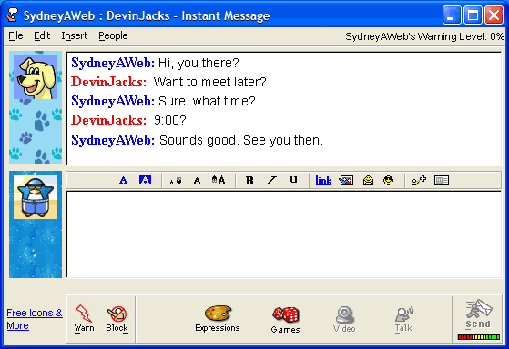
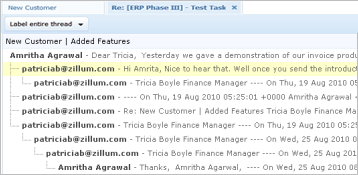
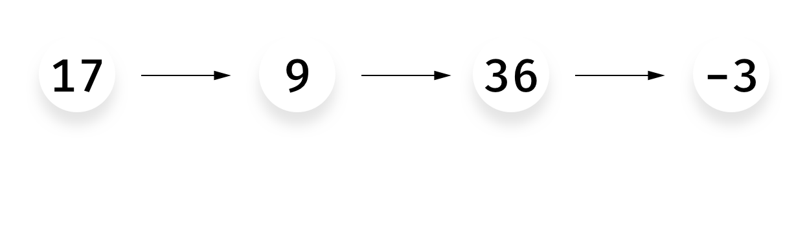
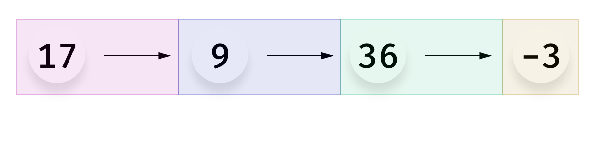
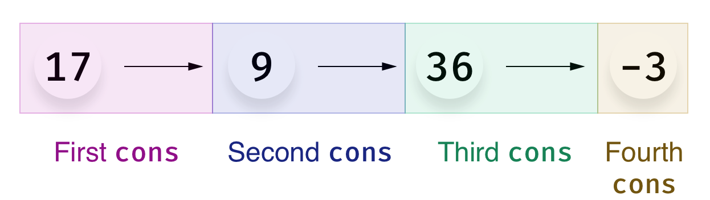
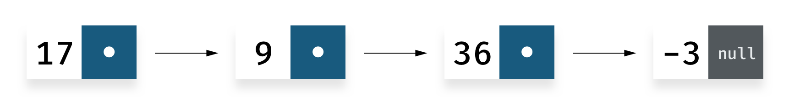
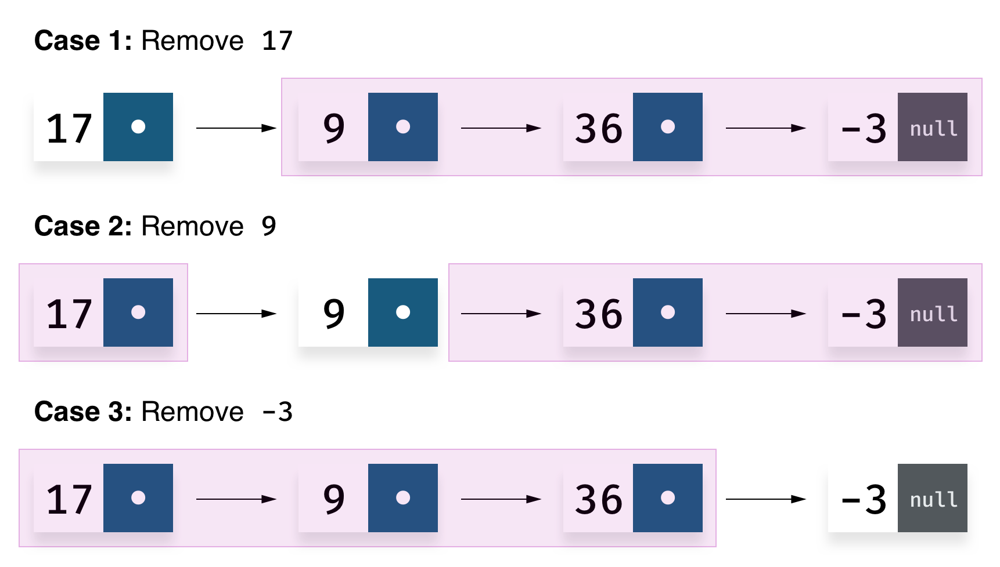
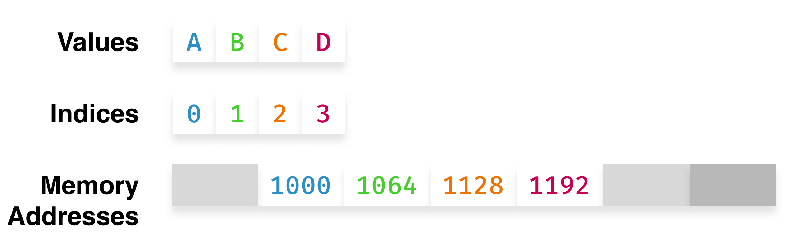
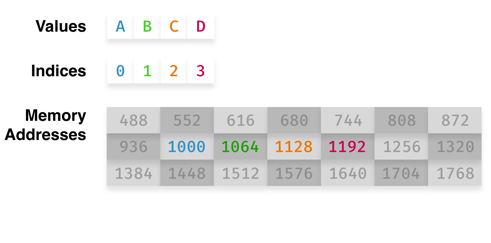

class: center, middle

# ☙ Data Structures ☙

## A human-friendly introduction

### by Boris ([github.com/bcherny](https://github.com/bcherny))

---
class: center, middle
## Q: Why should I care about data structures?
---
class: center, middle
### Q: Why should I care about data structures?
## A: Because wherever there is data, there are data structures.
You just might not realize it.
---
class: center, middle
## Q: What do you mean by "data"?
---
class: center, middle
### Q: What do you mean by "data"?
## A: "Data" is anything that isn't source code.*
---
class: center, middle
## For example:

**Data stored in your database**


---
class: center, middle
## For example:

Data stored in your database

**A list of users you fetched from the server**


---
class: center, middle
## For example:

Data stored in your database

A list of users you fetched from the server

**The email address a user typed into your form**


---
class: center, middle
## For example:

Data stored in your database

A list of users you fetched from the server

The email address a user typed into your form

**A chat conversation with your best friend**


---
class: center, middle
## For example:

Data stored in your database

A list of users you fetched from the server

The email address a user typed into your form

A chat conversation with your best friend

**An email thread with your coworkers**


---
class: center, middle
## For example:

Data stored in your database

A list of users you fetched from the server

The email address a user typed into your form

A chat conversation with your best friend

An email thread with your coworkers

**The last Youtube video you watched**


---
class: center, middle
## Every time you handle/process/store data, you make decisions about how to represent it.
---
class: center, middle
## For example, that chat conversation you had with your friend...
---
#### For example, that chat you had with your friend.

```js
let myMessages = [
  'hey',
  'whats up'
]

let theirMessages = [
  'yo',
  'not much',
  'you?'
]
```
---
#### For example, that chat you had with your friend.

```js
let myMessages = [
  { text: 'hey',      time: '2017-08-08 12:20:00' },
  { text: 'whats up', time: '2017-08-08 12:20:42' }
]

let theirMessages = [
  { text: 'yo',       time: '2017-08-08 12:20:25' },
  { text: 'not much', time: '2017-08-08 12:21:01' },
  { text: 'you?',     time: '2017-08-08 12:21:03' }
]
```
---
#### For example, that chat you had with your friend.

```js
let messages = [
  { text: 'hey',      time: '2017-08-08 12:20:00', sentBy: 'me'   },
  { text: 'yo',       time: '2017-08-08 12:20:25', sentBy: 'them' },
  { text: 'whats up', time: '2017-08-08 12:20:42', sentBy: 'me'   },
  { text: 'not much', time: '2017-08-08 12:21:01', sentBy: 'them' },
  { text: 'you?',     time: '2017-08-08 12:21:03', sentBy: 'them' }
]
```
---
#### For example, that chat you had with your friend.

```js
let messages = {
  'hey':      { time: '2017-08-08 12:20:00', sentBy: 'me'   },
  'yo':       { time: '2017-08-08 12:20:25', sentBy: 'them' },
  'whats up': { time: '2017-08-08 12:20:42', sentBy: 'me'   },
  'not much': { time: '2017-08-08 12:21:01', sentBy: 'them' },
  'you?':     { time: '2017-08-08 12:21:03', sentBy: 'them' }
}
```
---
#### For example, that chat you had with your friend.

```js
let messages = {
  '2017-08-08 12:20:00': { text: 'hey',      sentBy: 'me'   },
  '2017-08-08 12:20:25': { text: 'yo',       sentBy: 'them' },
  '2017-08-08 12:20:42': { text: 'whats up', sentBy: 'me'   },
  '2017-08-08 12:21:01': { text: 'not much', sentBy: 'them' },
  '2017-08-08 12:21:03': { text: 'you?',     sentBy: 'them' }
}
```
---
class: center, middle
## Q: What's the best data structure to store the chat conversation?
---
class: center, middle
### Q: What's the best data structure to store the chat conversation?
## A: It depends 😬
---
#### What's the best data structure to store the chat conversation...
### For reading chats in order?
---
#### What's the best data structure to store the chat conversation...
### For reading chats in order?

```js
let messages = [
  { text: 'hey',      time: '2017-08-08 12:20:00', sentBy: 'me'   },
  { text: 'yo',       time: '2017-08-08 12:20:25', sentBy: 'them' },
  { text: 'whats up', time: '2017-08-08 12:20:42', sentBy: 'me'   },
  { text: 'not much', time: '2017-08-08 12:21:01', sentBy: 'them' },
  { text: 'you?',     time: '2017-08-08 12:21:03', sentBy: 'them' }
]
```
---
#### What's the best data structure to store the chat conversation...
### For reading just my chats in order?
---
#### What's the best data structure to store the chat conversation...
### For reading just my chats in order?

```js
let myMessages = [
  { text: 'hey',      time: '2017-08-08 12:20:00' },
  { text: 'whats up', time: '2017-08-08 12:20:42' }
]

let theirMessages = [
  { text: 'yo',       time: '2017-08-08 12:20:25' },
  { text: 'not much', time: '2017-08-08 12:21:01' },
  { text: 'you?',     time: '2017-08-08 12:21:03' }
]
```
---
#### What's the best data structure to store the chat conversation...
### For looking up who sent a specific message?
---
#### What's the best data structure to store the chat conversation...
### For looking up who sent a specific message?

```js
let messages = {
  'hey':      { time: '2017-08-08 12:20:00', sentBy: 'me'   },
  'yo':       { time: '2017-08-08 12:20:25', sentBy: 'them' },
  'whats up': { time: '2017-08-08 12:20:42', sentBy: 'me'   },
  'not much': { time: '2017-08-08 12:21:01', sentBy: 'them' },
  'you?':     { time: '2017-08-08 12:21:03', sentBy: 'them' }
}
```
---
#### What's the best data structure to store the chat conversation...
### For looking up what message was sent at a specific time?
---
#### What's the best data structure to store the chat conversation...
### For looking up what message was sent at a specific time?

```js
let messages = {
  '2017-08-08 12:20:00': { text: 'hey',      sentBy: 'me'   },
  '2017-08-08 12:20:25': { text: 'yo',       sentBy: 'them' },
  '2017-08-08 12:20:42': { text: 'whats up', sentBy: 'me'   },
  '2017-08-08 12:21:01': { text: 'not much', sentBy: 'them' },
  '2017-08-08 12:21:03': { text: 'you?',     sentBy: 'them' }
}
```
---
#### What's the best data structure to store the chat conversation...
### For adding new messages?
---
#### What's the best data structure to store the chat conversation...
### For adding new messages?
# 🤐☠️💀😵🤦‍♀️
---
class: middle
## Which data structure is right depends on your access pattern.
---
class: center, middle
## Lists
---
class: middle
```
                                 List
                         (abstract data type)
                        /                    \
                       /                      \
               Linked List                    Array
              /           \                  /     \
             /             \                /       \
          Singly         Doubly         Dynamic    Fixed
       Linked List     Linked List       Array     Array
```
---
class: middle
```
                                 List
                         (abstract data type)
                        /                    \
                       /                      \
               Linked List                    Array
              /           \                  /     \
             /             \                /       \
    ->    Singly   <-    Doubly         Dynamic    Fixed
    -> Linked List <-  Linked List       Array     Array
```
---
class: center, middle

---
class: center, middle

---
class: center, middle

---
#### Singly Linked List: What is a Linked List?


A Linked List is a series of `cons` cells, where a `cons` cell is either:
  - A value and `null`
  - A value and another `cons` cell

---
#### Singly Linked List: What is a Linked List?


A Linked List is a series of `cons` cells, where a `cons` cell is either:
  - **A value and `null`:**

  ```js
  cons(-3, null)
  ```

  - A value and another `cons` cell
---
#### Singly Linked List: What is a Linked List?


A Linked List is a series of `cons` cells, where a `cons` cell is either:
  - A value and `null`:

  ```js
  cons(-3, null)
  ```

  - **A value and another `cons` cell:**

  ```js
  cons(36, cons(-3, null))
  ```
---
#### Singly Linked List: What is a Linked List?


A Linked List is a series of `cons` cells, where a `cons` cell is either:
  - A value and `null`:

  ```js
  cons(-3, null)
  ```

  - A value and another `cons` cell:

  ```js
  cons(36, cons(-3, null))
  ```

  - **(This can go on as long as you want):**

  ```js
  cons(17, cons(9, cons(36, cons(-3, null))))
  ```
---
#### Singly Linked List: What is a Linked List?


```js
cons(17, cons(9, cons(36, cons(-3, null))))
```

This code represents the list `[17, 9, 36, -3]`.
---
class: center, middle
## What can you do with a Linked List?
---
#### Singly Linked List: What can you do with a Linked List?

Create a new list:

```js
function cons(value, next) {
  return {
    value: value,
    next: next
  }
}
```
---
#### Singly Linked List: What can you do with a Linked List?

Get the first item:

```js
function head(list) {
  return list
}
```
---
#### Singly Linked List: What can you do with a Linked List?

Get the first item:

```js
function head(list) {
  return list
}
```

Get the last item:

```js
function last(list) {
  while (list.next !== null) {
    list = list.next
  }
  return list
}
```
---
#### Singly Linked List: What can you do with a Linked List?

Get the first item:

```js
function head(list) {
  return list
}
```

Get the last item:

```js
function last(list) {
  while (list.next !== null) {
    list = list.next
  }
  return list
}
```

Get the `n`th item:

```js
function get(list, index) {
  while (list.next !== null && index > 0) {
    list = list.next
    index--
  }
  if (index === 0) { return list }
}
```

---
#### Singly Linked List: What can you do with a Linked List?

Set the `n`th item:

```js
function set(list, index) {
  get(list, index).value = value
}
```
---
#### Singly Linked List: What can you do with a Linked List?

Set the `n`th item:

```js
function set(list, index) {
  get(list, index).value = value
}
```

Add a value to the end:

```js
function push(list, value) {
  last(list).next = cons(value, null)
}
```
---
#### Singly Linked List: What can you do with a Linked List?

Set the `n`th item:

```js
function set(list, index) {
  get(list, index).value = value
}
```

Add a value to the end:

```js
function push(list, value) {
  last(list).next = cons(value, null)
}
```

Iterate over a list:

```js
function forEach(list, fn) {
  while (list !== null) {
    fn(list.value)
    list = list.next
  }
}
```
---
#### Singly Linked List: What can you do with a Linked List?

```js
// Add a value to the beginning:
function unshift(list, value) {...}

// Find the index of a value:
function indexOf(list, value) {...}

// Find the item with the given value:
function find(list, value) {...}

// Combine two lists:
function concat(list1, list2) {...}

// Find an item's parent (or undefined if it has none):
function parent(list, item) {...}

// Remove a value (hint: think about what happens when we remove
// the 1st item vs. other items):
function remove(list, value) {...}
```

Get the LinkedList code we wrote so far: [git.io/v7oEP](https://git.io/v7oEP)

---
#### Singly Linked List: What can you do with a Linked List?

Add a value to the beginning:

```js
function unshift(list, value) {
  return cons(value, list)
}
```

Find the index of a value:

```js
function indexOf(list, value, index = 0) {
  if (list.value === value) {
    return index
  }
  if (list.next === null) {
    return -1
  }
  return indexOf(list.next, value, index + 1)
}
```
---
#### Singly Linked List: What can you do with a Linked List?

Find the item with the given value:

```js
function find(list, value) {
  if (list.value === value) {
    return list
  }
  if (list.next === null) {
    return undefined
  }
  return find(list.next, value)
}
```

Combine two lists:

```js
function concat(list1, list2) {
  last(list1).next = list2
}
```
---
#### Singly Linked List: What can you do with a Linked List?

Find an item's parent (or undefined if it has none):

```js
function parent(list, item) {
  switch (list.next) {
    case null: return undefined
    case item: return list
      default: return parent(list.next, item)
  }
}
```
---
#### Singly Linked List: What can you do with a Linked List?

Remove a value:


---
#### Singly Linked List: What can you do with a Linked List?

Remove a value:

```js
function remove(list, value) {

  let item = find(list, value)
  if (item === null) {
    return list
  }

  let prev = parent(list, item)

  // case 1
  if (prev === undefined) {
    return item.next
  }

  // case 2 & 3
  prev.next = item.next
  return list
}
```
---
class: center, middle
## What's the performance?
---
#### Singly Linked List: Performance

| Operation                     | Method     | Performance  |
|-------------------------------|------------|--------------|
| Create a list of `n` items    | `cons`     | `O(n)`       |
| Get the first item            | `head`     | `O(1)`       |
| Get the last item             | `last`     | `O(n)`       |
| Get the `n`th item            | `get`      | `O(n)`       |
| Set the `n`th item            | `set`      | `O(n)`       |
| Add a value to the beginning  | `unshift`  | `O(1)`       |
| Add a value to the end        | `push`     | `O(n)`       |
| Find the index of a value     | `indexOf`  | `O(n)`       |
| Combine two lists             | `concat`   | `O(n)`       |
| Find an item's parent         | `parent`   | `O(n)`       |
| Remove an item                | `remove`   | `O(n)`       |
---
#### Singly Linked List: Performance

*** Enhancement*: Keep track of the last element in the list.**

```js
function cons(value, next, last) {
  return {
    value: value,
    next: next,
    last: last
  }
}
```
---
#### Singly Linked List: Performance

| Operation                     | Method     | Performance  |
|-------------------------------|------------|--------------|
| Create a list of `n` items    | `cons`     | `O(n)`       |
| Get the first item            | `head`     | `O(1)`       |
| Get the last item             | `last`     | ~~`O(n)`~~ **`O(1)`** |
| Get the `n`th item            | `get`      | `O(n)`       |
| Set the `n`th item            | `set`      | `O(n)`       |
| Add a value to the beginning  | `unshift`  | `O(1)`       |
| Add a value to the end        | `push`     | ~~`O(n)`~~ **`O(1)`** |
| Find the index of a value     | `indexOf`  | `O(n)`       |
| Combine two lists             | `concat`   | ~~`O(n)`~~ **`O(1)`** |
| Find an item's parent         | `parent`   | `O(n)`       |
| Remove an item                | `remove`   | `O(n)`       |
---
#### Singly Linked List: Performance

*Enhancement*: Keep track of the last element in the list.

```js
function cons(value, next, last) {
  return {
    value: value,
    next: next,
    last: last
  }
}
```

** *Enhancement*: Make it a doubly-linked list.**

```js
function cons(value, prev, next, last) {
  return {
    value: value,
    prev: prev,
    next: next,
    last: last
  }
}
```
---
#### Singly Linked List: Performance

| Operation                     | Method     | Performance  |
|-------------------------------|------------|--------------|
| Create a list of `n` items    | `cons`     | `O(n)`       |
| Get the first item            | `head`     | `O(1)`       |
| Get the last item             | `last`     | ~~`O(n)`~~ `O(1)` |
| Get the `n`th item            | `get`      | `O(n)`       |
| Set the `n`th item            | `set`      | `O(n)`       |
| Add a value to the beginning  | `unshift`  | `O(1)`       |
| Add a value to the end        | `push`     | ~~`O(n)`~~ `O(1)` |
| Find the index of a value     | `indexOf`  | `O(n)`       |
| Combine two lists             | `concat`   | ~~`O(n)`~~ `O(1)` |
| Find an item's parent         | `parent`   | ~~`O(n)`~~ **`O(1)`** |
| Remove an item                | `remove`   | ~~`O(2n)`~~ **`O(n)`** |
---
class: center, middle
## (Side Note: Style)
---
#### Side Note: Style

We implemented a C-style list, but we can also:

1. Implement a functional list, if we avoid mutation
2. Implement an object-oriented list, if we move methods to a List class
---
#### Side Note: Style

We implemented a C-style list, but we can also:

1. **Implement a functional list, if we avoid mutation:**

  `push`, `concat`, and `remove` mutate the list we pass in. We could rewrite them to return a new list instead (Full implementation: [git.io/v7ozw](https://git.io/v7ozw)).

2. Implement an object-oriented list, if we move methods to a List class
---
#### Side Note: Style

We implemented a C-style list, but we can also:

1. Implement a functional list, if we avoid mutation:

  `push`, `concat`, and `remove` mutate the list we pass in. We could rewrite them to return a new list instead (Full implementation: [git.io/v7ozw](https://git.io/v7ozw)).

2. **Implement an object-oriented list, if we move methods to a List class:**

  ```js
  class Cons {
      constructor(value, next) {
        this.value = value
        this.next = next
      }
      head() {
        return this
      }
      ...
  }

  let a = new Cons(1, new Cons(2, null))
  let b = a.head().value // 1
  ```

  (Full implementation: [git.io/v7oE7](https://git.io/v7oE7))
---
class: center, middle
# Arrays
---
class: middle
```
                                 List
                         (abstract data type)
                        /                    \
                       /                      \
               Linked List                    Array
              /           \                  /     \
             /             \                /       \
          Singly         Doubly         Dynamic     Fixed
       Linked List     Linked List       Array      Array
```
---
class: center, middle
## What's an Array?
---
class: center, middle
# `[]`
---
class: center, middle
# `['A', 'B', 'C', 'D']`
---

---


```js
AddressInMemory = InitialLocation + (Index * 64)
```
---


```js
AddressInMemory = InitialLocation + (Index * 64)
```

- Read at index in `O(1)`
- Write to index in `O(1)`
---


```js
AddressInMemory = InitialLocation + (Index * 64)
```
---


```js
AddressInMemory = InitialLocation + ???
```
---
class: center, middle
## Arrays must be pre-allocated
### (But we don't usually have to deal with low level problems like this)
---
class: middle
```js
let a = array(100)
a[101] = 'hello world' // Error: Array has just 100 slots!
```
---
class: center, middle
### "But in JavaScript/Python/Ruby I never had this problem!"
---
class: center, middle
### That's because JavaScript/Python/Ruby use...
## Dynamic Arrays
---
#### Dynamic Arrays
- Like regular arrays, but they automatically resize when necessary
---
#### Dynamic Arrays
- Like regular arrays, but they automatically resize when necessary
- Resizing from size `m` to size `n` takes `O(m)` time
---
#### Dynamic Arrays
- Like regular arrays, but they automatically resize when necessary
- Resizing from size `m` to size `n` takes `O(m)` time
- How big should `n` be? It's arbitrary
---
#### Dynamic Arrays
- Like regular arrays, but they automatically resize when necessary
- Resizing from size `m` to size `n` takes `O(m)` time
- How big should `n` be? It's arbitrary
- Performance hit from resizing isn't bad: No impact on average, `O(m)` impact in worst case
---
#### Dynamic Arrays

```js
class DynamicArray {
  constructor(sizeInitial) {
    this.sizeAvailable = sizeInitial
    this.sizeUsed = 0
    this.data = new Array(this.sizeAvailable)
  }
}
```
---
#### Dynamic Arrays

```js
class DynamicArray {
  constructor(sizeInitial) {
    this.sizeAvailable = sizeInitial
    this.sizeUsed = 0
    this.data = new Array(this.sizeAvailable)
  }
  push(value) {
    if (this.sizeUsed === this.sizeAvailable) {
      this.resize()
    }
    this.data[this.sizeUsed++] = value
  }
}
```
---
#### Dynamic Arrays

```js
class DynamicArray {
  constructor(sizeInitial) {
    this.sizeAvailable = sizeInitial
    this.sizeUsed = 0
    this.data = new Array(this.sizeAvailable)
  }
  push(value) {
    if (this.sizeUsed === this.sizeAvailable) {
      this.resize()
    }
    this.data[this.sizeUsed++] = value
  }
  resize() {
    this.sizeAvailable *= 2

    let data = this.data

    this.data = new Array(this.sizeAvailable)

    for (let i = 0; i < data.length; i++) {
      this.data[i] = data[i]
    }
  }
}
```
---
#### Dynamic Arrays: What can you do with a Dynamic Array?

```js
// Add a value to the beginning:
unshift(value) {...}

// Find the index of a value:
indexOf(value) {...}

// Combine two lists:
concat(list) {...}

// Iterate over a list:
forEach(fn) {...}

// Remove a value (hint: think about what happens to the items
// after the item we remove):
remove(value) {...}
```

Get the DynamicArray code we wrote so far: [git.io/v76kD](https://git.io/v76kD)

<small class="right">Answers here: [git.io/v76Ls](https://git.io/v76Ls)</small>
---
class: center, middle
## What's the performance?
---
#### Array: Performance

| Operation                     | Perf (Array)     | Perf (Doubly Linked List)  |
|-------------------------------|------------|--------------|
| Get the first item            | `O(1)`     | `O(1)`       |
| Get the last item             | `O(1)`     | `O(1)`       |
| Get the `n`th item            | **`O(1)`** | `O(n)`       |
| Set the `n`th item            | **`O(1)`** | `O(n)`       |
| Add a value to the beginning  | `O(n)`     | **`O(1)`**   |
| Add a value to the end        | `O(1)`     | `O(1)`       |
| Find the index of a value     | `O(n)`     | `O(n)`       |
| Combine two lists             | `O(n)`     | **`O(1)`**   |
| Find an item's parent         | `O(1)`     | `O(1)`       |
| Remove an item                | `O(n)`     | `O(n)`       |
---
class: center, middle

