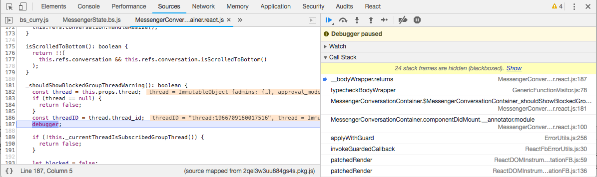
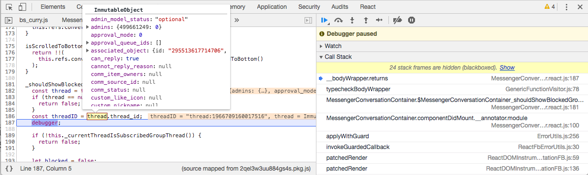

class: center, middle
# An introduction to Flow
## Boris Cherny
### @bcherny
---
class: center, middle
# 
---
class: middle
## Plan
1. The problem
2. The solution
3. How it works
4. Features
5. Common patterns
6. Common pitfalls
---
class: center, middle
## 1. The problem
---
<legend>1. The problem</legend>
```js
class MyComponent extends React.Component {
  state = {events: {}}
  render() {
    return <div>
      <p>Today is: {this.props.day}/{this.props.month}/{this.props.year}</p>
      <p>Today's events are:</p>
      <ul>{this.events.map(event => <li>{event.name}</li></ul>
      <MonthPicker year={this.props.year} month={this.props.moth} />
      <button onClick={this.refresh}>Refresh</button>
    </div>
  }
  async refresh = () => {
    const events = this.fetchEvents()
    this.setState({
      events: events
    })
  }
  fetchEvents() {
    new AsyncRequest().setURI('/uri')
      .setData({
        month: this.props.month,
        date: this.props.date,
        year: this.props.yer
      })
      .setMethod('POST').exec();
  }
}
```
---
<legend>1. The problem</legend>
```js
class MyComponent extends React.Component {
* state = {events: {}}
  render() {
    return <div>
      <p>Today is: {this.props.day}/{this.props.month}/{this.props.year}</p>
      <p>Today's events are:</p>
*     <ul>{this.events.map(event => <li>{event.name}</li></ul>
*     <MonthPicker year={this.props.year} month={this.props.moth} />
      <button onClick={this.refresh}>Refresh</button>
    </div>
  }
  async refresh = () => {
*   const events = this.fetchEvents()
    this.setState({
      events: events
    })
  }
  fetchEvents() {
*   new AsyncRequest().setURI('/uri')
      .setData({
        month: this.props.month,
*       date: this.props.date,
*       year: this.props.yer
      })
      .setMethod('POST').exec();
  }
}
```
---
class: center, middle
## 2. The solution
---
class: center, middle
# 
---
<legend>2. The solution</legend>
```js
// @flow

type Props = {|
  day: number,
  month: number,
  year: number
|}

type State = {|
  events: Array<{name: string}>
|}

class MyComponent extends React.Component<Props, State> {
  // ...
}
```
---
class: center, middle
## 3. How it works
---
class: middle
<legend>3. How it works</legend>
`@flow` tells Flow to typecheck your file
```js
/**
 * Copyright 2004-present Facebook. All Rights Reserved.
 *
 * @fbt {"project": "tribes"}
* * @flow
 * @format
 */

...
```
---
<legend>3. How it works</legend>
<span class="PadTop">Flow *unifies* your types</span>
```js
function a(x) {
  return x + 4
}
```
---
<legend>3. How it works</legend>
<span class="PadTop">Flow *unifies* your types</span>
```js
function a(x) { // x must be a number or a string
  return x + 4  // the return type must be a number or a string
}
```
---
<legend>3. How it works</legend>
<span class="PadTop">Flow *unifies* your types</span>
```js
function a(x) { // x must be a number | string
  return x + 4  // the return type must be a number | string
}
```
---
<legend>3. How it works</legend>
<span class="PadTop">Flow *unifies* your types</span>
```js
function a(x) { // x must be a number
  return x + 4  // the return type must be a number
}

*a(42)
```
---
<legend>3. How it works</legend>
<span class="PadTop">Flow *unifies* your types</span>
```js
function a(x) { // x must be a string
  return x + 4  // the return type must be a string
}

*a('foo')
```
---
<legend>3. How it works</legend>
<span class="PadTop">Flow *unifies* your types</span>
```js
function a(x) { // x must be a number | string
  return x + 4  // the return type must be a number | string
}

*a(42)
a('foo')
```
---
<legend>3. How it works</legend>
<span class="PadTop">Flow *unifies* your types</span>
```js
*function a(x: number): number { // x must be a number
  return x + 4  // the return type must be a number
}

a(42)
a('foo') // Error: Cannot call a with 'foo' bound to x because
         //        string is incompatible with number.
```
---
<legend>3. How it works</legend>
<span class="PadTop">Flow takes *control flow* into account</span>
```js
function a(x: number | string): number | string {
  if (typeof x === 'number') {
    return x * 4 // x must be a number
  }
  return x.toUpperCase() // x must be a string
}

a(42) // number | string
a('x') // number | string
```
---
<legend>3. How it works</legend>
<span class="PadTop">Flow takes *control flow* into account</span>
```js
function a(x: number | string): number | string {
  if (typeof x === 'number') {
    return x * 4 // x must be a number
  }
  return x.toUpperCase() // x must be a string
}

a(42) // number | string
a('x') // number | string
```
---
<legend>3. How it works</legend>
<span class="PadTop">We *strip* Flow types at runtime</span>
```js
// Before (in Nuclide)
*function a(x: number | string): number | string {
  if (typeof x === 'number') {
    return x * 4
  }
  return x.toUpperCase()
}

// After (in Sandbox & Prod)
*function a(x) {
  if (typeof x === 'number') {
    return x * 4
  }
  return x.toUpperCase()
}
```
---
class: center, middle
## 4. Features
---
<legend>4. Features</legend>
<span class="PadTop">Type annotations</span>
```js
function a(b: {|c: number|}): {|d: boolean|} {
  // ...
}
```

<small>Hack equivalent</small>
```js
class A {
  public function a(shape('c' => num) $b): shape('d' => bool) {
    // ...
  }
}
```
---
<legend>4. Features</legend>
<span class="PadTop">Type aliases</span>
```js
type MyType = number
type MyOther = string
```

<small>Hack equivalent</small>
```js
class A {
  const type MyType = num;
  const type MyOther = string;
}
```
---
<legend>4. Features</legend>
<span class="PadTop">Union types</span>
```js
type NumberOrStringOrBoolean = number | string | boolean
```
<small>Hack equivalent (sort of)</small>
```js
interface NumberOrStringOrBoolean {}
interface Number extends NumberOrStringOrBoolean {}
interface String extends NumberOrStringOrBoolean {}
interface Boolean extends NumberOrStringOrBoolean {}
```
---
<legend>4. Features</legend>
<span class="PadTop">Spread types</span>
```js
type User = {| userID: FBID |}
type Name = {| name: string |}
type UserWithName = {| ...User, ...Name |}

// Equivalent to:
type UserWithName = {| userID: FBID, name: string |}
```
<small>Hack equivalent</small>
```js
interface User {
  public FBID $userID;
}
interface Name {
  public string $name;
}
trait UserWithName {
  require extends User;
  require extends Name;
}
```
---
<legend>4. Features</legend>
<span class="PadTop">Type reflection</span>
```js
const user = {userID: 3}

type User = typeof user // {userID: number, [string]: any}
```

<small>Compiles to:</small>
```js
const user = {userID: 3}
```
---
<legend>4. Features</legend>
<span class="PadTop">Explicit type annotations</span>
```js
const n: number = 4

type User = {| userID: number |}
const user: User = {userID: 3}
```
---
<legend>4. Features</legend>
<span class="PadTop">Literal types</span>
```js
type Day = 'Monday'
  | 'Tuesday'
  | 'Wednesday'
  | 'Thursday'
  | 'Friday'
  | 'Saturday'
  | 'Sunday'

const a: Day = 'Friday'
const b: Day = 'Sun' // Error: Cannot assign 'Sun' to b
```
---
<legend>4. Features</legend>
<span class="PadTop">Utility types</span>
```js
type User = {| name: string, userID: FBID |}

// Type of object's keys
type UserFields = $Keys<User> // Array<'name' | 'userID'>
const a: UserFields = 'name' // OK
const b: UserFields = 'name2' // Error!

// Type of object's values
type UserTypes = $Values<User> // Array<string | FBID>

// Type of a value at a specific key
type NameType = $ElementType<User, 'userID'> // FBID
```

<small>See https://flow.org/en/docs/types/utilities</small>
---
class: center, middle
## 5. Common patterns
---
<legend>5. Common patterns</legend>
<span class="PadTop">React components</span>
```js
type Props = {|
  a: number
|}

type State = {|
  b: string
|}

class MyComponent extends React.Component<Props, State> {
  // ...
}
```
---
<legend>5. Common patterns</legend>
<span class="PadTop">React components</span>
```js
type Props = {|
  a: number
|}

type State = {|
  b: string
|}

class MyComponent extends React.Component<Props, State> {
  // ...
}
```
---
<legend>5. Common patterns</legend>
<span class="PadTop">Functional React components</span>
```js
type Props = {|
  a: number
|}

function MyComponent(props: Props): React.Node {
  // ...
}
```
---
<legend>5. Common patterns</legend>
<span class="PadTop">Relay</span>
```js
import type {MyComponent_myGraphQLQuery} from 'MyComponent_myGraphQLQuery.graphql'

type Props = {|
  a: number
|}

type QueryRendererProps = {|
  error?: Error,
  props?: MyComponent_myGraphQLQuery
|}

function MyComponent(props: Props): React.Node {
  return <QueryRenderer
    environment={RelayFBEnvironment}
    query={myGraphQLQuery}
    variables={{a: 1}}
    render={({error, props}: QueryRendererProps): React.Node => {
      // ...
    }}
  />
}
```
---
class: center, middle
## 6. Common pitfalls
---
<legend>6. Common pitfalls</legend>
<span class="PadTop"></span>
- Avoid `any`, `Object`, and `*` like 🔥

```js
// Good
type A = mixed
type B = Object
type C = *

// Bad
type A = any
type B = {b: string}
type C = mixed
```

<small>Use `@flow strict` or `@flow strict-local` to enforce this.</small>
---
<legend>6. Common pitfalls</legend>
<span class="PadTop"></span>
- Avoid `{}`, use `{||}` instead
- Avoid `&`, use `...` instead

```js
// Good
type A = {|a: number|}
type B = {|b: string|}
type C = {|...a, ...b|}

// Bad
type A = {a: number}
type B = {b: string}
type C = A & B
```

<small>We have a lint rule to enforce this.</small>
---
<legend>6. Common pitfalls</legend>
<span class="PadTop"></span>
- Avoid `{}`, use `{||}` instead
- Avoid `&`, use `...` instead

| Flow | Hack |
|--|--|
| `{a: number}` | `shape('a' => num, ...)` |
| `{︳a: number︳}` | `shape('a' => num)` |
---
class: center, middle
# 7. Workflow
---
<legend>7. Workflow</legend>
<span class="PadTop"></span>
① Type your code manually, if types are obvious

```js
function timesSeven(n) {
  return n * 7
}

module.exports = timesSeven
```
---
<legend>7. Workflow</legend>
<span class="PadTop"></span>
① Type your code manually, if types are obvious

```js
*function timesSeven(n: number): number {
  return n * 7
}

module.exports = timesSeven
```
---
<legend>7. Workflow</legend>
<span class="PadTop"></span>
② TBGS & look at how people use your code

```js
// Foobjord.js
class Foobjord {
  fwonk(zoom) {
    return zoom.froomba.hello()
  }
}

module.exports = Foobjord

// Main.js
const f = new Foobjord
f.fwonk({
  froomba: {
    hello() { return 12 }
  }
})
```
---
<legend>7. Workflow</legend>
<span class="PadTop"></span>
② TBGS & look at how people use your code

```js
// Foobjord.js
*type Zoom = {| hello(): number |}

class Foobjord {
* fwonk(zoom: Zoom): number {
    return zoom.froomba.hello()
  }
}

module.exports = Foobjord

// Main.js
const f = new Foobjord
f.fwonk({
  froomba: {
    hello() { return 12 }
  }
})
```
---
<legend>7. Workflow</legend>
<span class="PadTop"></span>
③ Set a debugger and run your code

```js
function mystery(a) {
  dosomething()
}
```
---
<legend>7. Workflow</legend>
<span class="PadTop"></span>
③ Set a debugger and run your code

```js
function mystery(a) {
* debugger
  dosomething()
}
```
---
<legend>7. Workflow</legend>
<span class="PadTop"></span>
③ Set a debugger and run your code
<span class="PadTop"></span>

---
<legend>7. Workflow</legend>
<span class="PadTop"></span>
③ Set a debugger and run your code
<span class="PadTop"></span>

---
<legend>7. Workflow</legend>
<span class="PadTop"></span>
④ Add `@typechecks`

<small>To throw runtime exceptions in your sandbox.</small>
```js
/**
 * Copyright 2004-present Facebook. All Rights Reserved.
 *
 * @flow strict
 * @format
 * @emails oncall+chats_in_groups_fb
 */
```
---
<legend>7. Workflow</legend>
<span class="PadTop"></span>
④ Add `@typechecks`

<small>To throw runtime exceptions in your sandbox.</small>
```js
/**
 * Copyright 2004-present Facebook. All Rights Reserved.
 *
 * @flow strict
 * @format
 * @emails oncall+chats_in_groups_fb
* * @typechecks
 */
```
---
<legend>7. Workflow</legend>
<span class="PadTop"></span>
## Happy fixing! 🎉

Tasks: [fburl.com/flow-fixathon](https://fburl.com/flow-fixathon)
<br><br>
Flow docs: [flow.org](https://flow.org)
