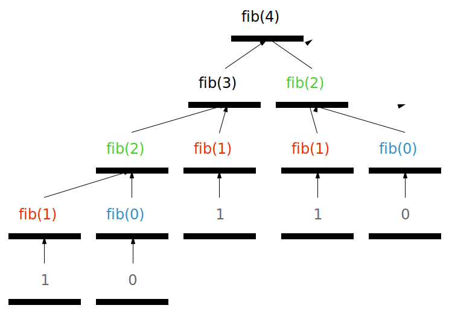
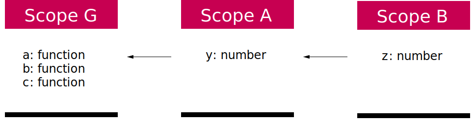

# Programs

Let's start simple: What is a computer program?

Right: Computer programs are files that contain text.

There is nothing special about these files: you can create and edit them in Notepad (or TextEdit if you use a Mac), Microsoft Word, or any other text editing program. More commonly, people use text editors that are made specifically for editing programs. They have nice features like tabbed interfaces, highlighting text in a way that makes it easy to skim, etc.

By convention, we give text files that contain programs file extensions indicating the programming language they use. For example, programs written in Haskell have the extension `.hs`, HTML uses `.html`, and Java uses `.java`. JavaScript uses `.js`. You might see some other variants of these (`.htm` for HTML, or `.es6` for JavaScript), but it's good style to stick to the canonical file extension for your given language. For JavaScript, that means sticking to `.js`.

Once you write a text file containing your program, you:

1. First use a *compiler* (itself a program!) to *compile* your program
2. Then use a *runtime* (another program!) to *evalutate* (or, *run*) your program

In a lot of languages (C++, Java, Scala, etc.) the compile and run steps are two separate commands, but in JavaScript you compile and run your program in a single step.

## Setting up your environment

Let's get your environment set up so we can start writing some code.

### Installing a text editor

1. Download and install VSCode from [here](TODO)

### Installing NodeJS

1. Open your terminal (Terminal on OSX, or `cmd` on Windows)
2. Install NVM by following the instructions [here](TODO)
3. Use NVM to install Node 6.9.5 (`nvm install v6.9.5`)

## Your first program

Let's write the world's simplest program:

1. Open up VSCode
2. Create a new file
3. Save that empty file as *hello.js*. You can save it anywhere you want - Desktop or Documents are a good option.

Congratulations! You just wrote your first JavaScript program (well, it doesn't do much, but it's still a program!).

To run it:

1. Open your terminal
2. `cd` into the directory where you saved your file (Desktop, etc.)
3. Run it with `node ./hello.js`

## Your second program

Ok, let's edit our program so it does something:

1. Open *hello.js* in your text editor
2. Type `console.log(1 + 2)`
3. Save the file
4. Run it with `node ./hello.js`

You should see `3` show up in your console. Congratulations - you just wrote your second JavaScript program!

## Breaking it down

How does JavaScript evaluate programs, in general?

Right: From the top down.

Say this is your program:

```js
1 + 2
3 + 4
5 + 6
```

How does the runtime evaluate it? Well, it goes line by line, starting with the first line:

```js
1 + 2
```

This evaluates to `3`, so the runtime continues:

```js
3 + 4
```

This evaluates to `7`, so the runtime continues once more:

```js
5 + 6
```

This evaluates to `11`. Since the runtime has reached the end of the program, it exits.

In general, the JavaScript runtime will:

- Evaluate your program one line at a time
- Starting from the first line
- Until it hits the last reachable line

We can understand this more deeply if we look at a more complicated example. But first, we'll take a small detour.

## Functions

Here's how we define functions:

```js
let f = x => x + 1
```

Some syntax & terminology:

- `let` declares a new *variable* (in this case, we're assigning a *function* to our variable)
- The thing to the left of the `=>` (in this case, `x`) is the function's *parameter* (also called (*argument*[1])
- The stuff to the right of the `=>` (in this case, `x + 1`) is the function's *body*

In general, when you see a `=>` in JavaScript, you know you're looking at a function definition.

How about this?

```js
let g = () => 'hello'
```

`g` is a function that takes no parameters, and returns the string `'hello'`.

Ok, so we can define functions. How do we evaluate them with specific arguments?

```js
let h = x => x * 2
h(3) // 6
```

- `h` is a function that takes a number `x` and returns that number multiplied by `2`
- We are *calling* (or, *invoking*) `h` with the argument `3`
- `h(3)` evaluates to `6`
- `//` followed by some text is a *comment* in JavaScript, and is just there for the reader's benefit

What about a function that has 2 parameters [2]? Ok, no problem:

```js
let i = x => y => x + y
```

- `i` is a function that takes a parameter `x`, and returns another function
- The function returned by `i` has no name, so we call it an *anonymous function*
- The function returned by `i` takes a parameter `y`, and returns `y` plus the `x` that was passed into `i`

How do we call `i`?

Easy:

```js
i(2)(3) // 5
```

We can also break this out into 2 steps, and assign our intermediate result to a variable:

```js
let a = i(2)
a(3) // 5
```

**Exercise**: Implement the function `y = m * x + b`, and call it with `m`=`2`, `x`=`3`, and `b`=`4`.

Ok, so far so good. Let's move on to some more complicated programs.

## Your third program

Replace the contents of hello.js with this code:

```js
let f = x => x * 2
let g = y => f(y) + 1
let h = z => g(z) > 3
h(2)
```

**Exercise**: What will `h(2)` evaluate to?

If it helps, you can substitue in values one step at a time, like you did in algebra class (ie. replace each instance of a variable's *usage* with its *definition*):

```js
// Step 1 - Substitute in h
let f = x => x * 2
let g = y => f(y) + 1
(z => g(z) > 3)(2)

// Step 2 - Substitute in g
let f = x => x * 2
(z => (y => f(y) + 1)(z) > 3)(2)

// Step 3 - Substitute in f
(z => (y => (x => x * 2)(y) + 1)(z) > 3)(2)

// Step 4 - Bind z <- 2
(() => (y => (x => x * 2)(y) + 1)(2) > 3)()

// Step 5 - Reduce
(y => (x => x * 2)(y) + 1)(2) > 3

// Step 6 - Bind y <- 2
(() => (x => x * 2)(2) + 1)() > 3

// Step 7 - Reduce
(x => x * 2)(2) + 1 > 3

// Step 8 - Bind x <- 2
(() => 2 * 2)() + 1 > 3

// Step 9 - Reduce
2 * 2 + 1 > 3

// Step 10 - Reduce
5 > 3

// Step 11 - Reduce
true
```

That is pretty close to how your favorite JS runtime would have evaluated that program [4].

Let's look at another example:

```js
// Returns the nth fibbonaci number TODO: spelling?
let fib = n => {
  switch (n) {
    case 0: return 0
    case 1: return 1
    default: return fib(n - 1) + fib(n - 2)
  }
}
fib(4)
```

Step by step:

```js
// Step 1 - Substitute in fib
(n => {
  switch (n) {
    case 0: return 0
    case 1: return 1
    default: return fib(n - 1) + fib(n - 2)
  }
})(4)

// Step 2 - Evaluate, binding n <- 4
switch (4) {
  case 0: return 0
  case 1: return 1
  default: return fib(n - 1) + fib(n - 2)
}

// Step 3 - Reduce
fib(3) + fib(2)

// Step 4 - Substitute in fib
(n => {
  switch (n) {
    case 0: return 0
    case 1: return 1
    default: return fib(n - 1) + fib(n - 2)
  }
})(3) + (n => {
  switch (n) {
    case 0: return 0
    case 1: return 1
    default: return fib(n - 1) + fib(n - 2)
  }
})(2)

// Step 5 - Evaluate and bind
() => {
  switch (3) {
    case 0: return 0
    case 1: return 1
    default: return fib(3 - 1) + fib(3 - 2)
  }
)
}() + (() => {
  switch (2) {
    case 0: return 0
    case 1: return 1
    default: return fib(2 - 1) + fib(2 - 2)
  }
})()

// Step 6 - Reduce
fib(2) + fib(1) + fib(1) + fib(0)

// Step 7 - Substitute in fib
(n => {
  switch (n) {
    case 0: return 0
    case 1: return 1
    default: return fib(n - 1) + fib(n - 2)
  }
})(2) + (n => {
  switch (n) {
    case 0: return 0
    case 1: return 1
    default: return fib(n - 1) + fib(n - 2)
  }
})(1) + (n => {
  switch (n) {
    case 0: return 0
    case 1: return 1
    default: return fib(n - 1) + fib(n - 2)
  }
})(1) + (n => {
  switch (n) {
    case 0: return 0
    case 1: return 1
    default: return fib(n - 1) + fib(n - 2)
  }
})(0)

// Step 8 - Evaluate and bind
(() => {
  switch (2) {
    case 0: return 0
    case 1: return 1
    default: return fib(2 - 1) + fib(2 - 2)
  }
})() + (() => {
  switch (1) {
    case 0: return 0
    case 1: return 1
    default: return fib(1 - 1) + fib(1 - 2)
  }
})() + (() => {
  switch (1) {
    case 0: return 0
    case 1: return 1
    default: return fib(1 - 1) + fib(1 - 2)
  }
})() + (() => {
  switch (0) {
    case 0: return 0
    case 1: return 1
    default: return fib(0 - 1) + fib(0 - 2)
  }
})()

// Step 9 - Reduce
fib(1) + fib(0) + 1 + 1 + 0

// Step 10 - Substitute in fib
(n => {
  switch (n) {
    case 0: return 0
    case 1: return 1
    default: return fib(n - 1) + fib(n - 2)
  }
})(1) + (n => {
  switch (n) {
    case 0: return 0
    case 1: return 1
    default: return fib(n - 1) + fib(n - 2)
  }
})(0) + 1 + 1 + 0

// Step 11 - Evaluate and bind
(() => {
  switch (1) {
    case 0: return 0
    case 1: return 1
    default: return fib(1 - 1) + fib(1 - 2)
  }
})() + (() => {
  switch (0) {
    case 0: return 0
    case 1: return 1
    default: return fib(0 - 1) + fib(0 - 2)
  }
})() + 1 + 1 + 0

// Step 12 - Reduce
1 + 0 + 1 + 1 + 0

// Step 13 - Reduce
3
```

We can also visualize the call tree:



**Exercise (hard)**: Some of you may have noticed that we repeated some computations multiple times:

- `fib(2)` - 2 times
- `fib(1)` - 3 times
- `fib(0)` - 2 times

Can you figure out a way to improve on that, so that `fib` is called at most once with any given value? Hint: Find a way to save the return value the first time `fib` is called with each input, and return it (rather than recomputing) on subsequent calls. Second hint: Look up *memoization*.

------------------------

## Purity

The above `fib` function is by far the easiest type of function to work with. The thing that makes it so easy to reason about is that it is *pure*.

> **Purity**: A function is *pure* if its output depends only on its input.

In the real world, you will encounter a lot of code that is not pure. That's because in JS, purity is not enforced (in some languages it is - eg. Haskell, OCaml, or Scala).

Impure functions can be a lot harder to reason about. For example, here is a function whose output depends not just on its inputs, but also on a global state:

```js
let isFirstCall = true
let fn = x => {
  if (isFirstCall) {
    isFirstCall = false
    return x
  } else {
    return x * 2
  }
}
fn(3) // 3
fn(3) // 6
```

The first time you call `fn(3)` it gives `3`, but subsequent calls will give `6`! As an engineer looking at this code, it's not obvious why `fn` returns different things even though you call it with the same argument. And if you try to apply the substitution model you used above to reason through it, it won't work quite as expected!

**Exercise**: Try to apply the substitution model to this code - what went wrong, and why?

Instead, consider the purified version of the above code:

```js
let fn = isFirstCall => x => {
  if (isFirstCall) {
    return x
  } else {
    return x * 2
  }
}
fn(true)(3) // 3
fn(false)(3) // 6
```

Ah, much better! Now it's clear why `fn` returned different values: because it was called with different arguments!

## Side effects

Something else to beware of when writing functions is *side effects*:

> **Side effect**: Anything that is not pure computation (ie. substitution, binding, or reduction) is a side effect. Examples: logging to the console, rendering DOM elements, making network requests, or reading from the filesystem.

For example, let's look at `console.log`. It takes a `string` and returns `undefined`, but has the side effect of writing text to the console:

```js
let fn = x => console.log(x * 2)
fn(4)
```

If we apply the substitution model, the result doesn't quite capture what this function really does:

```js
// Step 1 - Substitute in fn
(x => console.log(x * 2))(4)

// Step 2 - Evaluate fn(), binding x <- 4
console.log(8)

// Step 3 - Reduce
undefined
```

Even though this code logged out `8` to the console, it reduced to `undefined`! Is `undefined` a good representation of what that code actually did?

It's probably not. In some cases, substitution is not a good enough mental model to think about what a piece of code does. In this specific case, our function actually did two things:

1. It evaluated to `undefined`
2. It produced the side effect of logging to the console

Substitution only revealed (1) to us, but we had to intuit (2) ourselves by reading through the code and knowing ahead of time that `console.log` is impure.

Let's avoid getting into the weeds of side effects, but the take home lesson is that if your function has side effects, it makes its behavior hard to reason about. Better managing side effects is an active area of programming language research, and has led to some seriously cool ideas [3].

Later on we'll talk about some ways to get rid of side effects, and some ways to better organize them.

## Scope

Let's look at how the JS runtime resolves variables in more detail.

Say this is your program:

```js
let a = x => {
  let y = x * 2
  return z => x + y + z
}
let b = a(1)
let c = b(2)
```

What does `c` evaluate to?

Right: It evaluates to `5`.

Let's prove this by substitution:

```js
// Step 1 - Substitute in a and b
let c = ((x => {
  let y = x * 2
  return z => x + y + z
})(1))(2)

// Step 2 - Bind x <- 1
let c = ((() => {
  let y = 1 * 2
  return z => 1 + y + z
})())(2)

// Step 3 - Reduce
let c = (z => 1 + 2 + z)(2)

// Step 4 - Bind z <- 2
let c = (() => 1 + 2 + 2)()

// Step 5 - Reduce
let c = 5

// Step 6 - Reduce
undefined
```

Note how in this example we subsituted the inner expression first, then the outer one, so that we could evaluate `a(1)` before `b(2)`. When applying substitution, order does not matter - all paths lead to the same result!

Also notice how each function has access not just to the variables defined in its own scope, but to all variables defined in outer scopes! And not just its immediate outer scope, but to *all* outer scopes in its *scope hierarchy*.

> **Scope hierarchy**: The list of scopes leading from a given function to the global scope. Think of it as the "breadcrumbs" leading from the root to a function's body. TODO: Improve this definition

In other words, JavaScript looks up (or, *resolves*) variables inside-out. Ie. if a given variable is defined in the local scope, that definition will be used. Otherwise, JS traverses out one scope at a time, until it gets to the global scope; if one of these scopes defines the variable in question, that definition will be used; otherwise, the variable will resolve to `undefined`[5].

In pseudocode the algorithm looks like this:

```js
let resolve = scope => variable => {
  if (variable in scope) {
    return scope[variable]
  }
  if (scope === GLOBAL_SCOPE) {
    return undefined
  }
  return resolve(parentOf(scope))(variable)
}
```

What is a "parent scope" (the `parentOf` function in our pseudocode)?

Let's look at the last code example again, and annotate it with line numbers this time:

```js
let a = x => {              // 1
  let y = x * 2             // 2
  return z => x + y + z     // 3
}                           // 4
let b = a(1)                // 5
let c = b(2)                // 6
```

We have three scopes in this code:

1. The top level scope, which includes definitions for the variables `a`, `b`, and `c`. Let's call this scope `Scope G`.
2. The `a` function's scope, which includes a definition for the variable `x`. Let's call this `Scope A`.
3. The scope for the anonymous function returned by `a`, which includes a definition for the variable `z`. Let's call this `Scope B`.

`Scope G` has no parent; it is the outermost, or *global* scope.

`Scope A`'s parent is `Scope G`.

`Scope B`'s parent is `Scope A`, and its grandparent is `Scope G`.

We can visualize these 3 scopes as a tree. `Scope G` is the root node, `Scope A` is its child, and `Scope B` is *its* child:



Let's walk through how variables in this program are resolved:

- `a` is consumed on line 5. It's defined in the same scope that it's consumed in (`Scope G`).
- `b` is consumed on line 6. It's defined in the same scope that it's consumed in (`Scope G`).
- `x` is consumed on lines 2 and 3:
  - On line 2, it's defined in the same scope that it's consumed in (`Scope A`).
  - On line 3, it's *not* defined in the scope (`Scope B`) that it's consumed in. Traversing out one scope at a time, JS looks at that scope's parent, `Scope A`. `Scope A` defines `x`, so JS returns the current value of the variable `x` (in this case, `1`).
- `y` is consumed on line 3. It's *not* defined in the scope `Scope B`, so JS traverses out one scope at a time, to `Scope A`. `y` is defined in `Scope A`, so JS returns the current value of the variable `y` (in this case, `2`).
- `z` is consumed on line 3. It's defined in the same scope that it's consumed in (`Scope B`).

**Exercise**: What does `y` resolve to if we consume it in `Scope G`? [6]

-------------

[1] There is a technical difference: *parameters* are not yet bound to values, and is what we call them when they show up in function definitions. *Arguments* are bound to specific values, and are what we call them when they show up in function invokations.

[2] If you've programmed before, you'll notice that we're focusing on *unary* (or, 1-parameter) functions. Don't worry, that's on purpose.

[3] In no particular order, see:

- How Rust treats [memory allocation as a side effect]()
- How Haskell uses [monads]() to manage side effects
- How Scala uses [Effect Systems]() to encode side effects in the type system

[4] This kind of evaluation by substitution is called the [*Substitution Model*](https://en.wikipedia.org/wiki/Lambda_calculus#Substitution), just like in math. JavaScript uses an *Environment Model*, which is like a Substitution Model, but also supports mutable variables (more on that later). Also note that modern JS engines heavily optimize programs with JIT optimizers (eg. see Chrome/NodeJS/Opera's [A](), Firefox's [B](), or IE's [TODO]()), so execution might not follow those steps exactly.

[5] This algorithm for inside-out traversal is called *lexical scoping*. Alternative algorithms also exist. For a good intro, see [Appendix A](https://github.com/getify/You-Dont-Know-JS/blob/6109cfe/scope%20%26%20closures/apA.md) of Simpson's You Don't Know JS.

[6] `undefined`, because it is defined in `Scope A`. Inner scopes have access to their outer scopes, but outer scopes do not have access to their inner scopes.