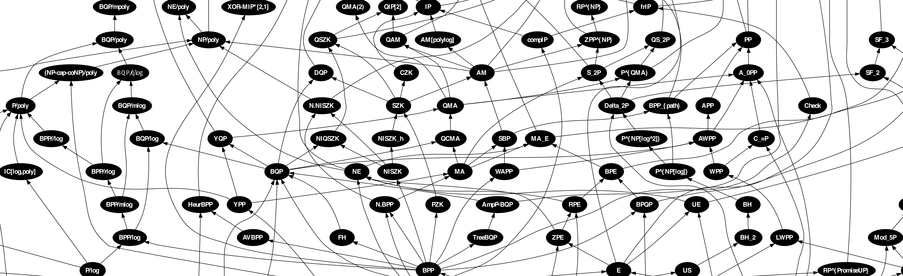

# Complexity

To preface this chapter: computational complexity theory is a giant area of active research. This chapter is meant to let you dip your toes in the complexity pond - if you find this stuff interesting, check out the resources in the footnotes.

We're going to start by thinking about performance as a measure of complexity, then briefly talk about some other possible metrics.

## How do we measure complexity?

Let's say we have 2 functions, `f` and `g`:

```js
let f = xs => xs[0] // eg. [1, 2] => 1
let g = xs => xs.map(_ => _ + 1) // eg. [1, 2] => [2, 3]
```

Both of these functions take arrays of numbers. `f` returns the first element of the array you give it; `g` returns a new array consisting of all of the elements of the array you give it, incremented by 1.

How would you describe the *performance* of these functions?

Well, you could pass some value to each function (say, the array `[1, 2, 3]`), and time how long it takes to return a result. Here is a simple timing function you could use to do that:

```js
let time = fn => {
  let start = Date.now()
  fn()
  let end = Date.now()
  return end - start
}
time(() => f([1, 2, 3])) // 1
time(() => g([1, 2, 3])) // 3
```

`f` might return in 1 millisecond, and `g` might return in 3 milliseconds (in reality it will be way faster, this is just an illustration). Does this mean that `g` is 3 times slower than `f`?

Right: No, because we just tested one value (`[1, 2, 3]`), and the performance probably depends on the specific values you pass in.

What if we repeated this timing experiment for a bunch of inputs, and recorded how long it took each function to run:

| Input             | `time(f(Input))`  | `time(g(Input))`  |
|-------------------|-------------------|-------------------|
| `[]`              | 1                 | 1                 |
| `[1, 2, 3]`       | 1                 | 3                 |
| `[1, 2, ..., 10]` | 1                 | 10                |
| `[1, 2, ..., 1000]` | 1               | 1000              |

Based on these data, we can conclude that:

- `f` always takes 1ms to run, regardless of its input
- `g`'s run time is linearly proportional to the length of its input

Thinking about performance this way (how does time depend on input?) has some nice properties:

- It's not tied to a specific input: instead, it describes performance over the full domain of possible inputs
- It's not tied to specific hardware: eg. `g` might take 3ms to run on my laptop for a given input, but it might take 10ms to run on your iPhone for that same input
- It's predictive: once we know how runtime scales with input size, we can predict runtimes for other inputs that we haven't actually timed

In fact, this way of thinking about performance is so useful that we have a name for it: *Big O Notation*.

> **Big O Notation**: A way to describe how an algorithm's performance varies with the size of its input. [2]

We can express our functions' performance in terms of Big O:

- `f` runs in *O(1)* time: its performance is always constant, and does not depend on the size of its input
- `g` runs in *O(n)* time: its performance is linear with the size of its input (we call that size *n*)

Here are some common Big Os that you will encounter in the real world, in order from fastest to slowest:

| Big O   | Name          | Description                   |
|---------|---------------|-------------------------------|
| *O(1)*  | Constant      | Does not depend on input size |
| *O(log(n))* | Logarithmic | Grows with the log of the input size
| *O(n)*  | Linear        | Grows linearly with input size
| *O(n*<sup>*2*</sup>*)*  | Quadratic | Grows with the square of the input size
| *O(n*<sup>*3*</sup>*)*  | Polynomial | Grows with the cube of the input size
| *O(C*<sup>*n*</sup>*)*  | Exponential | Grows with some constant *C* raised to the power of the input size
| *O(n!)* | Factorial     | Grows with the factorial of the input size |

And the same thing in graph form - notice how fast some Big Os grow!


Because of how quickly *O(n!)* and *O(C*<sup>*n*</sup>*)* grow, they are only practical for the tiniest inputs. For example, let's define a function `permute` that takes an array of numbers, and returns all permutations of that array:

```js
let flatten = xs => xs.reduce((a, b) => a.concat(b))
let omit = xs => x => xs.filter(_ => _ !== x)
let permute = xs => {
  switch (xs.length) {
    case 0: return []
    case 1: return xs
    default: return flatten(xs.map(x =>
      permute(omit(xs)(x)).map(_ => [x].concat(_))
    ))
  }
}
permute([1, 2]) // [[1, 2], [2, 1]]
```

**Exercise**: Convince yourself that `permute` has a complexity of *O(n!)*.

To give you an idea of just how fast *O(n!)* algorithms grow, here's the expected runtime for our `permute` function (assuming 1 nanosecond per call):

| Input size    | Output size    | Run time      |
|---------------|----------------|---------------|
| 0             | 0              | 1 ns          |
| 5             | 120            | 120 ns        |
| 10            | 3628800        | 3.6 ms        |
| 15            | 1.3*10<sup>12</sup> | 21.8 min |
| 20            | 2.4*10<sup>18</sup> | 77 years |

What this means is practically, if you're thinking about using an *O(n!)* (or other fast-growing) algorithm in the real world, it's often better to use a faster, less precise algorithm [3].

## Other measures of complexity

Though Big O for time is the most common measure of complexity that you'll encounter, there are others too:

- **Big O for space**: How does an algorithm's memory usage vary with the size of its input?
- **Average-case Big O**: Some algorithms have a bad worst case, but usually perform much better than the worst case.
- **Complexity classes**: A lot of algorithms take different times to compute an answer vs. to verify that a given answer is correct (eg. sorting an array takes *O(n\*log(n))* time, but verifying that an array is sorted takes just *O(n)* time). Computer scientists have been hard at work grouping algorithms into complexity classes like P (all algorithms that run in *O(n*<sup>*C*</sup>*)* time, eg. deciding whether a number is prime), NP (all algorithms that have answers verifiable in *O(n*<sup>*C*</sup>*)* time), and hundreds of others [4].
- **Cyclomatic complexity**: The number of paths through an algorithm (eg. an algorithm consisting of a single `if`/`else` statement will have 2 paths through it).
- **Kolmogorov complexity**: Given an input and output, the length of the shortest program that will produce that output given that input (this is widely used in information theory, and is a very elegant measure of complexity!).

-------------------

[1] For example, here's a case where half the time performance is constant, and half the time it's linear:

```js
let h = xs => Math.random() < 0.5 ? f(xs) : g(xs)
```

Which Big O do we report for `h`? Is it *O(1)*, *O(n)*, or something in between, *O(n/2)*?

By convention, and because it's what's most interesting in practice, we report `O(n)` because it's the *worst case* for this algorithm.

[2] A few notes:

- By convention, we ignore constants in Big O Notation (eg. instead of writing *O(2\*n)*, we just write *O(n)*)
- Big O usually refers to *worst case runtime* (because computer scientists are pessimists) [1]

[3] For example, see the [Travelling Salesman Problem](https://en.wikipedia.org/wiki/Travelling_salesman_problem#Exact_algorithms).

[4] For a more complete survey of complexity classes, see Aaronson's [Complexity Zoo](https://complexityzoo.uwaterloo.ca/Complexity_Zoo). Here is a piece of the pie:

