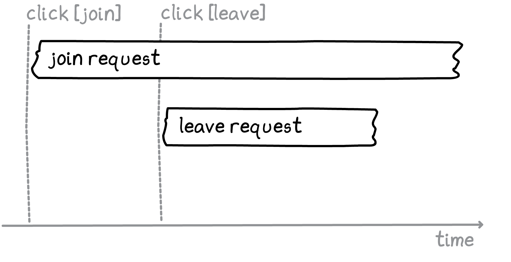

class: center, middle
<div class="relay-full-screen"></div>
---
class: middle
## agenda
- architecture
- APIs
  - querying
  - mutating
- deep dives
  - actors
  - queuing
---
class: middle
<legend>architecture</legend>
## architecture
- compiler
- runtime
  - environment
     - store
     - network
- comet-relay
---
class: center, middle
<legend>architecture > compiler</legend>

---
class: center, middle
<legend>architecture > runtime</legend>

---
class: center, middle
<legend>architecture > runtime > environment</legend>

---
class: middle
<legend>architecture > runtime > environment > store</legend>
## store
- normalized graph store
- garbage collection
- subscriptions
---
class: middle
<legend>architecture > runtime > environment > store</legend>
<div class="columns">
  <div>
    <pre class="language-graphql"><code>
    // Fragment
    fragment A on User {
      id
      name
      address {
        city
      }
    }

    // Response
    {
      id: '842472',
      name: 'Joe',
      address: {
        city: 'Menlo Park',
      }
    }
    </code></pre>
  </div>
  <div>
    <pre class="language-js"><code>
    // Data in store
    {
      '842472': {
        __id: '842472',
        __typename: 'User',
        id: '842472',
        name: 'Joe',
        address: {__ref: 'client:842472:address'},
      },
      'client:842472:address': {
        __id: 'client:842472:address',
        __typename: 'Address',
        city: 'Menlo Park',
      }
    }
    </code></pre>
  </div>
</div>
---
class: middle
<legend>architecture > runtime > environment > store</legend>
<div class="columns">
  <div>
    <pre class="language-graphql"><code>
    // Fragment
    fragment A on User {
      id
      friends {
        nodes {
          name
        }
      }
    }

    // Response
    {
      id: '842472',
      friends: {
        nodes: [
          {name: 'Amy'},
          {name: 'Beth'},
        ]
      }
    }
    </code></pre>
  </div>
  <div>
    <pre class="language-js"><code>
    // Data in store
    {
      '842472': {
        __id: '842472',
        __typename: 'User',
        id: '842472',
        name: 'Joe',
        friends: {__ref: 'client:842472:friends'},
      },
      'client:842472:friends': {
        __id: 'client:842472:friends',
        __refs: ['123', '456'],
        __typename: 'UserToFriendsConnection'
      },
      '123': {
        __id: '123',
        __typename: 'User',
        name: 'Amy'
      },
      '456': {
        __id: '456',
        __typename: 'User',
        name: 'Beth'
      }
    }
    </code></pre>
  </div>
</div>
---
class: center, middle
<legend>APIs</legend>
## relay APIs
---
<legend>APIs > querying</legend>
```js
// Queries
useLazyLoadQuery(graphql, vars)
usePreloadedQuery(graphql, queryReference)

// Fragments
useFragment(graphql, fragmentReference)
useRefetchableFragment(graphql, fragmentReference)
usePaginationFragment(graphql, fragmentReference)
```
---
<legend>APIs > querying</legend>
```js
// Queries
*useLazyLoadQuery(graphql, vars)
usePreloadedQuery(graphql, queryReference)

// Fragments
*useFragment(graphql, fragmentReference)
useRefetchableFragment(graphql, fragmentReference)
usePaginationFragment(graphql, fragmentReference)

const {group} = useLazyLoadQuery(graphql`
  query Q {
    group(id: $id) {
      ...F
    }
  }
`, {id: '123'})

useFragment(graphql`
  fragment F on Group {
    name
  }
`, group)
```
---
<legend>APIs > querying</legend>
```js
// Queries
*useLazyLoadQuery(graphql, vars)
usePreloadedQuery(graphql, queryReference)

// Fragments
*useFragment(graphql, fragmentReference)
useRefetchableFragment(graphql, fragmentReference)
usePaginationFragment(graphql, fragmentReference)

// Data in store
{
*  '842472': {
    __id: '842472',
    __typename: 'Group',
    id: '842472',
    name: 'Cool beanz for teens',
  }
}
```
---
<legend>APIs > querying</legend>
```js
// Queries
useLazyLoadQuery(graphql, vars)
*usePreloadedQuery(graphql, queryReference)

// Fragments
useFragment(graphql, fragmentReference)
useRefetchableFragment(graphql, fragmentReference)
usePaginationFragment(graphql, fragmentReference)

TODO: entrypoint

const {group} = usePreloadedQuery<Q>(graphql`
  query Q {
    group(id: $id) {
      name
    }
  }
`, queryReference)
```
---
<legend>APIs > querying</legend>
```js
// Queries
*useLazyLoadQuery(graphql, vars)
usePreloadedQuery(graphql, queryReference)

// Fragments
useFragment(graphql, fragmentReference)
*useRefetchableFragment(graphql, fragmentReference)
usePaginationFragment(graphql, fragmentReference)

const {group} = useLazyLoadQuery(graphql`
  query Q {
    group(id: $id) {
      ...F
    }
  }
`, {id: '123', order: 'CHRONOLOGICAL'})

const [data, refetch] = useRefetchableFragment(graphql`
  fragment F on Group @refetchable(queryName: "X") {
    group_feed(order: $order) {
      nodes {
        # ...
      }
    }
  }
`, group)

refetch({order: 'TOP_POSTS'})
```
---
<legend>APIs > querying</legend>
```js
// Queries
*useLazyLoadQuery(graphql, vars)
usePreloadedQuery(graphql, queryReference)

// Fragments
useFragment(graphql, fragmentReference)
useRefetchableFragment(graphql, fragmentReference)
*usePaginationFragment(graphql, fragmentReference)

const {group} = useLazyLoadQuery(graphql`
  query Q {
    group(id: $id) {
      ...F
    }
  }
`, {id: '123'})

const {data, hasNext, loadNext} = usePaginationFragment(graphql`
  fragment F on Group @refetchable(queryName: "X") {
    group_feed(first: $count, after: $cursor)
      @connection(key: "X_group_feed") {
      nodes {
        # ...
      }
    }
  }
`, group)

loadNext(4)
```
---
<legend>APIs > querying</legend>
```js
// Queries
*useLazyLoadQuery(graphql, vars)
usePreloadedQuery(graphql, queryReference)

// Fragments
useFragment(graphql, fragmentReference)
useRefetchableFragment(graphql, fragmentReference)
*usePaginationFragment(graphql, fragmentReference)

const {group} = useLazyLoadQuery(graphql`
  query Q {
    group(id: $id) {
      ...F
    }
  }
`, {id: '123'})

const {data, hasNext, loadNext} = usePaginationFragment(graphql`
  fragment F on Group @refetchable(queryName: "X") {
    group_feed(first: $count, after: $cursor)
      @stream_connection(key: "X_group_feed", initial_count: 1) {
      nodes {
        # ...
      }
    }
  }
`, group)

loadNext(4)
```
---
class: center, middle
<legend>APIs > querying</legend>

---
class: center, middle
<legend>APIs > querying</legend>

---
class: center, middle
<legend>APIs > querying</legend>

---
class: center, middle
<legend>APIs > querying</legend>

---
class: center, middle
<legend>APIs > querying</legend>

---
class: center, middle
<legend>APIs > querying</legend>

---
class: center, middle
<legend>APIs > querying</legend>

---
<legend>APIs > mutating</legend>
```js
commitMutation(environment, config)
enqueueMutation(environment, config)
createUseMutation(graphql, config)
```
---
<legend>APIs > mutating</legend>
```js
*commitMutation(environment, config)
enqueueMutation(environment, config)
createUseMutation(graphql, config)

function useChangeName(
  groupID: FBID,
  name: string,
  onCompleted: ChangeGroupNameResponse => void,
  onError: Error => void
) {
  const environment = useRelayEnvironment()
  commitMutation(environment, {
    mutation: graphql`
      mutation ChangeGroupName($input: ChangeGroupNameData!) {
        change_group_name(data: $input) {
          group {
            name
          }
        }
      }
    `,
    onCompleted,
    onError,
    variables: {groupID, name}
  })
}
```
---
<legend>APIs > mutating</legend>
```js
*commitMutation(environment, config)
enqueueMutation(environment, config)
createUseMutation(graphql, config)

// Mutation
commitMutation(environment, {
  mutation: graphql`
    mutation ChangeGroupName($input: ChangeGroupNameData!) {
      change_group_name(data: $input) {
        group {
          name
        }
      }
    }
  `,
  ...
)

// Data in store
{
   '842472': {
    __id: '842472',
    __typename: 'Group',
    id: '842472',
    name: 'New beanz', // Before: 'Cool beanz for teens'
  }
}
```
---
<legend>APIs > mutating</legend>
```js
*commitMutation(environment, config)
enqueueMutation(environment, config)
createUseMutation(graphql, config)

// Mutation
commitMutation(environment, {
  mutation: graphql`
    mutation ChangeGroupName($input: ChangeGroupNameData!) {
      change_group_name(data: $input) {
        group {
          ...GroupMall_group
          ...GroupsTab_group
        }
      }
    }
  `,
  ...
)
```
---
<legend>APIs > mutating</legend>
```js
commitMutation(environment, config)
*enqueueMutation(environment, config)
createUseMutation(graphql, config)

function useChangeName(
  groupID: FBID,
  name: string,
  onCompleted: ChangeGroupNameResponse => void,
  onError: Error => void
) {
  const environment = useRelayEnvironment()
  enqueueMutation(environment, {
    mutation: graphql`
      mutation ChangeGroupName($input: ChangeGroupNameData!) {
        change_group_name(data: $input) {
          group {
            name
          }
        }
      }
    `,
    onCompleted,
    onError,
    variables: {groupID, name}
  })
}
```
---
<legend>APIs > mutating</legend>
```js
commitMutation(environment, config)
*enqueueMutation(environment, config)
createUseMutation(graphql, config)
```
<video src="./images/queue-before.mov" class="video" autoplay />
---
<legend>APIs > mutating</legend>
```js
commitMutation(environment, config)
*enqueueMutation(environment, config)
createUseMutation(graphql, config)
```
<video src="./images/queue-before.mov" class="video" autoplay loop />
---
<legend>APIs > mutating</legend>
```js
commitMutation(environment, config)
*enqueueMutation(environment, config)
createUseMutation(graphql, config)
```

---
<legend>APIs > mutating</legend>
```js
commitMutation(environment, config)
*enqueueMutation(environment, config)
createUseMutation(graphql, config)
```

| action | UI state | optimistic stack |
| ---|--|--|
| (start) | Join | `[]`
| click Join | Leave | `[Leave]`
| click Leave | Join | `[Leave, Join]`
| (Leave returns) | Leave | `[Leave]`
| (Join returns) | Leave | `[]`


---
<legend>APIs > mutating</legend>
```js
commitMutation(environment, config)
*enqueueMutation(environment, config)
createUseMutation(graphql, config)
```

<div class="columns">
  <div class="column">
  <h4><code>commitMutation</code></h4>
  <video src="./images/queue-before.mov" class="small-video" autoplay loop />
  </div>
  <div class="column">
  <h4><code>enqueueMutation</code></h4>
  <video src="./images/queue-after.mov" class="small-video" autoplay loop />
  </div>
</div>
---
class: center, middle
<legend>APIs > mutating</legend>

---
class: center, middle
<legend>deep dives > actors</legend>

---
class: center, middle
<legend>deep dives > actors</legend>

---
class: middle
<legend>deep dives > actors</legend>
```js
<ActorProvider initialActorID="a" readonly={true}>
  <Feed>                                                // actor = a
    <ActorProvider initialActorID="b" readonly={true}>
      <Media>                                           // actor = b
        <Image />                                       // actor = b
      </Media>
    </ActorProvider>
  </Feed>
</ActorProvider>
```
---
class: center, middle
<legend>deep dives > actors</legend>

---
<legend>deep dives > queuing</legend>
Click button
Dispatch Join mutation
Optimistically update the UI to "Requested"
Click button again
Dispatch Leave mutation
Optimistically update the UI to "Join"
Leave mutation completes. Update Relay cache with server response (to "Join")
Join mutation completes. Update Relay cache with server response (to "Requested")
---
