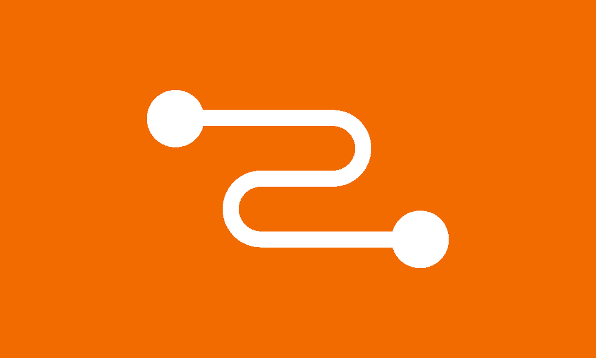

class: center, middle
<div class="relay-full-screen"></div>
---
class: middle
## agenda
- architecture
- APIs
  - querying
  - mutating
- actors
---
class: middle
<legend>architecture</legend>
## architecture
- compiler
- runtime
  - environment
     - store
     - network
- comet-relay
---
class: center, middle
<legend>architecture > compiler</legend>

---
class: center, middle
<legend>architecture > runtime</legend>

---
class: center, middle
<legend>architecture > runtime > environment</legend>

---
class: middle
<legend>architecture > runtime > environment > store</legend>
## store
- normalized graph store
- garbage collection
- subscriptions
---
class: middle
<legend>architecture > runtime > environment > store</legend>
<div class="columns">
  <div>
    <pre class="language-graphql"><code>
    // Fragment
    fragment A on User {
      id
      name
      address {
        city
      }
    }

    // Response
    {
      id: '842472',
      name: 'Joe',
      address: {
        city: 'Menlo Park',
      }
    }
    </code></pre>
  </div>
  <div>
    <pre class="language-js"><code>
    // Data in store
    {
      '842472': {
        __id: '842472',
        __typename: 'User',
        id: '842472',
        name: 'Joe',
        address: {__ref: 'client:842472:address'},
      },
      'client:842472:address': {
        __id: 'client:842472:address',
        __typename: 'Address',
        city: 'Menlo Park',
      }
    }
    </code></pre>
  </div>
</div>
---
class: middle
<legend>architecture > runtime > environment > store</legend>
<div class="columns">
  <div>
    <pre class="language-graphql"><code>
    // Fragment
    fragment A on User {
      id
      friends {
        nodes {
          name
        }
      }
    }

    // Response
    {
      id: '842472',
      friends: {
        nodes: [
          {name: 'Amy'},
          {name: 'Beth'},
        ]
      }
    }
    </code></pre>
  </div>
  <div>
    <pre class="language-js"><code>
    // Data in store
    {
      '842472': {
        __id: '842472',
        __typename: 'User',
        id: '842472',
        name: 'Joe',
        friends: {__ref: 'client:842472:friends'},
      },
      'client:842472:friends': {
        __id: 'client:842472:friends',
        __refs: ['123', '456'],
        __typename: 'UserToFriendsConnection'
      },
      '123': {
        __id: '123',
        __typename: 'User',
        name: 'Amy'
      },
      '456': {
        __id: '456',
        __typename: 'User',
        name: 'Beth'
      }
    }
    </code></pre>
  </div>
</div>
---
class: center, middle
<legend>APIs</legend>
## relay APIs
---
<legend>APIs > querying</legend>
```js
// Queries
useLazyLoadQuery(graphql, vars)
usePreloadedQuery(graphql, queryReference)

// Fragments
useFragment(graphql, fragmentReference)
useRefetchableFragment(graphql, fragmentReference)
usePaginationFragment(graphql, fragmentReference)
```
---
<legend>APIs > querying</legend>
```js
// Queries
*useLazyLoadQuery(graphql, vars)
usePreloadedQuery(graphql, queryReference)

// Fragments
*useFragment(graphql, fragmentReference)
useRefetchableFragment(graphql, fragmentReference)
usePaginationFragment(graphql, fragmentReference)

const {group} = useLazyLoadQuery(graphql`
  query Q {
    group(id: $id) {
      ...F
    }
  }
`, {id: '123'})

useFragment(graphql`
  fragment F on Group {
    name
  }
`, group)
```
---
<legend>APIs > querying</legend>
```js
// Queries
*useLazyLoadQuery(graphql, vars)
usePreloadedQuery(graphql, queryReference)

// Fragments
*useFragment(graphql, fragmentReference)
useRefetchableFragment(graphql, fragmentReference)
usePaginationFragment(graphql, fragmentReference)

// Data in store
{
*  '842472': {
    __id: '842472',
    __typename: 'Group',
    id: '842472',
    name: 'Cool beanz for teens',
  }
}
```
---
<legend>APIs > querying</legend>
```js
// Queries
useLazyLoadQuery(graphql, vars)
*usePreloadedQuery(graphql, queryReference)

// MyQueryRoot.entrypoint.js
const entrypoint = {
  getPreloadProps: ({actorID, groupID}) => ({
    queries: {
      myQueryReference: {
        environmentProviderOptions: {actorID},
        parameters: require('MyQuery$Parameters'),
        variables: {groupID}
      }
    }
  }),
  root: JSResourceForInteraction('m#MyQueryRoot.react')
}

// MyQueryRoot.react.js
const {group} = usePreloadedQuery(graphql`
  query MyQuery {
    group(id: $id) {
      name
    }
  }
`, myQueryReference)
```
---
<legend>APIs > querying</legend>
```js
// Queries
*useLazyLoadQuery(graphql, vars)
usePreloadedQuery(graphql, queryReference)

// Fragments
useFragment(graphql, fragmentReference)
*useRefetchableFragment(graphql, fragmentReference)
usePaginationFragment(graphql, fragmentReference)

const {group} = useLazyLoadQuery(graphql`
  query Q {
    group(id: $id) {
      ...F
    }
  }
`, {id: '123', order: 'CHRONOLOGICAL'})

const [data, refetch] = useRefetchableFragment(graphql`
  fragment F on Group @refetchable(queryName: "X") {
    group_feed(order: $order) {
      nodes {
        # ...
      }
    }
  }
`, group)

refetch({order: 'TOP_POSTS'})
```
---
<legend>APIs > querying</legend>
```js
// Queries
*useLazyLoadQuery(graphql, vars)
usePreloadedQuery(graphql, queryReference)

// Fragments
useFragment(graphql, fragmentReference)
useRefetchableFragment(graphql, fragmentReference)
*usePaginationFragment(graphql, fragmentReference)

const {group} = useLazyLoadQuery(graphql`
  query Q {
    group(id: $id) {
      ...F
    }
  }
`, {id: '123'})

const {data, hasNext, loadNext} = usePaginationFragment(graphql`
  fragment F on Group @refetchable(queryName: "X") {
    group_feed(first: $count, after: $cursor)
      @connection(key: "X_group_feed") {
      nodes {
        # ...
      }
    }
  }
`, group)

loadNext(4)
```
---
<legend>APIs > querying</legend>
```js
// Queries
*useLazyLoadQuery(graphql, vars)
usePreloadedQuery(graphql, queryReference)

// Fragments
useFragment(graphql, fragmentReference)
useRefetchableFragment(graphql, fragmentReference)
*usePaginationFragment(graphql, fragmentReference)

const {group} = useLazyLoadQuery(graphql`
  query Q {
    group(id: $id) {
      ...F
    }
  }
`, {id: '123'})

const {data, hasNext, loadNext} = usePaginationFragment(graphql`
  fragment F on Group @refetchable(queryName: "X") {
    group_feed(first: $count, after: $cursor)
      @stream_connection(key: "X_group_feed", initial_count: 1) {
      nodes {
        # ...
      }
    }
  }
`, group)

loadNext(4)
```
---
class: center, middle
<legend>APIs > querying</legend>

---
class: center, middle
<legend>APIs > querying</legend>

---
class: center, middle
<legend>APIs > querying</legend>

---
class: center, middle
<legend>APIs > querying</legend>

---
class: center, middle
<legend>APIs > querying</legend>

---
class: center, middle
<legend>APIs > querying</legend>

---
class: center, middle
<legend>APIs > querying</legend>

---
<legend>APIs > mutating</legend>
```js
commitMutation(environment, config)
enqueueMutation(environment, config)
createUseMutation(graphql, config)
```
---
class: center, middle
<legend>APIs > mutating</legend>

---
<legend>APIs > mutating</legend>
```js
*commitMutation(environment, config)
enqueueMutation(environment, config)
createUseMutation(graphql, config)

function useChangeName(
  group_id: FBID,
  name: string,
  onCompleted: ChangeGroupNameResponse => void,
  onError: Error => void
) {
  const environment = useRelayEnvironment()
  commitMutation(environment, {
    mutation: graphql`
      mutation ChangeGroupName($input: ChangeGroupNameData!) {
        change_group_name(data: $input) {
          group {
            name
          }
        }
      }
    `,
    onCompleted,
    onError,
    optimisticResponse, // or, optimisticUpdater
    updater,
    variables: {group_id, name}
  })
}
```
---
<legend>APIs > mutating</legend>
```js
*commitMutation(environment, config)
enqueueMutation(environment, config)
createUseMutation(graphql, config)

// Mutation
commitMutation(environment, {
  mutation: graphql`
    mutation ChangeGroupName($input: ChangeGroupNameData!) {
      change_group_name(data: $input) {
        group {
          name
        }
      }
    }
  `,
  ...
)

// Data in store
{
   '842472': {
    __id: '842472',
    __typename: 'Group',
    id: '842472',
    name: 'New beanz', // Before: 'Cool beanz for teens'
  }
}
```
---
<legend>APIs > mutating</legend>
## mutations
- a way to call a Hack function
- update data & fetch new data in one request
---
<legend>APIs > mutating</legend>
## handling loading states
- **principle**: always show that something happened
  - eg. optimistic update
  - eg. disable the button that triggered it
  - eg. show a glimmer
---
<legend>APIs > mutating</legend>
## handling responses
- **principle**: tell people when something succeeded/failed; stronger intent -> stronger affordance
  - eg. optimistic update
  - eg. optimistic update + confirmation toast 
  - eg. optimistic update + confirmation toast w/ Undo 
---
<legend>APIs > mutating</legend>
## handling errors
- `onCompleted(data, errors)`
- `onError(error)`
- **principle**: give people a way to recover
  - eg. optimistic update + error toast w/ Try Again 
- No need to log errors. Already in [Scuba > GraphQL Exceptions](https://our.intern.facebook.com/intern/scuba/query?dataset=graphql_exception)
---
<legend>APIs > mutating</legend>
```js
*commitMutation(environment, config)
enqueueMutation(environment, config)
createUseMutation(graphql, config)

// Mutation
commitMutation(environment, {
  mutation: graphql`
    mutation ChangeGroupName($input: ChangeGroupNameData!) {
      change_group_name(data: $input) {
        group {
          ...GroupMall_group
          ...GroupsTab_group
        }
      }
    }
  `,
  ...
)
```
---
<legend>APIs > mutating</legend>
```js
*commitMutation(environment, config)
enqueueMutation(environment, config)
createUseMutation(graphql, config)

// Mutation
commitMutation(environment, {
  mutation: graphql`
    mutation ChangeGroupName($input: ChangeGroupNameData!) {
      change_group_name(data: $input) {
        group {
          name
        }
      }
    }
  `,
  optimisticResponse: {
    change_group_name: {
      group: {
        name: 'New beanz'
      }
    }
  }
)
```
---
<legend>APIs > mutating</legend>
```js
*commitMutation(environment, config)
enqueueMutation(environment, config)
createUseMutation(graphql, config)

// Mutation
commitMutation(environment, {
  mutation: graphql`
    mutation ChangeGroupName($input: ChangeGroupNameData!) {
      change_group_name(data: $input) {
        group {
          name
        }
      }
    }
  `,
  optimisticUpdater(store) {
    const group = store.get(groupID)
    group.setValue('New beanz', 'name')
  }
)
```
---
class: middle
<legend>APIs > mutating</legend>

## optimistic updates

- prefer them > loading states
- prefer `optimisticResponse` > `optimisticUpdater`
- use them when the mutation is:
  - not critical
  - predictable
  - reliable
---
<legend>APIs > mutating</legend>
```js
commitMutation(environment, config)
*enqueueMutation(environment, config)
createUseMutation(graphql, config)

function useChangeName(
  group_id: FBID,
  name: string,
  onCompleted: ChangeGroupNameResponse => void,
  onError: Error => void
) {
  const environment = useRelayEnvironment()
  enqueueMutation(environment, {
    mutation: graphql`
      mutation ChangeGroupName($input: ChangeGroupNameData!) {
        change_group_name(data: $input) {
          group {
            name
          }
        }
      }
    `,
    onCompleted,
    onError,
    optimisticResponse, // or, optimisticUpdater
    variables: {group_id, name}
  })
}
```
---
<legend>APIs > mutating</legend>
```js
commitMutation(environment, config)
*enqueueMutation(environment, config)
createUseMutation(graphql, config)
```
<video src="./images/queue-before.mov" class="video" autoplay />
---
<legend>APIs > mutating</legend>
```js
commitMutation(environment, config)
*enqueueMutation(environment, config)
createUseMutation(graphql, config)
```
<video src="./images/queue-before.mov" class="video" autoplay loop />
---
<legend>APIs > mutating</legend>
```js
commitMutation(environment, config)
*enqueueMutation(environment, config)
createUseMutation(graphql, config)
```

---
<legend>APIs > mutating</legend>
```js
commitMutation(environment, config)
*enqueueMutation(environment, config)
createUseMutation(graphql, config)
```

---
<legend>APIs > mutating</legend>
```js
*commitMutation(environment, config)
enqueueMutation(environment, config)
createUseMutation(graphql, config)
```

| action | UI state | optimistic stack |
| ---|--|--|
| (start) |  | `[]`
| click Join |  | `[Cancel]`
| (Join returns) |  | `[]`
| click Cancel |  | `[Join]`
| (Cancel returns) |  | `[]`


---
<legend>APIs > mutating</legend>
```js
*commitMutation(environment, config)
enqueueMutation(environment, config)
createUseMutation(graphql, config)
```

| action | UI state | optimistic stack |
| ---|--|--|
| (start) |  | `[]`
| click Join |  | `[Cancel]`
| click Cancel |  | `[Cancel, Join]`
| (Cancel returns) |  | `[Cancel]`
| (Join returns) |  | `[]`


---
<legend>APIs > mutating</legend>
```js
commitMutation(environment, config)
*enqueueMutation(environment, config)
createUseMutation(graphql, config)
```

| action | UI state | optimistic stack | network queue |
| ---|--|--|--|
| (start) |  | `[]` | `[]`
| click Join |  | `[Cancel]` | `[]`
| click Cancel |  | `[Cancel, Join]` | `[Cancel]`
| (Join returns) |  | `[Cancel]` | `[Cancel]`
| (Cancel returns) |  | `[]` | `[]`
---
<legend>APIs > mutating</legend>
```js
commitMutation(environment, config)
*enqueueMutation(environment, config)
createUseMutation(graphql, config)
```

<div class="columns">
  <div class="column">
  <h4><code>commitMutation</code></h4>
  <video src="./images/queue-before.mov" class="small-video" autoplay loop />
  </div>
  <div class="column">
  <h4><code>enqueueMutation</code></h4>
  <video src="./images/queue-after.mov" class="small-video" autoplay loop />
  </div>
</div>
---
<legend>APIs > mutating</legend>
```js
commitMutation(environment, config)
enqueueMutation(environment, config)
*createUseMutation(graphql, config)

// Mutation
const useChangeGroupName = createUseMutation(
  graphql`
    mutation ChangeGroupName($input: ChangeGroupNameData!) {
      change_group_name(data: $input) {
        group {name}
      }
    }
  `,
  input => ({
    change_group_name: {
      group: {
        name: input.name
      }
    }
  })
)

// In a React component...
const changeGroupName = useChangeGroupName()

changeGroupName({group_id: '123', name: 'New beanz'})
  .then(response => { /* success */ })
  .catch(error => { /* error */ })
```
---
class: middle
<legend>APIs > mutating</legend>
## `createUseMutation`
- Porcelain for `enqueueMutation`
- `Promise`-based API
- Environment-aware
- More intuitive success/error callbacks
---
class: center, middle
## actors
---
class: middle
<legend>actors</legend>
## definitions
- **account**: who you're logged in as
- **user** (or, "actor"): who you're acting as

<small>*41 kinds of actors at time of writing</small>
---
class: center, middle
<legend>actors</legend>

---
class: center, middle
<legend>actors</legend>

---
class: center, middle
<legend>actors</legend>

---
class: center, middle
<legend>actors</legend>

---
class: center, middle
<legend>actors</legend>

---
class: middle
<legend>actors</legend>
```js
<ActorProvider initialActorID="123" readonly={true}>
  <TopBar />                                              // actor = 123
  <GroupMall>                                             // actor = 123
    <ActorProvider initialActorID="456" readonly={true}>  // actor = 123
      <GroupMallFeed />                                   // actor = 456
    </ActorProvider>
  </GroupMall>
</ActorProvider>
```
---
class: center, middle
<legend>actors</legend>

---
class: middle
<legend>actors</legend>
## getting the current actor
```js
const [actorID] = useActor()

// or
{
  viewer {
    actor {
      id
    }
  }
}
```
---
class: middle
<legend>actors</legend>
## setting the current actor
```js
<ActorProvider initialActorID="123" scope="456">
  <MyComponent />
</ActorProvider>

// MyComponent.react.js
const [actorID, setActorID] = useActor()
setActorID('789')
```
---
class: middle
<legend>actors</legend>
## actors
- many actors per page
- set automatically on all GraphQL reads/writes
- totally sandboxed data
---
class: center, middle
## thanks!
---
class: middle
## learn more:

- fburl.com/guided-tour-of-relay
- fburl.com/relay-api
- fburl.com/actors-on-comet
