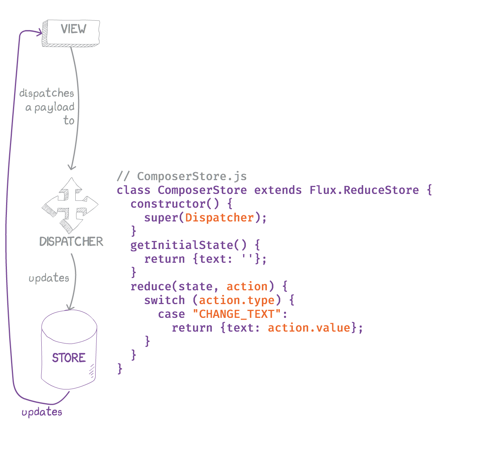
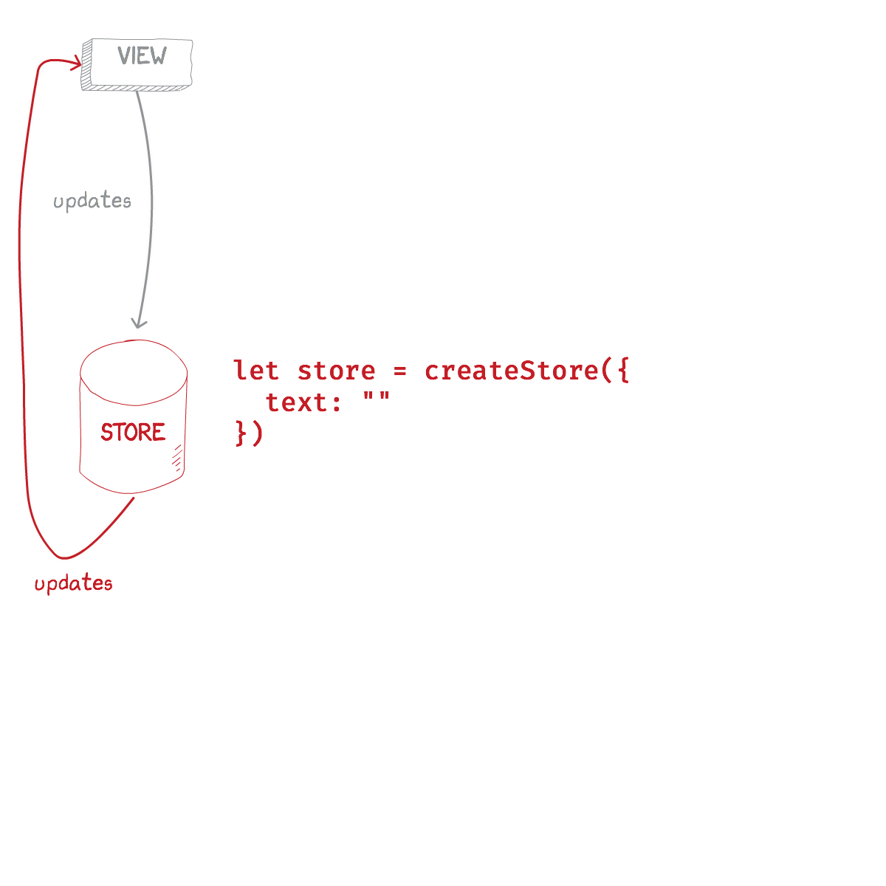
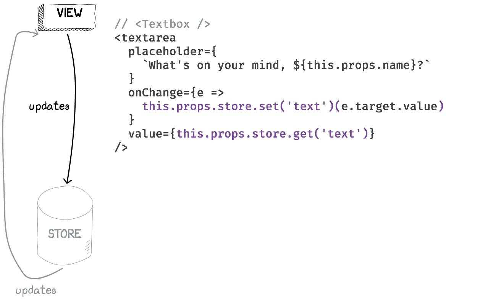

class: center, middle
# State Management on the Frontend
## By Boris Cherny
### @bcherny - github.com/bcherny
---
class: middle
# Plan
1. React refresher
2. Flux
3. Redux
4. Undux
---
class: center, middle
<legend>1. React refresher</legend>

---
class: center, middle
<legend>1. React refresher</legend>

---
class: center, middle
<legend>1. React refresher</legend>

---
class: center, middle
<legend>1. React refresher</legend>

---
class: center, middle
<legend>1. React refresher</legend>

---
class: center, middle
<legend>1. React refresher</legend>

---
class: center, middle
<legend>1. React refresher</legend>

```html
<Composer>
  <Editor>
    <Avatar />
    <Textbox />
  </Editor>
  <Sproutbar />
  <Button />
</Composer>
```
---
class: center, middle
<legend>1. React refresher</legend>

---
class: center, middle
<legend>1. React refresher</legend>

---
class: center, middle
<legend>1. React refresher</legend>

---
class: center, middle
<legend>1. React refresher</legend>

---
class: center, middle
<legend>1. React refresher</legend>

---
class: center, middle
<legend>1. React refresher</legend>

---
class: center, middle
<legend>1. React refresher</legend>

---
class: center, middle
<legend>1. React refresher</legend>

---
class: center, middle
<legend>1. React refresher</legend>

---
class: center, middle
<legend>1. React refresher</legend>

---
class: center, middle
<legend>1. React refresher</legend>

---
class: center, middle
<legend>1. React refresher</legend>

---
class: center, middle
<legend>1. React refresher</legend>

---
class: center, middle
<legend>1. React refresher</legend>

---
class: center, middle
<legend>1. React refresher</legend>

---
class: center, middle
<legend>1. React refresher</legend>

---
class: center, middle
<legend>1. React refresher</legend>

---
class: center, middle
<legend>1. React refresher</legend>

---
class: center, middle
<legend>1. React refresher</legend>

---
class: center, middle
<legend>1. React refresher</legend>
# 😵😵😵😵😵😵😵😵😵😵😵😵😵😵😵😵😵😵😵😵😵😵😵😵😵😵😵😵😵😵😵😵😵😵😵😵😵😵😵😵😵😵😵😵😵😵😵😵😵😵😵😵😵😵😵😵😵😵😵😵😵😵😵😵😵😵😵😵😵😵😵😵😵😵😵😵😵😵😵😵😵😵😵😵😵😵😵😵😵😵😵😵😵😵😵😵😵😵😵😵😵😵😵😵😵😵😵😵
---
class: center, middle
# Flux

---
class: center, middle
<legend>2. Flux</legend>

---
class: center, middle
<legend>2. Flux</legend>

---
class: center, middle
<legend>2. Flux</legend>

---
class: center, middle
<legend>2. Flux</legend>

---
class: center, middle
<legend>2. Flux</legend>

---
class: center, middle
<legend>2. Flux</legend>

---
class: center, middle
<legend>2. Flux</legend>

---
class: center, middle
<legend>2. Flux</legend>

---
class: center, middle
<legend>2. Flux</legend>

---
class: center, middle
<legend>2. Flux</legend>

---
class: center, middle
<legend>2. Flux</legend>

---
class: center, middle
<legend>2. Flux</legend>

---
class: center, middle
<legend>2. Flux</legend>
## Flux

---
class: center, middle
<legend>2. Flux</legend>

---
class: center, middle
<legend>2. Flux</legend>

---
class: center, middle
<legend>2. Flux</legend>

---
class: center, middle
<legend>2. Flux</legend>
## WHEW.

---
class: center, middle
<legend>2. Flux</legend>
# Let's scale it. 
---
class: center, middle
<legend>2. Flux</legend>

---
class: center, middle
<legend>2. Flux</legend>

---
<legend>2. Flux</legend>
## Flux
- Singleton <font color="orange">Dispatcher</font>
- Lots of <font color="red">Stores</font>
- Describe CUD operations with <font color="red">Actions</font>
- Stores take Actions → mutate their internal state → update the <font color="green">View</font>
---
class: center, middle

---
<legend>3. Redux</legend>
## Redux
- Singleton <font color="red">Store</font>
- Lots of <font color="magenta">Reducers</font>
- Describe CUD operations with <font color="red">Actions</font>
- Reducers take Actions → create a new state for the Store → update the <font color="green">View</font>

<small>
## Flux
- Singleton <font color="orange">Dispatcher</font>
- Lots of <font color="red">Stores</font>
- Describe CUD operations with <font color="red">Actions</font>
- Stores take Actions → mutate their internal state → update the <font color="green">View</font>

</small>
---
class: center, middle
<legend>3. Redux</legend>

---
class: center, middle
<legend>3. Redux</legend>

---
class: center, middle
<legend>3. Redux</legend>
## Redux

---
class: center, middle
<legend>3. Redux</legend>

---
class: center, middle
<legend>3. Redux</legend>

---
class: center, middle
<legend>3. Redux</legend>

---
class: center, middle
<legend>3. Redux</legend>

---
class: center, middle

---
class: center, middle
<legend>4. Undux</legend>

---
class: center, middle
<legend>4. Undux</legend>

---
class: center, middle
<legend>4. Undux</legend>

---
<legend>4. Undux</legend>
## Undux
- Lots of <font color="red">Stores</font>
- Use `.get(key)` and `.set(key)(value)` to read and write to them
- <font color="red">Store</font> updates → <font color="green">View</font> updates
- **Reactive effects**
---
<legend>4. Undux</legend>
```js
composerStore
  .on('text')
  .subscribe(text => {
    console.log('text changed!', text)
  })
```
---
<legend>4. Undux</legend>
```js
composerStore
  .on('text')
  .filter(text => text !== '')
  .subscribe(text => {
    console.log('text changed!', text)
  })
```
---
<legend>4. Undux</legend>
```js
composerStore
  .on('text')
  .filter(text => text !== '')
  .map(text => text.toLowerCase())
  .subscribe(text => {
    console.log('text changed!', text)
  })
```
---
<legend>4. Undux</legend>
```js
composerStore
  .on('text')
  .filter(text => text !== '')
  .map(text => text.toLowerCase())
  .throttle(200)
  .subscribe(text => {
    console.log('text changed!', text)
  })
```
---
class: center, middle
<legend>4. Undux</legend>

---
class: center, middle
<legend>4. Undux</legend>

---
<legend>4. Undux</legend>
## Undux: features
---
<legend>4. Undux</legend>
## Undux: features
## 🤭 No boilerplate
---
<legend>4. Undux</legend>
## Undux: features
## 🤭 No boilerplate
## 😯 100% TYPESAFE
---
<legend>4. Undux</legend>
## Undux: features
## 🤭 No boilerplate
## 😯 100% TYPESAFE
## 😱 Reactive effects
---
<legend>4. Undux</legend>
## Undux: features
## 🤭 No boilerplate
## 😯 100% TYPESAFE
## 😱 Reactive effects
## 🤯 Built in logger
---
class: center, middle
# Thanks!
-----------
## Learn more...
## <a href="fburl.com/undux">fburl.com/undux</a>
