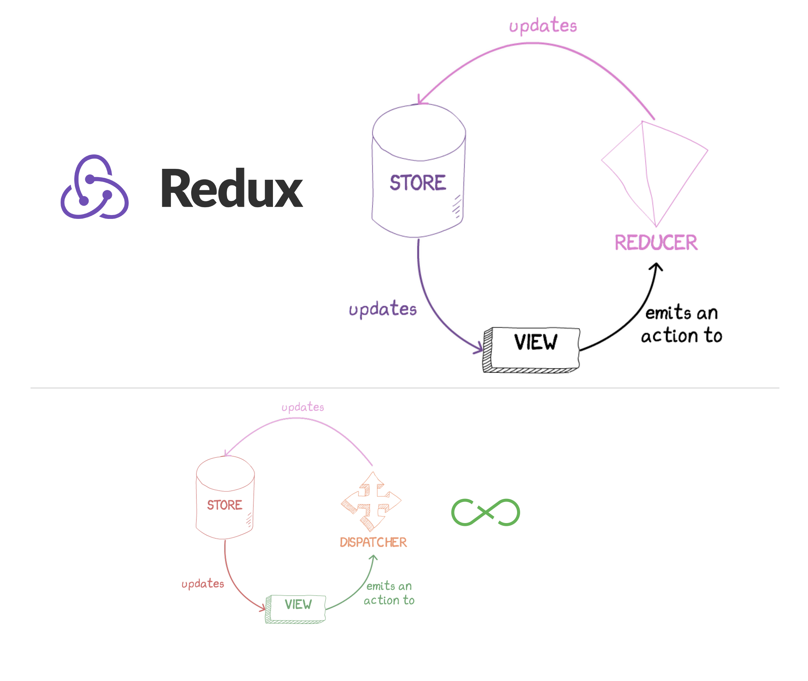

class: center, middle
# Web 300: UI State Management with React
---
class: middle
# Plan
1. React refresher
2. Local state
3. Flux
4. Redux
5. Undux
---
class: center, middle
<legend>1. React refresher</legend>


???
Let's start with a quick refresher on React.
---
class: center, middle
<legend>1. React refresher</legend>

---
class: center, middle
<legend>1. React refresher</legend>

---
class: center, middle
<legend>1. React refresher</legend>

---
class: center, middle
<legend>1. React refresher</legend>

---
class: center, middle
<legend>1. React refresher</legend>

---
class: center, middle
<legend>1. React refresher</legend>

```html
<Composer>
  <Editor>
    <Avatar />
    <Textbox />
  </Editor>
  <Sproutbar />
  <Button />
</Composer>
```
---
class: center, middle
<legend>1. React refresher</legend>

---
class: center, middle
<legend>1. React refresher</legend>

---
class: center, middle
<legend>1. React refresher</legend>

---
class: center, middle
<legend>1. React refresher</legend>

---
class: center, middle
<legend>1. React refresher</legend>

---
class: center, middle
<legend>1. React refresher</legend>

---
class: center, middle
<legend>1. React refresher</legend>

---
class: center, middle
<legend>1. React refresher</legend>

---
class: center, middle
<legend>1. React refresher</legend>

---
class: center, middle
<legend>1. React refresher</legend>

---
class: center, middle
<legend>1. React refresher</legend>

---
class: center, middle
<legend>1. React refresher</legend>

---
class: center, middle
<legend>1. React refresher</legend>

---
class: center, middle
# Local state
---
class: center, middle
<legend>2. Local state</legend>

---
class: center, middle
<legend>2. Local state</legend>

---
class: center, middle
<legend>2. Local state</legend>

---
class: center, middle
<legend>2. Local state</legend>

---
class: center, middle
<legend>2. Local state</legend>

---
class: center, middle
<legend>2. Local state</legend>

---
class: center, middle
<legend>2. Local state</legend>

---
class: center, middle
<legend>2. Local state</legend>
# 😵😵😵😵😵😵😵😵😵😵😵😵😵😵😵😵😵😵😵😵😵😵😵😵😵😵😵😵😵😵😵😵😵😵😵😵😵😵😵😵😵😵😵😵😵😵😵😵😵😵😵😵😵😵😵😵😵😵😵😵😵😵😵😵😵😵😵😵😵😵😵😵😵😵😵😵😵😵😵😵😵😵😵😵😵😵😵😵😵😵😵😵😵😵😵😵😵😵😵😵😵😵😵😵😵😵😵😵
---
class: center, middle
# Application state
---
class: center, middle
<legend>2. Flux</legend>

---
class: center, middle
<legend>2. Flux</legend>

---
class: center, middle
<legend>2. Flux</legend>

---
class: center, middle
<legend>2. Flux</legend>

---
class: center, middle
<legend>2. Flux</legend>

---
class: center, middle
<legend>2. Flux</legend>

---
class: center, middle
<legend>2. Flux</legend>

---
class: center, middle
<legend>2. Flux</legend>

---
class: center, middle
<legend>2. Flux</legend>

---
class: center, middle
<legend>2. Flux</legend>

---
class: center, middle
<legend>2. Flux</legend>

---
class: center, middle
<legend>2. Flux</legend>

---
class: center, middle
<legend>2. Flux</legend>


---
class: center, middle
<legend>2. Flux</legend>

---
class: center, middle
<legend>2. Flux</legend>

---
class: center, middle
<legend>2. Flux</legend>

---
class: center, middle
<legend>2. Flux</legend>
## WHEW.

---
class: center, middle
<legend>2. Flux</legend>
# Let's scale it. 
---
class: center, middle
<legend>2. Flux</legend>

---
class: center, middle
<legend>2. Flux</legend>

---
<legend>2. Flux</legend>
## Flux
- Singleton <font color="#ED692F">Dispatcher</font>
- Lots of <font color="#774896">Stores</font>
- Describe CUD operations with <font color="#ED692F">Actions</font>
- Stores take Actions → mutate their internal state → update the View
---
class: center, middle

---
<legend>3. Redux</legend>
## Redux
- Singleton <font color="#774896">Store</font>
- Lots of <font color="#E57ACF">Reducers</font>
- Describe CUD operations with <font color="#ED692F">Actions</font>
- Reducers take Actions → create a new state for the Store → update the View

<small>
## Flux
- Singleton <font color="#ED692F">Dispatcher</font>
- Lots of <font color="#774896">Stores</font>
- Describe CUD operations with <font color="#ED692F">Actions</font>
- Stores take Actions → mutate their internal state → update the <font color="green">View</font>

</small>
---
class: center, middle
<legend>3. Redux</legend>

---
class: center, middle
<legend>3. Redux</legend>

---
class: center, middle
<legend>3. Redux</legend>

---
class: center, middle
<legend>3. Redux</legend>

---
class: center, middle
<legend>3. Redux</legend>

---
class: center, middle
<legend>3. Redux</legend>

---
class: center, middle
<legend>3. Redux</legend>

---
class: center, middle

---
class: center, middle
<legend>4. Undux</legend>

---
class: center, middle
<legend>4. Undux</legend>

---
class: center, middle
<legend>4. Undux</legend>

---
<legend>4. Undux</legend>
## Undux
- No ~~<font color="#ED692F">dispatcher</font>, <font color="#E57ACF">reducer</font>, <font color="#ED692F">actions</font>~~
- Any number of <font color="#774896">Stores</font>
- Reactive effects (observe store fields)
- Store updates → View updates

<small>
## Flux
- Singleton <font color="#ED692F">Dispatcher</font>
- Lots of <font color="#774896">Stores</font>
- Describe CUD operations with <font color="#ED692F">Actions</font>
- Stores take Actions → mutate their internal state → update the <font color="green">View</font>

</small>
---
class: center, middle
<legend>4. Undux</legend>

---
class: center, middle
<legend>4. Undux</legend>

---
class: center, middle
# tl;dr
---
class: middle
<legend>5. tl;dr</legend>

| Library  | For application size | Type safety | Features
|-|-|-|-|
| **Flux** | Medium | Poor | Most code examples
| **Redux** | Medium | Poor | Single store, selectors
| **Undux** | Small-Medium | Excellent | Low boilerplate, reactive effects
| **Relay** | Medium | Poor | One API for local and remote state
| **Flux Data Plugins** | Large | Excellent | Code splitting, selectors

<br>
<small>
https://fburl.com/febible
</small>
---
class: middle
# Thanks!
-----------
## Learn more...
### <a href="https://fburl.com/learn-flux">fburl.com/learn-flux</a>
### <a href="https://fburl.com/learn-redux">fburl.com/learn-redux</a>
### <a href="https://fburl.com/learn-undux">fburl.com/learn-undux</a>
### <a href="https://fburl.com/learn-data-plugins">fburl.com/learn-data-plugins</a>
