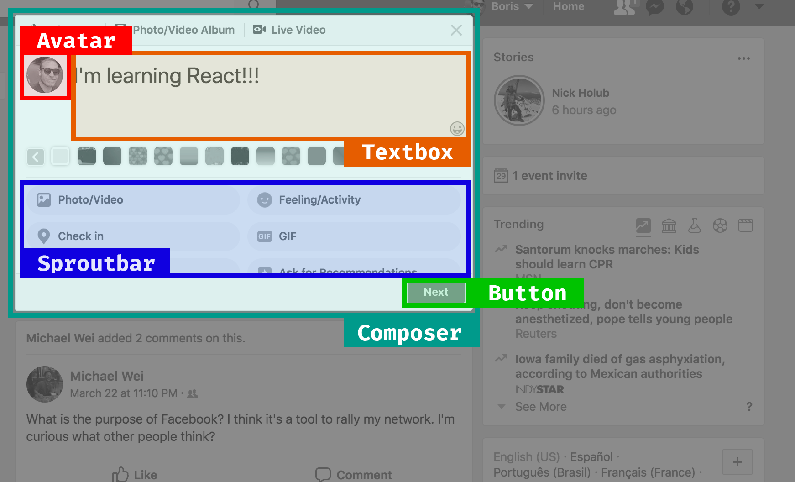

class: center, middle
# State Management on the Frontend
## By Boris Cherny
### @bcherny - github.com/bcherny
---
class: center, middle

---
class: center, middle

---
class: center, middle

---
class: center, middle

---
class: center, middle

---
class: center, middle

---
class: center, middle

---
class: center, middle

---
```jsx
class App extends React.Component {            // App.react.js
  render() { return <Composer /> }}

class Composer extends React.Component {       // Composer.react.js
  state = {
    text: '' }
  render() {
    return <Editor text={this.state.text}>
      <Avatar />
      <Textbox onChange={this.onChange} text={text} />
    </Editor>
    <Sproutbar />
    <Button isEnabled={this.state.text !== ''} />
  }
  onChange(text) {
    this.setState({ text }) }}

class Textbox extends React.Component          // Textbox.react.js
  render() {
    return <textarea
      onChange={this.props.onChange}
      value={this.props.text} /> }}
```