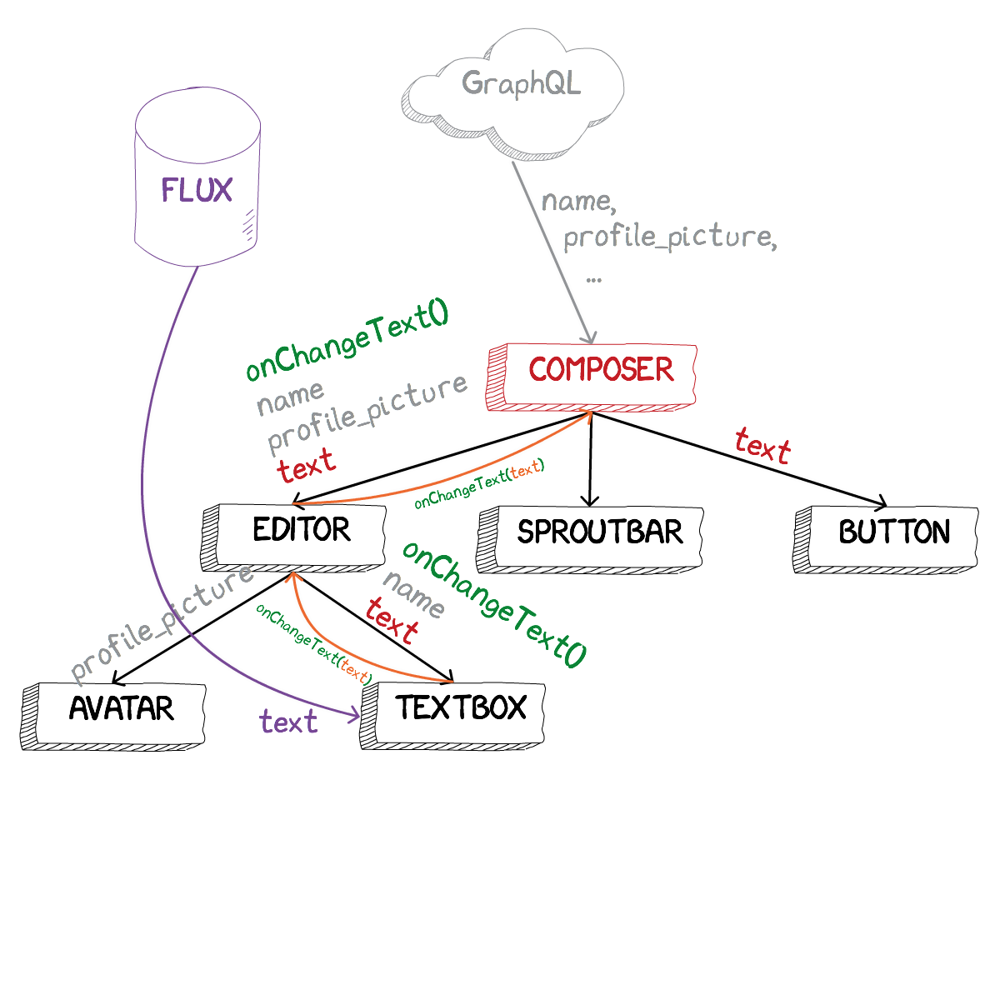
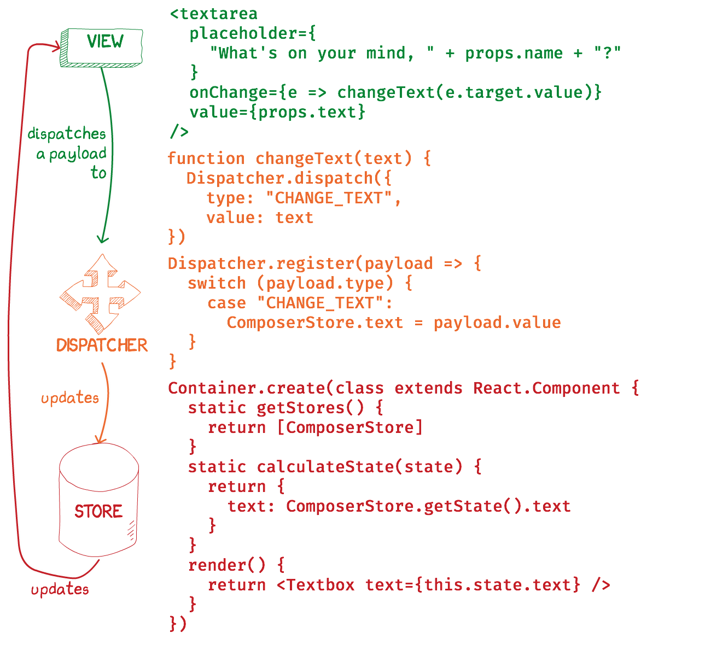

class: center, middle
# State Management on the Frontend
## By Boris Cherny
### @bcherny - github.com/bcherny
---
class: center, middle

---
class: center, middle

---
class: center, middle

---
class: center, middle

---
class: center, middle

---
class: center, middle

---
class: center, middle

```html
<Composer>
  <Editor>
    <Avatar />
    <Textbox />
  </Editor>
  <Sproutbar />
  <Button />
</Composer>
```
---
class: center, middle

---
class: center, middle

---
class: center, middle

---
class: center, middle

---
class: center, middle

---
class: center, middle

---
class: center, middle

---
class: center, middle

---
class: center, middle

---
class: center, middle

---
class: center, middle

---
class: center, middle

---
class: center, middle

---
class: center, middle

---
class: center, middle

---
class: center, middle

---
class: center, middle
# Flux
---
class: center, middle

---
class: center, middle

---
class: center, middle

---
class: center, middle

---
class: center, middle

---
class: center, middle

---
class: center, middle

---
class: center, middle

---
class: center, middle

---
class: center, middle

---
class: center, middle

---
class: center, middle

---
class: center, middle
## Flux

---
class: center, middle

---
class: center, middle
## WHEW.

---
class: center, middle
# Let's scale it. 
---
class: center, middle

---
class: center, middle

---
## Flux
- Singleton <font color="orange">Dispatcher</font>
- Lots of <font color="red">Stores</font>
- Describe CRUD operations with <font color="red">Actions</font>
- Stores take Actions → mutate their internal state → update the <font color="green">View</font>
---
class: center, middle
# Redux
---
## Redux
- Singleton <font color="red">Store</font>
- Lots of <font color="magenta">Reducers</font>
- Describe CRUD operations with <font color="red">Actions</font>
- Reducers take Actions → create a new state for the Store → update the <font color="green">View</font>

## Flux
- Singleton <font color="orange">Dispatcher</font>
- Lots of <font color="red">Stores</font>
- Describe CRUD operations with <font color="red">Actions</font>
- Stores take Actions → mutate their internal state → update the <font color="green">View</font>
---
class: center, middle

---
class: center, middle
## Redux

---
class: center, middle

---