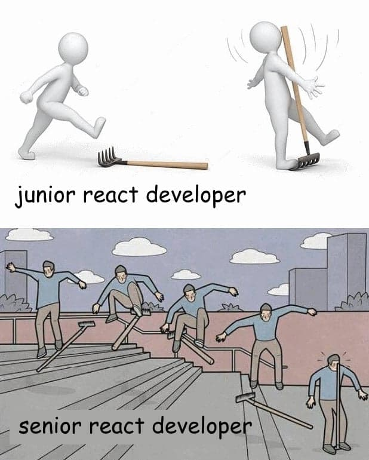
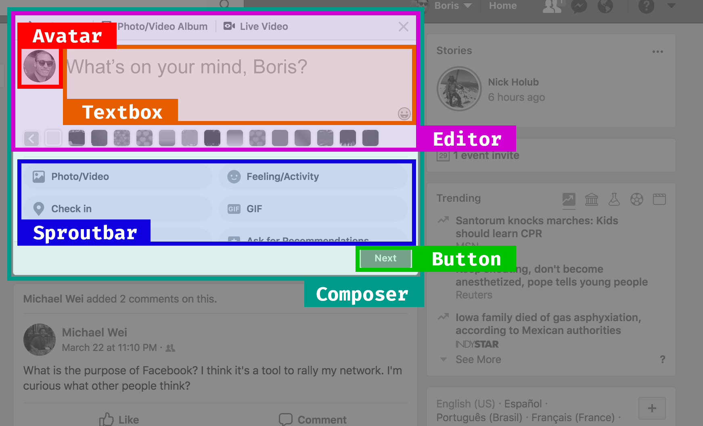

class: center, middle
# 
---
class: center, middle
# 
<h3 class='Subtitle'>⚡Dead simple state for ReactJS</h3>
## Boris Cherny
### github.com/bcherny
---
class: middle
# Plan
1. Problems
2. Solutions
3. Architecture
4. Usage
5. Flux & Redux, before & after
6. Reactivity
---
class: center, middle
## 1. Problems
### With ___ux
---
<legend>1. Problems</legend>
- Globs of boilerplate
  <br /><small>🐌Slows down engineering</small>
---
<legend>1. Problems</legend>
- Globs of boilerplate
  <br /><small>🐌Slows down engineering</small>
- Actions, creators, types, reducers, callers spread across lots of files
  <br /><small>🔎Makes it hard to trace code</small>
---
<legend>1. Problems</legend>
- Globs of boilerplate
  <br /><small>🐌Slows down engineering</small>
- Actions, creators, types, reducers, callers spread across lots of files
  <br /><small>🔎Makes it hard to trace code</small>
- Really hard to type safely
  <br /><small>🐛Causes bugs</small>
---
<legend>1. Problems</legend>
- Globs of boilerplate
  <br /><small>🐌Slows down engineering</small>
- Actions, creators, types, reducers, callers spread across lots of files
  <br /><small>🔎Makes it hard to trace code</small>
- Really hard to type safely
  <br /><small>🐛Causes bugs</small>
- <font color="#ff005a">Makes easy things hard!</font>
---
class: center, middle
## 2. Solutions
---
<legend>2. Solutions</legend>
- ~~<font color="#999">Globs of boilerplate</font>~~ Near-zero boilerplate
  <br /><small><font color="#999">~~🐌Slows down engineering~~</font> ⚡Enables rapid iteration</small>
- <font color="#999">Actions, creators, types, reducers, callers spread across lots of files</font>
  <br /><small><font color="#999">🔎Makes it hard to trace code</font></small>
- <font color="#999">Really hard to type safely</font>
  <br /><small><font color="#999">🐛Causes bugs</font></small>
- <font color="#999">Makes easy things hard!</font>
---
<legend>2. Solutions</legend>
- ~~<font color="#999">Globs of boilerplate</font>~~ Near-zero boilerplate
  <br /><small><font color="#999">~~🐌Slows down engineering~~</font> ⚡Enables rapid iteration</small>
- ~~<font color="#999">Actions, creators, types, reducers, callers spread across lots of files</font>~~ <br />Do everything right in your view
  <br /><small><font color="#999">~~🔎Makes it hard to trace code~~</font> 📍Colocates model updates with code</small>
- <font color="#999">Really hard to type safely</font>
  <br /><small><font color="#999">🐛Causes bugs</font></small>
- <font color="#999">Makes easy things hard!</font>
---
<legend>2. Solutions</legend>
- ~~<font color="#999">Globs of boilerplate</font>~~ Near-zero boilerplate
  <br /><small><font color="#999">~~🐌Slows down engineering~~</font> ⚡Enables rapid iteration</small>
- ~~<font color="#999">Actions, creators, types, reducers, callers spread across lots of files</font>~~ <br />Do everything right in your view
  <br /><small><font color="#999">~~🔎Makes it hard to trace code~~</font> 📍Colocates model updates with code</small>
- ~~<font color="#999">Really hard to type safely</font>~~ 100% typesafe
  <br /><small><font color="#999">~~🐛Causes bugs~~</font> 😃Prevents bugs</small>
- <font color="#999">Makes easy things hard!</font>
---
<legend>2. Solutions</legend>
- ~~<font color="#999">Globs of boilerplate</font>~~ Near-zero boilerplate
  <br /><small><font color="#999">~~🐌Slows down engineering~~</font> ⚡Enables rapid iteration</small>
- ~~<font color="#999">Actions, creators, types, reducers, callers spread across lots of files</font>~~ <br />Do everything right in your view
  <br /><small><font color="#999">~~🔎Makes it hard to trace code~~</font> 📍Colocates model updates with code</small>
- ~~<font color="#999">Really hard to type safely</font>~~ 100% typesafe
  <br /><small><font color="#999">~~🐛Causes bugs~~</font> 😃Prevents bugs</small>
- ~~<font color="#999">Makes easy things hard!</font>~~ <br /><font color="#006def" style="font-size:48px">Makes hard things easy.</font>
---
class: center, middle
## 3. Architecture
---
class: center, middle
<legend>3. Architecture</legend>

---
class: middle
<legend>3. Architecture</legend>

- `React.Component`
- Reads from the <font color="red">store</font>
- Writes to the <font color="red">store</font>
---
class: middle
<legend>3. Architecture</legend>

- `createConnectedStore()`
- Updated by the <font color="green">view</font>
- Re-renders the <font color="green">view</font>
---
class: middle
<legend>3. Architecture</legend>

- React to changes to specific fields
- Or, react to a set of fields
- A reactive way to listen to changes
---
class: center, middle
## 4. Usage
---
class: center, middle
<legend>4. Usage</legend>
### Let's build composer.
---
class: center, middle
<legend>4. Usage</legend>

---
class: center, middle
<legend>4. Usage</legend>
### Step 1: Create a store
---
class: center
<legend>4. Usage</legend>
```ts
// ComposerStore.ts
```
---
class: center
<legend>4. Usage</legend>
```ts
// ComposerStore.ts

*import {createConnectedStore} from 'undux'
```
---
class: center
<legend>4. Usage</legend>
```ts
// ComposerStore.ts

import {createConnectedStore} from 'undux'

*type State = {
* isNextEnabled: boolean,
* text: string
*}
```
---
class: center
<legend>4. Usage</legend>
```ts
// ComposerStore.ts

import {createConnectedStore} from 'undux'

type State = {
  isNextEnabled: boolean,
  text: string
}

*const initialState: State = {
* isNextEnabled: false,
* text: ''
*}
```
---
class: center
<legend>4. Usage</legend>
```ts
// ComposerStore.ts

import {createConnectedStore} from 'undux'

type State = {
  isNextEnabled: boolean,
  text: string
}

const initialState: State = {
  isNextEnabled: false,
  text: ''
}

*const {
* Container,
* withStore
*} = createConnectedStore(initialState)
```
---
class: center
<legend>4. Usage</legend>
```ts
// ComposerStore.ts

import {createConnectedStore} from 'undux'

type State = {
  isNextEnabled: boolean,
  text: string
}

const initialState: State = {
  isNextEnabled: false,
  text: ''
}

*export default createConnectedStore(initialState)
```
---
class: center
<legend>4. Usage</legend>
```ts
// ComposerStore.ts

*import {Store, createConnectedStore} from 'undux'

type State = {
  isNextEnabled: boolean,
  text: string
}

const initialState: State = {
  isNextEnabled: false,
  text: ''
}

export default createConnectedStore(initialState)

*export type StoreProps = {
* store: Store<State>
*}
```
---
class: center
<legend>4. Usage</legend>
```ts
// ComposerStore.ts

*import {Effects, Store, createConnectedStore} from 'undux'

type State = {
  isNextEnabled: boolean,
  text: string
}

const initialState: State = {
  isNextEnabled: false,
  text: ''
}

export default createConnectedStore(initialState)

export type StoreProps = {
  store: Store<State>
}

*export type StoreEffects = Effects<State>
```
---
class: center, middle
<legend>4. Usage</legend>
### Step 2: Connect the store
---
class: center, middle
<legend>4. Usage</legend>

---
class: center
<legend>4. Usage</legend>
```jsx
// Composer.tsx

class Composer extends React.Component {
  render() {
    return <>
      <Editor>
        <Avatar />
        <Textbox />
      </Editor>
      <Sproutbar />
      <Button />
    </>
  }
}
```
---
class: center
<legend>4. Usage</legend>
```jsx
// Composer.tsx

*import {StoreProps} from './ComposerStore'

*class Composer extends React.Component<StoreProps> {
  render() {
    return <>
      <Editor>
        <Avatar />
        <Textbox />
      </Editor>
      <Sproutbar />
      <Button />
    </>
  }
}
```
---
class: center
<legend>4. Usage</legend>
```jsx
// Composer.tsx

import {StoreProps} from './ComposerStore'

class Composer extends React.Component<StoreProps> {
  render() {
*   const {store} = this.props
    return <>
      <Editor>
        <Avatar />
*       <Textbox value={store.get('text')} />
      </Editor>
      <Sproutbar />
      <Button />
    </>
  }
}
```
---
class: center
<legend>4. Usage</legend>
```jsx
// Composer.tsx

import {StoreProps} from './ComposerStore'

class Composer extends React.Component<StoreProps> {
  render() {
    const {store} = this.props
    return <>
      <Editor>
        <Avatar />
        <Textbox value={store.get('text')}
*                onChange={value =>
*                  store.set('text')(value)
*                } />
      </Editor>
      <Sproutbar />
      <Button />
    </>
  }
}
```
---
class: center
<legend>4. Usage</legend>
```jsx
// Composer.tsx

import {StoreProps} from './ComposerStore'

class Composer extends React.Component<StoreProps> {
  render() {
    const {store} = this.props
    return <>
      <Editor>
        <Avatar />
        <Textbox value={store.get('text')}
*                onChange={store.set('text')} />
      </Editor>
      <Sproutbar />
      <Button />
    </>
  }
}
```
---
class: center
<legend>4. Usage</legend>
```jsx
// Composer.tsx

import {StoreProps} from './ComposerStore'

class Composer extends React.Component<StoreProps> {
  render() {
    const {store} = this.props
    return <>
      <Editor>
        <Avatar />
        <Textbox value={store.get('text')}
                 onChange={store.set('text')} />
      </Editor>
      <Sproutbar />
*     <Button disabled={!store.get('isNextEnabled')} />
    </>
  }
}
```
---
class: center
<legend>4. Usage</legend>
```jsx
// Composer.tsx

*import ComposerStore, {StoreProps} from './ComposerStore'

class Composer extends React.Component<StoreProps> {
  render() {
    const {store} = this.props
    return <>
      <Editor>
        <Avatar />
        <Textbox value={store.get('text')}
                 onChange={store.set('text')} />
      </Editor>
      <Sproutbar />
      <Button disabled={!store.get('isNextEnabled')} />
    </>
  }
}

*export default ComposerStore.withStore(Composer)
```
---
class: center, middle
<legend>4. Usage</legend>
### ✨ Step 3: Effects ✨
---
class: center
<legend>4. Usage</legend>
```jsx
// ComposerEffects.ts
```
---
class: center
<legend>4. Usage</legend>
```jsx
// ComposerEffects.ts

*import {StoreEffects} from './ComposerStore'
```
---
class: center
<legend>4. Usage</legend>
```jsx
// ComposerEffects.ts

import {StoreEffects} from './ComposerStore'

*export const withEffects: StoreEffects = store => {
*
*}
```
---
class: center
<legend>4. Usage</legend>
```jsx
// ComposerEffects.ts

import {StoreEffects} from './ComposerStore'

export const withEffects: StoreEffects = store => {
* store
*   .on('text')
}
```
---
class: center
<legend>4. Usage</legend>
```jsx
// ComposerEffects.ts

import {StoreEffects} from './ComposerStore'

export const withEffects: StoreEffects = store => {
  store
    .on('text')
*   .subscribe(text => {
*
*   })
}
```
---
class: center
<legend>4. Usage</legend>
```jsx
// ComposerEffects.ts

import {StoreEffects} from './ComposerStore'

export const withEffects: StoreEffects = store => {
  store
    .on('text')
    .subscribe(text => {
*     if (text === '') {
*       store.set('isNextEnabled')(false)
*     } else {
*       store.set('isNextEnabled')(true)
*     }
    })
}
```
---
class: center
<legend>4. Usage</legend>
```jsx
// ComposerEffects.ts

import {StoreEffects} from './ComposerStore'

export const withEffects: StoreEffects = store => {
  store
    .on('text')
    .subscribe(text => {
      if (text === '') {
        store.set('isNextEnabled')(false)
      } else {
        store.set('isNextEnabled')(true)
      }
    })
* return store
}
```
---
class: center
<legend>4. Usage</legend>
<div style='margin-top: -30px'></div>
```jsx
// ComposerStore.ts

import {Effects, Store, createConnectedStore} from 'undux'

type State = {
  isNextEnabled: boolean,
  text: string
}

const initialState: State = {
  isNextEnabled: false,
  text: ''
}

export default createConnectedStore(initialState)

export type StoreProps = {
  store: Store<State>
}

export type StoreEffects = Effects<State>
```
---
class: center
<legend>4. Usage</legend>
<div style='margin-top: -30px'></div>
```jsx
// ComposerStore.ts

import {Effects, Store, createConnectedStore} from 'undux'
*import {withEffects} from './ComposerEffects'

type State = {
  isNextEnabled: boolean,
  text: string
}

const initialState: State = {
  isNextEnabled: false,
  text: ''
}

*export default createConnectedStore(
* initialState,
* withEffects
*)

export type StoreProps = {
  store: Store<State>
}

export type StoreEffects = Effects<State>
```
---
class: center, middle
<legend>4. Usage</legend>
### Step 4: Wrap your app
---
class: center
<legend>4. Usage</legend>
```jsx
// App.tsx

*import Composer from './Composer'

*export function App() {
* return <Composer />
*}
```
---
class: center
<legend>4. Usage</legend>
```jsx
// App.tsx

import Composer from './Composer'
*import ComposerStore from './ComposerStore'

export function App() {
  return <Composer />
}
```
---
class: center
<legend>4. Usage</legend>
```jsx
// App.tsx

import Composer from './Composer'
import ComposerStore from './ComposerStore'

export function App() {
* return <ComposerStore.Container>
    <Composer />
* </ComposerStore.Container>
}
```
---
class: center, middle
<legend>4. Usage</legend>
### <font color="#006def" style="font-size:48px">Done.</font>
---
class: center, middle
## 5. Flux & Redux, <br />before & after
---
class: center, middle
<legend>5. <u>Flux</u> & Redux, before & after</legend>
### Flux
---
class: center, middle
<legend>5. <u>Flux</u> & Redux, before & after</legend>

---
class: center, middle
<legend>5. <u>Flux</u> & Redux, before & after</legend>

---
class: center, middle
<legend>5. <u>Flux</u> & Redux, before & after</legend>

---
class: center, middle
<legend>5. <u>Flux</u> & Redux, before & after</legend>

---
class: center, middle
<legend>5. <u>Flux</u> & Redux, before & after</legend>

---
class: center, middle
<legend>5. <u>Flux</u> & Redux, before & after</legend>

---
class: center, middle
<legend>5. <u>Flux</u> & Redux, before & after</legend>

---
class: center, middle
<legend>5. <u>Flux</u> & Redux, before & after</legend>

---
class: center, middle
<legend>5. <u>Flux</u> & Redux, before & after</legend>

---
class: center, middle
<legend>5. Flux & <u>Redux</u>, before & after</legend>
### Redux
---
class: center, middle
<legend>5. Flux & <u>Redux</u>, before & after</legend>

---
class: center, middle
<legend>5. Flux & <u>Redux</u>, before & after</legend>

---
class: center, middle
<legend>5. Flux & <u>Redux</u>, before & after</legend>

---
class: center, middle
<legend>5. Flux & <u>Redux</u>, before & after</legend>

---
class: center, middle
<legend>5. Flux & <u>Redux</u>, before & after</legend>

---
class: center, middle
<legend>5. Flux & <u>Redux</u>, before & after</legend>

---
class: center, middle
## 6. Reactivity
---
class: center, middle
<legend>6. Reactivity</legend>
### For example:<br />Let's add a logger to composer.
---
<legend>6. Reactivity</legend>
```js
export const withEffects: StoreEffects = store => {
  store
    .on('text')
    .subscribe(text => {
      if (text === '') {
        store.set('isNextEnabled')(false)
      } else {
        store.set('isNextEnabled')(true)
      }
    })
  return store
}
```
---
<legend>6. Reactivity</legend>
```js
export const withEffects: StoreEffects = store => {
  store
    .on('text')
    .subscribe(text => {
      if (text === '') {
        store.set('isNextEnabled')(false)
      } else {
        store.set('isNextEnabled')(true)
      }
    })
*
* store
*   .on('text')
*   .subscribe(text =>
*
*   )

  return store
}
```
---
<legend>6. Reactivity</legend>
```js
export const withEffects: StoreEffects = store => {
  // ...
*
* store
*   .on('text')
*   .subscribe(text =>
*
*   )

  return store
}
```
---
<legend>6. Reactivity</legend>
```js
*import ReactGA from 'react-ga'

export const withEffects: StoreEffects = store => {
  // ...

  store
    .on('text')
    .subscribe(text =>
*      ReactGA.event({
*        category: 'User',
*        action: 'Typed text into composer',
*        label: text
*      })
    )
  return store
}
```
---
<legend>6. Reactivity</legend>
```js
import ReactGA from 'react-ga'
*import {debounceTime} from 'rxjs/operators'

export const withEffects: StoreEffects = store => {
  // ...

  store
    .on('text')
*   .pipe(
*     debounceTime(100)
*   )
    .subscribe(text =>
      ReactGA.event({
        category: 'User',
        action: 'Typed text into composer',
        label: text
      })
    )
  return store
}
```
---
<legend>6. Reactivity</legend>
```js
import ReactGA from 'react-ga'
*import {debounceTime, filter} from 'rxjs/operators'

export const withEffects: StoreEffects = store => {
  // ...

  store
    .on('text')
    .pipe(
*     filter(text => text !== ''),
      debounceTime(100)
    )
    .subscribe(text =>
      ReactGA.event({
        category: 'User',
        action: 'Typed text into composer',
        label: text
      })
    )
  return store
}
```
---
<legend>6. Reactivity</legend>
```js
import ReactGA from 'react-ga'
*import {debounceTime, filter, map} from 'rxjs/operators'

export const withEffects: StoreEffects = store => {
  // ...

  store
    .on('text')
    .pipe(
      filter(text => text !== ''),
*     map(text => text.toLowerCase()),
      debounceTime(100)
    )
    .subscribe(text =>
      ReactGA.event({
        category: 'User',
        action: 'Typed text into composer',
        label: text
      })
    )
  return store
}
```
---
class: center, middle
# Thanks!
## Learn more: <font color="#006def">undux.org</font>
# &nbsp;
### Boris Cherny
### github.com/bcherny
---
class: center
<legend>4. Usage</legend>
```jsx
class Composer extends React.Component<StoreProps> {
  render() {
    const {store} = this.props
    return <>
      <Editor>
        <Avatar />
        <Textbox value={store.get('text')}
                 onChange={store.set('text')} />
      </Editor>
      <Sproutbar />
      <Button disabled={!store.get('isNextEnabled')} />
    </>
  }
}
```
---
class: center
<legend>4. Usage</legend>
```jsx
class Composer extends React.Component<StoreProps> {
  render() {
    const {store} = this.props
    return <>
      <Editor>
        <Avatar />
        <Textbox value={store.get('text')}
*                onChange={text =>
*                  store.set('text')(sanitize(text))
*                } />
      </Editor>
      <Sproutbar />
      <Button disabled={!store.get('isNextEnabled')} />
    </>
  }
}

*function sanitize(text: string) {
* return text.replace(EVIL_REGEX, '')
*}
```
---
class: center
<legend>4. Usage</legend>
```jsx
*import {flow} from 'lodash'

class Composer extends React.Component<StoreProps> {
  render() {
    const {store} = this.props
    return <>
      <Editor>
        <Avatar />
        <Textbox value={store.get('text')}
*                onChange={flow(sanitize, store.set('text'))} />
      </Editor>
      <Sproutbar />
      <Button disabled={!store.get('isNextEnabled')} />
    </>
  }
}

function sanitize(text: string) {
  return text.replace(EVIL_REGEX, '')
}
```
