class: center, middle
# 
<h3 class='Subtitle'>⚡Dead simple state management for ReactJS</h3>
## By Boris Cherny
### @bcherny - github.com/bcherny
---
class: middle
# Plan
1. Problems
2. Solutions
3. Architecture
4. Usage
5. Flux & Redux, before & after
6. Reactivity
---
class: center, middle
## 1. Problems
---
<legend>1. Problems</legend>
- Globs of boilerplate
  <br /><small>🐌Slows down engineering</small>
---
<legend>1. Problems</legend>
- Globs of boilerplate
  <br /><small>🐌Slows down engineering</small>
- Really hard to type safely
  <br /><small>🐛Causes bugs</small>
---
<legend>1. Problems</legend>
- Globs of boilerplate
  <br /><small>🐌Slows down engineering</small>
- Really hard to type safely
  <br /><small>🐛Causes bugs</small>
- Actions, creators, types, reducers, callers spread across lots of files
  <br /><small>🔎Makes it hard to trace code</small>
---
<legend>1. Problems</legend>
- Globs of boilerplate
  <br /><small>🐌Slows down engineering</small>
- Really hard to type safely
  <br /><small>🐛Causes bugs</small>
- Actions, creators, types, reducers, callers spread across lots of files
  <br /><small>🔎Makes it hard to trace code</small>
- <font color="#ff005a">Makes easy things hard!</font>
---
class: center, middle
## 2. Solutions
---
<legend>2. Solutions</legend>
- ~~<font color="#999">Globs of boilerplate</font>~~ Near-zero boilerplate
  <br /><small><font color="#999">~~🐌Slows down engineering~~</font> ⚡Enables rapid iteration</small>
- <font color="#999">Really hard to type safely</font>
  <br /><small><font color="#999">🐛Causes bugs</font></small>
- <font color="#999">Actions, creators, types, reducers, callers spread across lots of files</font>
  <br /><small><font color="#999">🔎Makes it hard to trace code</font></small>
- <font color="#999">Makes easy things hard!</font>
---
<legend>2. Solutions</legend>
- ~~<font color="#999">Globs of boilerplate</font>~~ Near-zero boilerplate
  <br /><small><font color="#999">~~🐌Slows down engineering~~</font> ⚡Enables rapid iteration</small>
- ~~<font color="#999">Really hard to type safely</font>~~ 100% typesafe
  <br /><small><font color="#999">~~🐛Causes bugs~~</font> 😃Prevents bugs</small>
- <font color="#999">Actions, creators, types, reducers, callers spread across lots of files</font>
  <br /><small><font color="#999">🔎Makes it hard to trace code</font></small>
- <font color="#999">Makes easy things hard!</font>
---
<legend>2. Solutions</legend>
- ~~<font color="#999">Globs of boilerplate</font>~~ Near-zero boilerplate
  <br /><small><font color="#999">~~🐌Slows down engineering~~</font> ⚡Enables rapid iteration</small>
- ~~<font color="#999">Really hard to type safely</font>~~ 100% typesafe
  <br /><small><font color="#999">~~🐛Causes bugs~~</font> 😃Prevents bugs</small>
- ~~<font color="#999">Actions, creators, types, reducers, callers spread across lots of files</font>~~ <br />Do everything right in your view
  <br /><small><font color="#999">~~🔎Makes it hard to trace code~~</font> 📍Colocates model updates with code</small>
- <font color="#999">Makes easy things hard!</font>
---
<legend>2. Solutions</legend>
- ~~<font color="#999">Globs of boilerplate</font>~~ Near-zero boilerplate
  <br /><small><font color="#999">~~🐌Slows down engineering~~</font> ⚡Enables rapid iteration</small>
- ~~<font color="#999">Really hard to type safely</font>~~ 100% typesafe
  <br /><small><font color="#999">~~🐛Causes bugs~~</font> 😃Prevents bugs</small>
- ~~<font color="#999">Actions, creators, types, reducers, callers spread across lots of files</font>~~ <br />Do everything right in your view
  <br /><small><font color="#999">~~🔎Makes it hard to trace code~~</font> 📍Colocates model updates with code</small>
- ~~<font color="#999">Makes easy things hard!</font>~~ <br /><font color="#006def" style="font-size:48px">Makes hard things easy.</font>
---
class: center, middle
## 3. Architecture
---
class: center, middle
<legend>3. Architecture</legend>
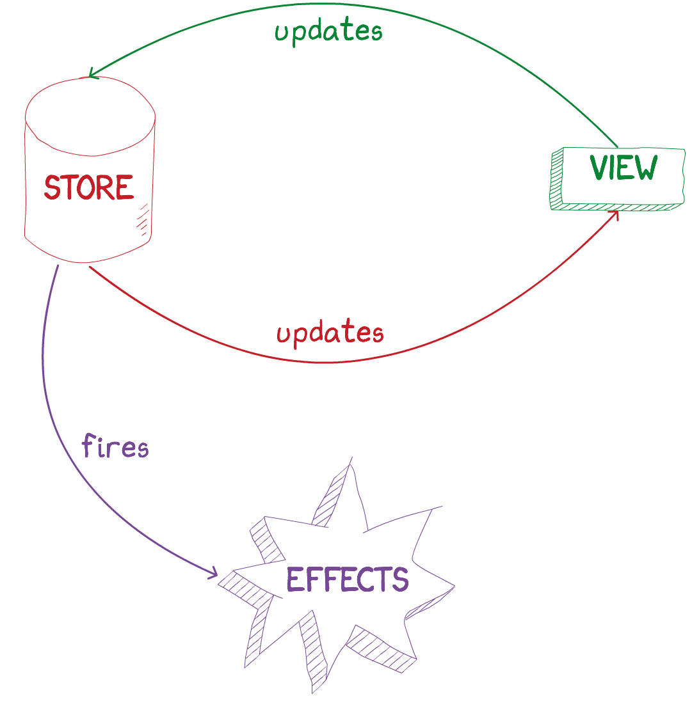
---
class: middle
<legend>3. Architecture</legend>

- `React.Component`
- Reads from the <font color="red">store</font>
- Writes to the <font color="red">store</font>
---
class: middle
<legend>3. Architecture</legend>

- `createStore()`
- Updated by the <font color="green">view</font>
- Re-renders the <font color="green">view</font>
---
class: middle
<legend>3. Architecture</legend>

- React to changes to specific fields
- Or, react to a set of fields
- A reactive way to listen to changes
---
class: center, middle
## 4. Usage
---
class: center, middle
<legend>4. Usage</legend>
### Let's build composer.
---
class: center, middle
<legend>4. Usage</legend>
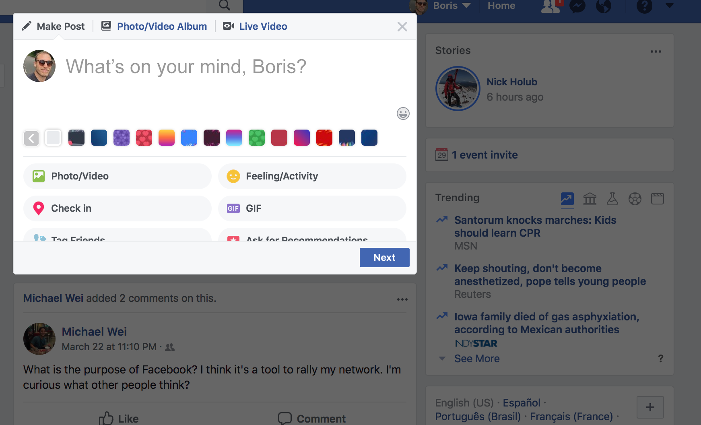
---
class: center, middle
<legend>4. Usage</legend>
### Step 1: Create a store
---
class: center
<legend>4. Usage</legend>
```ts
// composerStore.js
```
---
class: center
<legend>4. Usage</legend>
```ts
// composerStore.js

*const { createStore } = require('undux')
```
---
class: center
<legend>4. Usage</legend>
```ts
// composerStore.js

const { createStore } = require('undux')

*type State = {
* isNextEnabled: boolean,
* text: string
*}
```
---
class: center
<legend>4. Usage</legend>
```ts
// composerStore.js

const { createStore } = require('undux')

type State = {
  isNextEnabled: boolean,
  text: string
}

*const initialState: State = {
* isNextEnabled: false,
* text: ''
*}
```
---
class: center
<legend>4. Usage</legend>
```ts
// composerStore.js

const { createStore } = require('undux')

type State = {
  isNextEnabled: boolean,
  text: string
}

const initialState: State = {
  isNextEnabled: false,
  text: ''
}

*const store = createStore(initialState)
```
---
class: center
<legend>4. Usage</legend>
```ts
// composerStore.js

*const {connect, createStore} = require('undux')

type State = {
  isNextEnabled: boolean,
  text: string
}

const initialState: State = {
  isNextEnabled: false,
  text: ''
}

const store = createStore(initialState)

*module.exports.withStore = connect(store)
```
---
class: center
<legend>4. Usage</legend>
```ts
// composerStore.js

const {connect, createStore} = require('undux')

type State = {
  isNextEnabled: boolean,
  text: string
}

const initialState: State = {
  isNextEnabled: false,
  text: ''
}

const store = createStore(initialState)

module.exports.withStore = connect(store)

*export type StoreProps = {
*  store: typeof store
*}
```
---
class: center, middle
<legend>4. Usage</legend>
### Step 2: Connect the store
---
class: center, middle
<legend>4. Usage</legend>
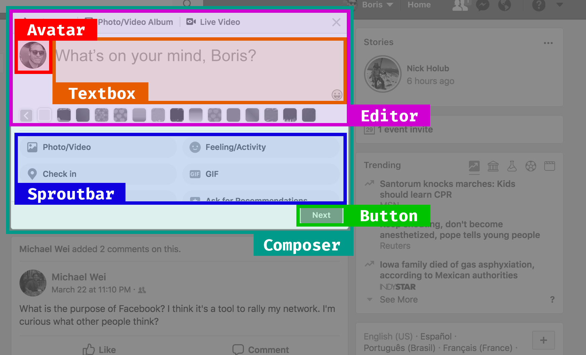
---
class: center
<legend>4. Usage</legend>
```jsx
// composer.react.js

class Composer extends React.Component {
  render() {
    return <div>
      <Editor>
        <Avatar />
        <Textbox />
      </Editor>
      <Sproutbar />
      <Button />
    </div>
  }
}
```
---
class: center
<legend>4. Usage</legend>
```jsx
// composer.react.js
*const {withStore} = require('composerStore')

*const Composer = withStore(
  class Composer extends React.Component {
    render() {
      return <div>
        <Editor>
          <Avatar />
          <Textbox />
        </Editor>
        <Sproutbar />
        <Button />
      </div>
    }
  }
*)
```
---
class: center
<legend>4. Usage</legend>
```jsx
// composer.react.js
*const {StoreProps, withStore} = require('composerStore')

const Composer = withStore(
* class Composer extends React.Component<StoreProps> {
    render() {
      return <div>
        <Editor>
          <Avatar />
          <Textbox />
        </Editor>
        <Sproutbar />
        <Button />
      </div>
    }
  }
)
```
---
class: center
<legend>4. Usage</legend>
```jsx
// composer.react.js
const {StoreProps, withStore} = require('composerStore')

const Composer = withStore(
  class Composer extends React.Component<StoreProps> {
    render() {
*     const {store} = this.props
      return <div>
        <Editor>
          <Avatar />
*         <Textbox value={store.get('text')} />
        </Editor>
        <Sproutbar />
        <Button />
      </div>
    }
  }
)
```
---
class: center
<legend>4. Usage</legend>
```jsx
// composer.react.js
const {StoreProps, withStore} = require('composerStore')

const Composer = withStore(
  class Composer extends React.Component<StoreProps> {
    render() {
      const {store} = this.props
      return <div>
        <Editor>
          <Avatar />
          <Textbox value={store.get('text')}
*                  onChange={value =>
*                    store.set('text')(value)
*                  } />
        </Editor>
        <Sproutbar />
        <Button />
      </div>
    }
  }
)
```
---
class: center
<legend>4. Usage</legend>
```jsx
// composer.react.js
const {StoreProps, withStore} = require('composerStore')

const Composer = withStore(
  class Composer extends React.Component<StoreProps> {
    render() {
      const {store} = this.props
      return <div>
        <Editor>
          <Avatar />
          <Textbox value={store.get('text')}
*                  onChange={store.set('text')} />
        </Editor>
        <Sproutbar />
        <Button />
      </div>
    }
  }
)
```
---
class: center
<legend>4. Usage</legend>
```jsx
// composer.react.js
const {StoreProps, withStore} = require('composerStore')

const Composer = withStore(
  class Composer extends React.Component<StoreProps> {
    render() {
      const {store} = this.props
      return <div>
        <Editor>
          <Avatar />
          <Textbox value={store.get('text')}
                   onChange={store.set('text')} />
        </Editor>
        <Sproutbar />
*       <Button disabled={!store.get('isNextEnabled')} />
      </div>
    }
  }
)
```
---
class: center, middle
<legend>4. Usage</legend>
### ✨ Step 3: Effects ✨
---
class: center
<legend>4. Usage</legend>
```jsx
// composerEffects.js
```
---
class: center
<legend>4. Usage</legend>
```jsx
// composerEffects.js

*import type {Plugin} from 'undux'
*import type {State} from 'composerStore'
```
---
class: center
<legend>4. Usage</legend>
```jsx
// composerEffects.js

import type {Plugin} from 'undux'
import type {State} from 'composerStore'

*const withEffects: Plugin<State> = store => {
*
*}
```
---
class: center
<legend>4. Usage</legend>
```jsx
// composerEffects.js

import type {Plugin} from 'undux'
import type {State} from 'composerStore'

const withEffects: Plugin<State> = store => {
* store
*   .on('text')
}
```
---
class: center
<legend>4. Usage</legend>
```jsx
// composerEffects.js

import type {Plugin} from 'undux'
import type {State} from 'composerStore'

const withEffects: Plugin<State> = store => {
  store
    .on('text')
*   .subscribe(text => {
*
*   })
}
```
---
class: center
<legend>4. Usage</legend>
```jsx
// composerEffects.js

import type {Plugin} from 'undux'
import type {State} from 'composerStore'

const withEffects: Plugin<State> = store => {
  store
    .on('text')
    .subscribe(text => {
*     if (text === '') {
*       store.set('isNextEnabled')(false)
*     } else {
*       store.set('isNextEnabled')(true)
*     }
    })
}
```
---
class: center
<legend>4. Usage</legend>
```jsx
// composerEffects.js

import type {Plugin} from 'undux'
import type {State} from 'composerStore'

const withEffects: Plugin<State> = store => {
  store
    .on('text')
    .subscribe(text => {
      if (text === '') {
        store.set('isNextEnabled')(false)
      } else {
        store.set('isNextEnabled')(true)
      }
    })
* return store
}
```
---
class: center
<legend>4. Usage</legend>
```jsx
// composerEffects.js

import type {Plugin} from 'undux'
import type {State} from 'composerStore'

const withEffects: Plugin<State> = store => {
  store
    .on('text')
    .subscribe(text => {
      if (text === '') {
        store.set('isNextEnabled')(false)
      } else {
        store.set('isNextEnabled')(true)
      }
    })
  return store
}

*module.exports.withEffects = withEffects
```
---
class: center
<legend>4. Usage</legend>
```jsx
// composerStore.js

const {connect, createStore} = require('undux')

type State = {
  isNextEnabled: boolean,
  text: string
}

const initialState: State = {
  isNextEnabled: false,
  text: ''
}

const store = createStore(initialState)

module.exports.withStore = connect(store)

export type StoreProps = {
  store: typeof store
}
```
---
class: center
<legend>4. Usage</legend>
```jsx
// composerStore.js

const {connect, createStore} = require('undux')

*export type State = {
  isNextEnabled: boolean,
  text: string
}

const initialState: State = {
  isNextEnabled: false,
  text: ''
}

const store = createStore(initialState)

module.exports.withStore = connect(store)

export type StoreProps = {
  store: typeof store
}
```
---
class: center
<legend>4. Usage</legend>
```jsx
// composerStore.js

const {connect, createStore} = require('undux')
*const {withEffects} = require('composerEffects')

export type State = {
  isNextEnabled: boolean,
  text: string
}

const initialState: State = {
  isNextEnabled: false,
  text: ''
}

*const store = withEffects(createStore(initialState))

module.exports.withStore = connect(store)

export type StoreProps = {
  store: typeof store
}
```
---
class: center, middle
<legend>4. Usage</legend>
### <font color="#006def" style="font-size:48px">Done.</font>
---
class: center, middle
<legend>4. Usage</legend>
<video controls="true" src="images/nuclide-template.mov" width="100%" />
---
class: center, middle
## 5. Flux & Redux, <br />before & after
---
class: center, middle
<legend>5. <u>Flux</u> & Redux, before & after</legend>
### Flux
---
class: center, middle
<legend>5. <u>Flux</u> & Redux, before & after</legend>
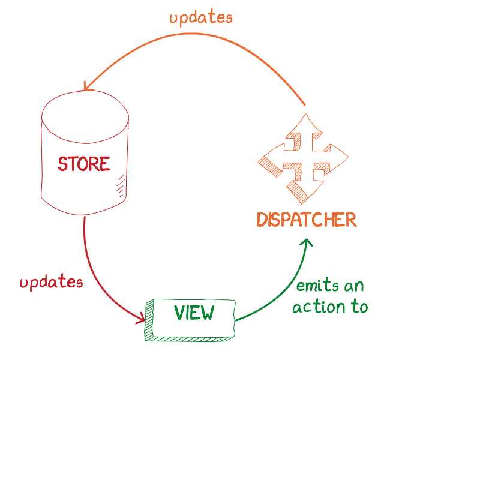
---
class: center, middle
<legend>5. <u>Flux</u> & Redux, before & after</legend>
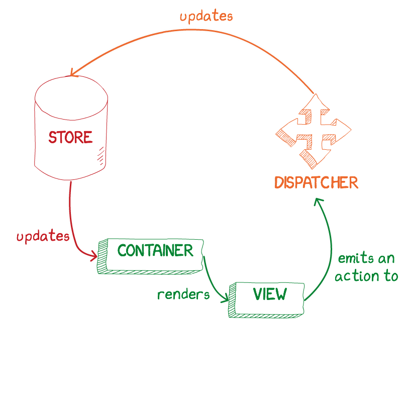
---
class: center, middle
<legend>5. <u>Flux</u> & Redux, before & after</legend>
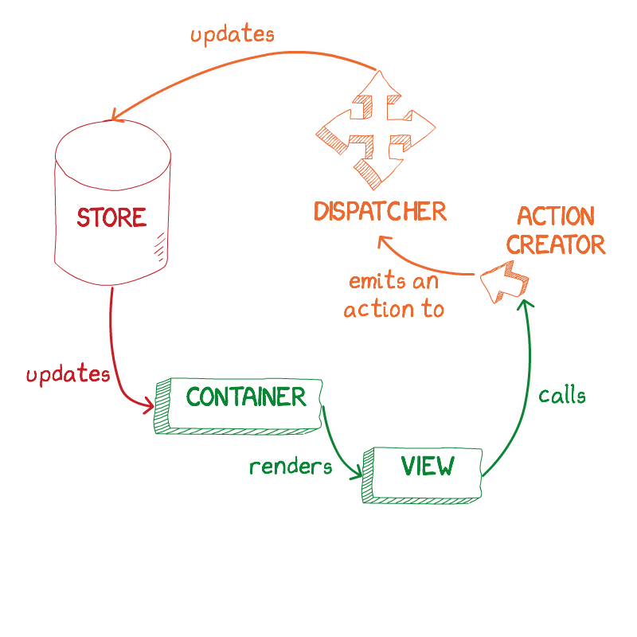
---
class: center, middle
<legend>5. <u>Flux</u> & Redux, before & after</legend>
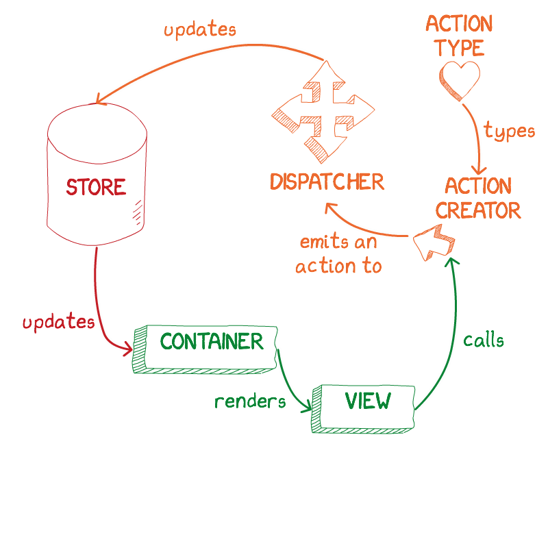
---
class: center, middle
<legend>5. <u>Flux</u> & Redux, before & after</legend>
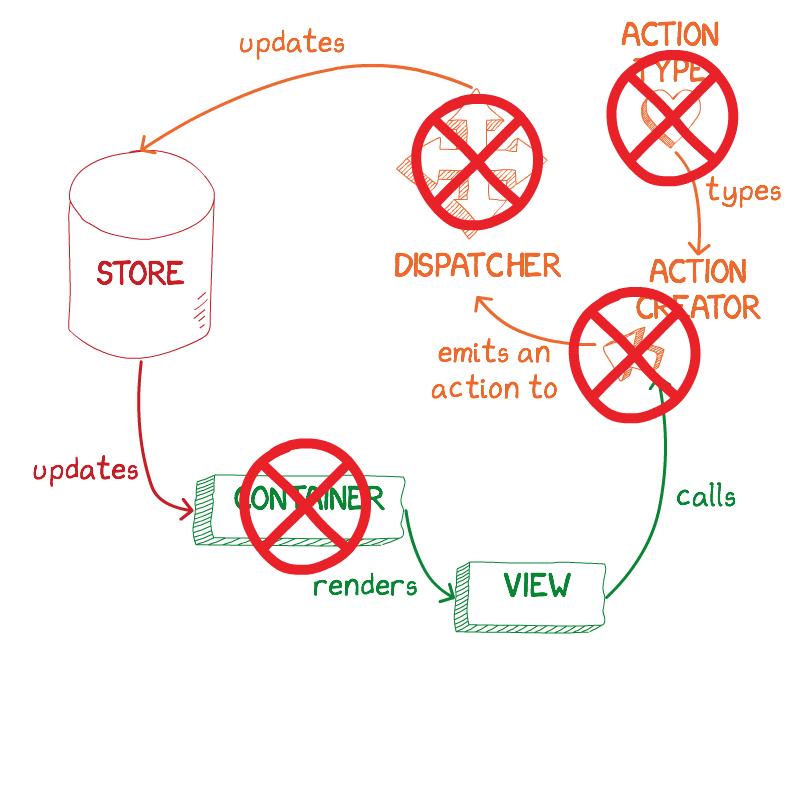
---
<legend>5. <u>Flux</u> & Redux, before & after</legend>

## Eg. `FluxReduceStore`

| Role | File | LoC |
|-------|------|-----|
| **Action creators** | CompassionResourceActions.js | 69 |
| **Action types** | CompassionMessageContextTypes.js | 25 |
| **Container** | withCompassionResourceLocation.js | 42 |
| **Dispatcher** | CompassionResourceDispatcher.js | 19 |
| **Store** | CompassionResourceStore.js | 97 |
|  | <b><right>Total</right></b> | <b>252</b> |

---
<legend>5. <u>Flux</u> & Redux, before & after</legend>

## Eg. `FluxReduceStore`

| Role | File | LoC |
|-------|------|-----|
| **Action creators** | CompassionResourceActions.js | ~~69~~ <span class="medium blue">0</span> |
| **Action types** | CompassionMessageContextTypes.js | 25 |
| **Container** | withCompassionResourceLocation.js | 42 |
| **Dispatcher** | CompassionResourceDispatcher.js | 19 |
| **Store** | CompassionResourceStore.js | 97 |
|  | <b><right>Total</right></b> | <b>252</b> |
---
<legend>5. <u>Flux</u> & Redux, before & after</legend>

## Eg. `FluxReduceStore`

| Role | File | LoC |
|-------|------|-----|
| **Action creators** | CompassionResourceActions.js | ~~69~~ <span class="medium blue">0</span> |
| **Action types** | CompassionMessageContextTypes.js | ~~25~~ <span class="medium blue">0</span> |
| **Container** | withCompassionResourceLocation.js | 42 |
| **Dispatcher** | CompassionResourceDispatcher.js | 19 |
| **Store** | CompassionResourceStore.js | 97 |
|  | <b><right>Total</right></b> | <b>252</b> |
---
<legend>5. <u>Flux</u> & Redux, before & after</legend>

## Eg. `FluxReduceStore`

| Role | File | LoC |
|-------|------|-----|
| **Action creators** | CompassionResourceActions.js | ~~69~~ <span class="medium blue">0</span> |
| **Action types** | CompassionMessageContextTypes.js | ~~25~~ <span class="medium blue">0</span> |
| **Container** | withCompassionResourceLocation.js | ~~42~~ <span class="medium blue">0</span> |
| **Dispatcher** | CompassionResourceDispatcher.js | 19 |
| **Store** | CompassionResourceStore.js | 97 |
|  | <b><right>Total</right></b> | <b>252</b> |
---
<legend>5. <u>Flux</u> & Redux, before & after</legend>

## Eg. `FluxReduceStore`

| Role | File | LoC |
|-------|------|-----|
| **Action creators** | CompassionResourceActions.js | ~~69~~ <span class="medium blue">0</span> |
| **Action types** | CompassionMessageContextTypes.js | ~~25~~ <span class="medium blue">0</span> |
| **Container** | withCompassionResourceLocation.js | ~~42~~ <span class="medium blue">0</span> |
| **Dispatcher** | CompassionResourceDispatcher.js | ~~19~~ <span class="medium blue">0</span> |
| **Store** | CompassionResourceStore.js | 97 |
|  | <b><right>Total</right></b> | <b>252</b> |
---
<legend>5. <u>Flux</u> & Redux, before & after</legend>

## Eg. `FluxReduceStore`

| Role | File | LoC |
|-------|------|-----|
| **Action creators** | CompassionResourceActions.js | ~~69~~ <span class="medium blue">0</span> |
| **Action types** | CompassionMessageContextTypes.js | ~~25~~ <span class="medium blue">0</span> |
| **Container** | withCompassionResourceLocation.js | ~~42~~ <span class="medium blue">0</span> |
| **Dispatcher** | CompassionResourceDispatcher.js | ~~19~~ <span class="medium blue">0</span> |
| **Store** | CompassionResourceStore.js | ~~97~~ <span class="medium blue">71</span> |
|  | <b><right>Total</right></b> | <b>252</b> |
---
<legend>5. <u>Flux</u> & Redux, before & after</legend>

## Eg. `FluxReduceStore`

| Role | File | LoC |
|-------|------|-----|
| **Action creators** | CompassionResourceActions.js | ~~69~~ <span class="medium blue">0</span> |
| **Action types** | CompassionMessageContextTypes.js | ~~25~~ <span class="medium blue">0</span> |
| **Container** | withCompassionResourceLocation.js | ~~42~~ <span class="medium blue">0</span> |
| **Dispatcher** | CompassionResourceDispatcher.js | ~~19~~ <span class="medium blue">0</span> |
| **Store** | CompassionResourceStore.js | ~~97~~ <span class="medium blue">71</span> |
|  | <b><right>Total</right></b> | ~~<b>252</b>~~ <span class="medium blue">71</span> |
<right><span class="heavy blue">70% LESS CODE</span></right>
---
<legend>5. <u>Flux</u> & Redux, before & after</legend>

## Eg. `FluxReduceStore` <br />+ data plugins

| Role | File | LoC |
|-------|------|-----|
| **Action creators** | AdBreakPortalActions.js | 231 |
| **Action types** | AdBreakPortalActionTypes.js | 33 |
| **Store** | AdBreakPortalInsightsStore.js | 219 |
|  | <b><right>Total</right></b> | <b>483</b> |
---
<legend>5. <u>Flux</u> & Redux, before & after</legend>

## Eg. `FluxReduceStore` <br />+ data plugins

| Role | File | LoC |
|-------|------|-----|
| **Action creators** | AdBreakPortalActions.js | ~~231~~ <span class="medium blue">103</span> |
| **Action types** | AdBreakPortalActionTypes.js | 33 |
| **Store** | AdBreakPortalInsightsStore.js | 219 |
|  | <b><right>Total</right></b> | <b>483</b> |
---
<legend>5. <u>Flux</u> & Redux, before & after</legend>

## Eg. `FluxReduceStore` <br />+ data plugins

| Role | File | LoC |
|-------|------|-----|
| **Action creators** | AdBreakPortalActions.js | ~~231~~ <span class="medium blue">103</span> |
| **Action types** | AdBreakPortalActionTypes.js | ~~33~~ <span class="medium blue">0</span> |
| **Store** | AdBreakPortalInsightsStore.js | 219 |
|  | <b><right>Total</right></b> | <b>483</b> |
---
<legend>5. <u>Flux</u> & Redux, before & after</legend>

## Eg. `FluxReduceStore` <br />+ data plugins

| Role | File | LoC |
|-------|------|-----|
| **Action creators** | AdBreakPortalActions.js | ~~231~~ <span class="medium blue">103</span> |
| **Action types** | AdBreakPortalActionTypes.js | ~~33~~ <span class="medium blue">0</span> |
| **Store** | AdBreakPortalInsightsStore.js | ~~219~~ <span class="medium blue">101</span> |
|  | <b><right>Total</right></b> | <b>483</b> |
---
<legend>5. <u>Flux</u> & Redux, before & after</legend>

## Eg. `FluxReduceStore` <br />+ data plugins

| Role | File | LoC |
|-------|------|-----|
| **Action creators** | AdBreakPortalActions.js | ~~231~~ <span class="medium blue">103</span> |
| **Action types** | AdBreakPortalActionTypes.js | ~~33~~ <span class="medium blue">0</span> |
| **Store** | AdBreakPortalInsightsStore.js | ~~219~~ <span class="medium blue">101</span> |
|  | <b><right>Total</right></b> | <b>~~483~~ <span class="medium blue">204</span></b> |
<right><span class="heavy blue">60% LESS CODE</span></right>
<right><span class="heavy blue">(also: caught a bug)</span></right>
---
class: center, middle
<legend>5. Flux & <u>Redux</u>, before & after</legend>
### Redux
---
class: center, middle
<legend>5. Flux & <u>Redux</u>, before & after</legend>
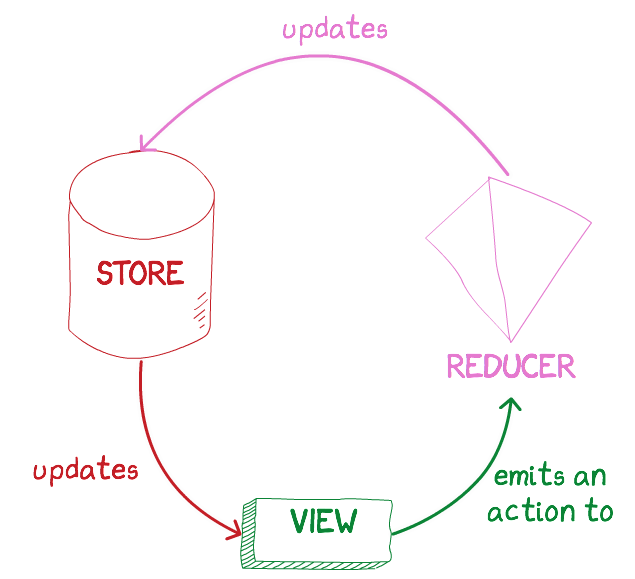
---
class: center, middle
<legend>5. Flux & <u>Redux</u>, before & after</legend>
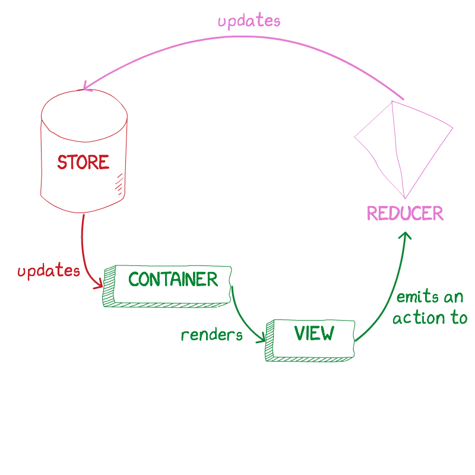
---
class: center, middle
<legend>5. Flux & <u>Redux</u>, before & after</legend>
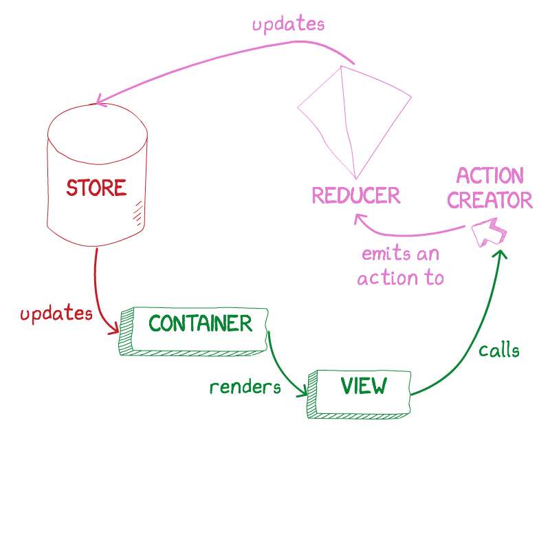
---
class: center, middle
<legend>5. Flux & <u>Redux</u>, before & after</legend>
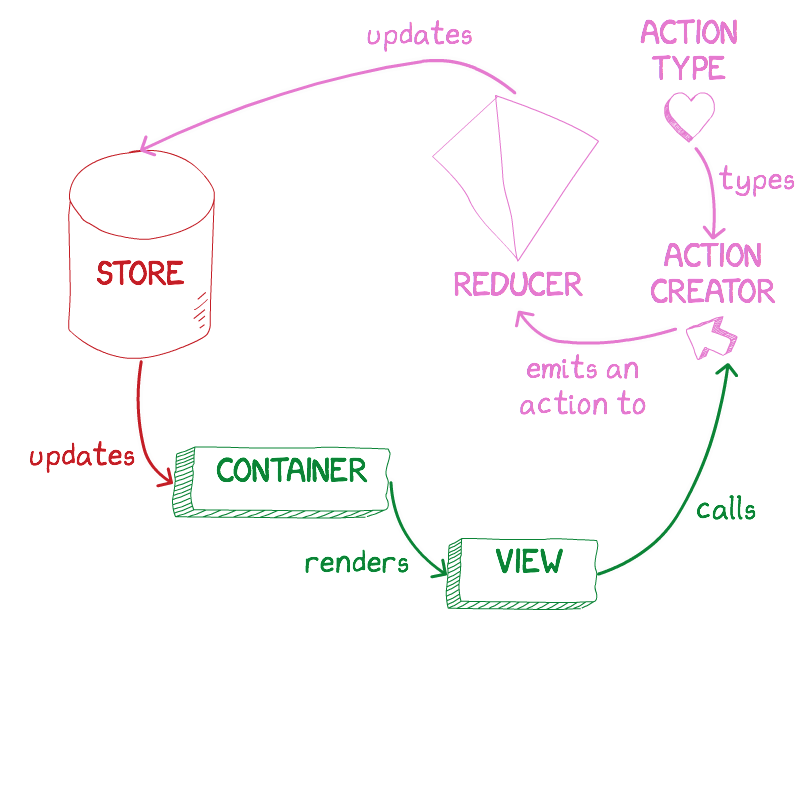
---
class: center, middle
<legend>5. Flux & <u>Redux</u>, before & after</legend>
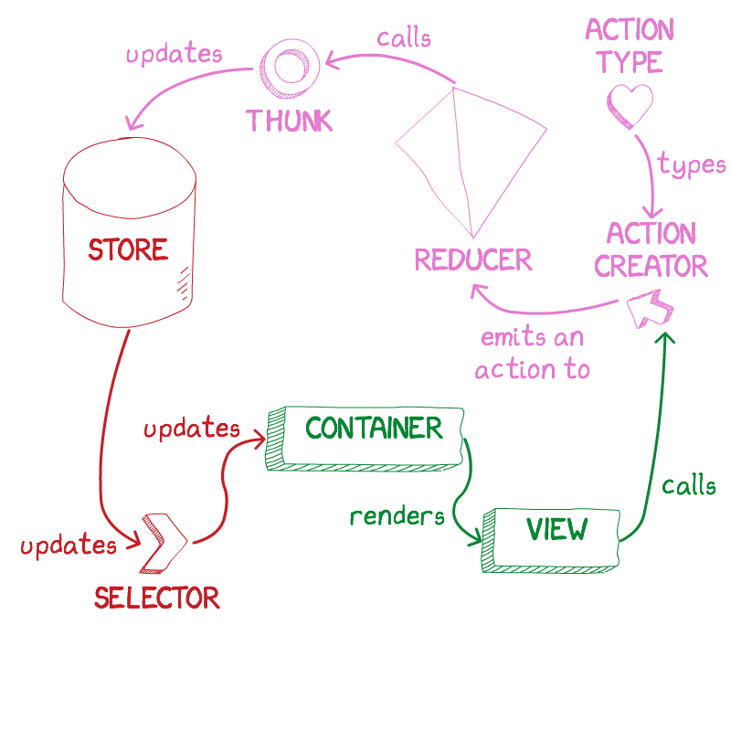
---
class: center, middle
<legend>5. Flux & <u>Redux</u>, before & after</legend>
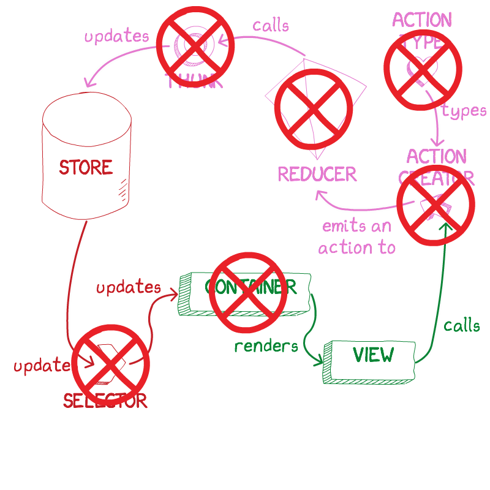
---
class: center, middle
<legend>5. Flux & <u>Redux</u>, before & after</legend>

## Eg. `SRTRouting`

| Role | File | LoC |
|-------|------|-----|
| **Action creators** | SRTRoutingActionCreators.js | 236 |
| **Action types** | SRTRoutingActionTypes.js | 38 |
| **Container** | SRTRoutingContainer.js | 88 |
| **Reducer** | SRTRoutingReducer.js | 50 |
| **Reducer** | SRTRoutingSaveRulesReducer.js | 44 |
| **Reducer** | SRTRoutingSearchReducer.js | 63 |
| **Store** | SRTRoutingStore.js | 59 |
| **Store types** | SRTRoutingSearchRecord.js | 25 |
|  | <b><right>Total</right></b> | <b>603</b> |
---
class: center, middle
<legend>5. Flux & <u>Redux</u>, before & after</legend>

## Eg. `SRTRouting`

| Role | File | LoC |
|-------|------|-----|
| **Action creators** | SRTRoutingActionCreators.js | ~~236~~ <span class="medium blue">114</span> |
| **Action types** | SRTRoutingActionTypes.js | 38 |
| **Container** | SRTRoutingContainer.js | 88 |
| **Reducer** | SRTRoutingReducer.js | 50 |
| **Reducer** | SRTRoutingSaveRulesReducer.js | 44 |
| **Reducer** | SRTRoutingSearchReducer.js | 63 |
| **Store** | SRTRoutingStore.js | 59 |
| **Store types** | SRTRoutingSearchRecord.js | 25 |
|  | <b><right>Total</right></b> | <b>603</b> |
---
class: center, middle
<legend>5. Flux & <u>Redux</u>, before & after</legend>

## Eg. `SRTRouting`

| Role | File | LoC |
|-------|------|-----|
| **Action creators** | SRTRoutingActionCreators.js | ~~236~~ <span class="medium blue">114</span> |
| **Action types** | SRTRoutingActionTypes.js | ~~38~~ <span class="medium blue">0</span> |
| **Container** | SRTRoutingContainer.js | 88 |
| **Reducer** | SRTRoutingReducer.js | 50 |
| **Reducer** | SRTRoutingSaveRulesReducer.js | 44 |
| **Reducer** | SRTRoutingSearchReducer.js | 63 |
| **Store** | SRTRoutingStore.js | 59 |
| **Store types** | SRTRoutingSearchRecord.js | 25 |
|  | <b><right>Total</right></b> | <b>603</b> |
---
class: center, middle
<legend>5. Flux & <u>Redux</u>, before & after</legend>

## Eg. `SRTRouting`

| Role | File | LoC |
|-------|------|-----|
| **Action creators** | SRTRoutingActionCreators.js | ~~236~~ <span class="medium blue">114</span> |
| **Action types** | SRTRoutingActionTypes.js | ~~38~~ <span class="medium blue">0</span> |
| **Container** | SRTRoutingContainer.js | ~~88~~ <span class="medium blue">78</span> |
| **Reducer** | SRTRoutingReducer.js | 50 |
| **Reducer** | SRTRoutingSaveRulesReducer.js | 44 |
| **Reducer** | SRTRoutingSearchReducer.js | 63 |
| **Store** | SRTRoutingStore.js | 59 |
| **Store types** | SRTRoutingSearchRecord.js | 25 |
|  | <b><right>Total</right></b> | <b>603</b> |
---
class: center, middle
<legend>5. Flux & <u>Redux</u>, before & after</legend>

## Eg. `SRTRouting`

| Role | File | LoC |
|-------|------|-----|
| **Action creators** | SRTRoutingActionCreators.js | ~~236~~ <span class="medium blue">114</span> |
| **Action types** | SRTRoutingActionTypes.js | ~~38~~ <span class="medium blue">0</span> |
| **Container** | SRTRoutingContainer.js | ~~88~~ <span class="medium blue">78</span> |
| **Reducer** | SRTRoutingReducer.js | ~~50~~ <span class="medium blue">0</span> |
| **Reducer** | SRTRoutingSaveRulesReducer.js | 44 |
| **Reducer** | SRTRoutingSearchReducer.js | 63 |
| **Store** | SRTRoutingStore.js | 59 |
| **Store types** | SRTRoutingSearchRecord.js | 25 |
|  | <b><right>Total</right></b> | <b>603</b> |
---
class: center, middle
<legend>5. Flux & <u>Redux</u>, before & after</legend>

## Eg. `SRTRouting`

| Role | File | LoC |
|-------|------|-----|
| **Action creators** | SRTRoutingActionCreators.js | ~~236~~ <span class="medium blue">114</span> |
| **Action types** | SRTRoutingActionTypes.js | ~~38~~ <span class="medium blue">0</span> |
| **Container** | SRTRoutingContainer.js | ~~88~~ <span class="medium blue">78</span> |
| **Reducer** | SRTRoutingReducer.js | ~~50~~ <span class="medium blue">0</span> |
| **Reducer** | SRTRoutingSaveRulesReducer.js | ~~44~~ <span class="medium blue">0</span> |
| **Reducer** | SRTRoutingSearchReducer.js | 63 |
| **Store** | SRTRoutingStore.js | 59 |
| **Store types** | SRTRoutingSearchRecord.js | 25 |
|  | <b><right>Total</right></b> | <b>603</b> |
---
class: center, middle
<legend>5. Flux & <u>Redux</u>, before & after</legend>

## Eg. `SRTRouting`

| Role | File | LoC |
|-------|------|-----|
| **Action creators** | SRTRoutingActionCreators.js | ~~236~~ <span class="medium blue">114</span> |
| **Action types** | SRTRoutingActionTypes.js | ~~38~~ <span class="medium blue">0</span> |
| **Container** | SRTRoutingContainer.js | ~~88~~ <span class="medium blue">78</span> |
| **Reducer** | SRTRoutingReducer.js | ~~50~~ <span class="medium blue">0</span> |
| **Reducer** | SRTRoutingSaveRulesReducer.js | ~~44~~ <span class="medium blue">0</span> |
| **Reducer** | SRTRoutingSearchReducer.js | ~~63~~ <span class="medium blue">0</span> |
| **Store** | SRTRoutingStore.js | 59 |
| **Store types** | SRTRoutingSearchRecord.js | 25 |
|  | <b><right>Total</right></b> | <b>603</b> |
---
class: center, middle
<legend>5. Flux & <u>Redux</u>, before & after</legend>

## Eg. `SRTRouting`

| Role | File | LoC |
|-------|------|-----|
| **Action creators** | SRTRoutingActionCreators.js | ~~236~~ <span class="medium blue">114</span> |
| **Action types** | SRTRoutingActionTypes.js | ~~38~~ <span class="medium blue">0</span> |
| **Container** | SRTRoutingContainer.js | ~~88~~ <span class="medium blue">78</span> |
| **Reducer** | SRTRoutingReducer.js | ~~50~~ <span class="medium blue">0</span> |
| **Reducer** | SRTRoutingSaveRulesReducer.js | ~~44~~ <span class="medium blue">0</span> |
| **Reducer** | SRTRoutingSearchReducer.js | ~~63~~ <span class="medium blue">0</span> |
| **Store** | SRTRoutingStore.js | ~~59~~ <span class="medium blue">49</span> |
| **Store types** | SRTRoutingSearchRecord.js | 25 |
|  | <b><right>Total</right></b> | <b>603</b> |
---
class: center, middle
<legend>5. Flux & <u>Redux</u>, before & after</legend>

## Eg. `SRTRouting`

| Role | File | LoC |
|-------|------|-----|
| **Action creators** | SRTRoutingActionCreators.js | ~~236~~ <span class="medium blue">114</span> |
| **Action types** | SRTRoutingActionTypes.js | ~~38~~ <span class="medium blue">0</span> |
| **Container** | SRTRoutingContainer.js | ~~88~~ <span class="medium blue">78</span> |
| **Reducer** | SRTRoutingReducer.js | ~~50~~ <span class="medium blue">0</span> |
| **Reducer** | SRTRoutingSaveRulesReducer.js | ~~44~~ <span class="medium blue">0</span> |
| **Reducer** | SRTRoutingSearchReducer.js | ~~63~~ <span class="medium blue">0</span> |
| **Store** | SRTRoutingStore.js | ~~59~~ <span class="medium blue">49</span> |
| **Store types** | SRTRoutingSearchRecord.js | ~~25~~ <span class="medium blue">0</span> |
|  | <b><right>Total</right></b> | <b>603</b> |
---
class: center, middle
<legend>5. Flux & <u>Redux</u>, before & after</legend>

## Eg. `SRTRouting`

| Role | File | LoC |
|-------|------|-----|
| **Action creators** | SRTRoutingActionCreators.js | ~~236~~ <span class="medium blue">114</span> |
| **Action types** | SRTRoutingActionTypes.js | ~~38~~ <span class="medium blue">0</span> |
| **Container** | SRTRoutingContainer.js | ~~88~~ <span class="medium blue">78</span> |
| **Reducer** | SRTRoutingReducer.js | ~~50~~ <span class="medium blue">0</span> |
| **Reducer** | SRTRoutingSaveRulesReducer.js | ~~44~~ <span class="medium blue">0</span> |
| **Reducer** | SRTRoutingSearchReducer.js | ~~63~~ <span class="medium blue">0</span> |
| **Store** | SRTRoutingStore.js | ~~59~~ <span class="medium blue">49</span> |
| **Store types** | SRTRoutingSearchRecord.js | ~~25~~ <span class="medium blue">0</span> |
| <span class="heavy blue">60% LESS CODE</span> | <b><right>Total</right></b> | <b>~~603~~ <span class="medium blue">241</span></b> |
---
class: center, middle
## 6. Reactivity
---
class: center, middle
<legend>6. Reactivity</legend>
### For example:<br />Let's add a logger to composer.
---
<legend>6. Reactivity</legend>
```js
const withEffects: Plugin<State> = store => {
  store
    .on('text')
    .subscribe(text => {
      if (text === '') {
        store.set('isNextEnabled')(false)
      } else {
        store.set('isNextEnabled')(true)
      }
    })
  return store
}
```
---
<legend>6. Reactivity</legend>
```js
const withEffects: Plugin<State> = store => {
  store
    .on('text')
    .subscribe(text => {
      if (text === '') {
        store.set('isNextEnabled')(false)
      } else {
        store.set('isNextEnabled')(true)
      }
    })
*
* store
*   .on('text')
*   .subscribe(text =>
*
*   )

  return store
}
```
---
<legend>6. Reactivity</legend>
```js
const withEffects: Plugin<State> = store => {
  // ...
*
* store
*   .on('text')
*   .subscribe(text =>
*
*   )

  return store
}
```
---
<legend>6. Reactivity</legend>
```js
const withEffects: Plugin<State> = store => {
  // ...

  store
    .on('text')
    .subscribe(text =>
*      new ComposerTypedLogger
*        .setText(text)
*        .log()
    )
  return store
}
```
---
<legend>6. Reactivity</legend>
```js
const withEffects: Plugin<State> = store => {
  // ...

  store
    .on('text')
*   .throttle(100)
    .subscribe(text =>
       new ComposerTypedLogger
         .setText(text)
         .log()
    )
  return store
}
```
---
<legend>6. Reactivity</legend>
```js
const withEffects: Plugin<State> = store => {
  // ...

  store
    .on('text')
    .throttle(100)
*   .filter(text => text !== '')
    .subscribe(text =>
       new ComposerTypedLogger
         .setText(text)
         .log()
    )
  return store
}
```
---
<legend>6. Reactivity</legend>
```js
const withEffects: Plugin<State> = store => {
  // ...

  store
    .on('text')
    .throttle(100)
    .filter(text => text !== '')
*   .map(text => text.toLowerCase())
    .subscribe(text =>
       new ComposerTypedLogger
         .setText(text)
         .log()
    )
  return store
}
```
---
<legend>6. Reactivity</legend>
```js
const withEffects: Plugin<State> = store => {
  // ...

  return store
}
```
---
<legend>6. Reactivity</legend>
```js
*const {combineLatest} = require('rxjs')

const withEffects: Plugin<State> = store => {
  // ...

* combineLatest(
*   store.on('text'),
*   store.on('video')
* )
  return store
}
```
---
<legend>6. Reactivity</legend>
```js
const {combineLatest} = require('rxjs')

const withEffects: Plugin<State> = store => {
  // ...

  combineLatest(
    store.on('text'),
    store.on('video')
  )
* .subscribe(([text, video]) =>
*   new ComposerTypedLogger
*     .setText(text)
*     .setVideo(video)
*     .log()
* )
  return store
}
```
---
class: center, middle
# Thanks!
## Learn more: <font color="#006def">fburl.com/undux</font>
# &nbsp;
### Boris Cherny
### @bcherny / github.com/bcherny
