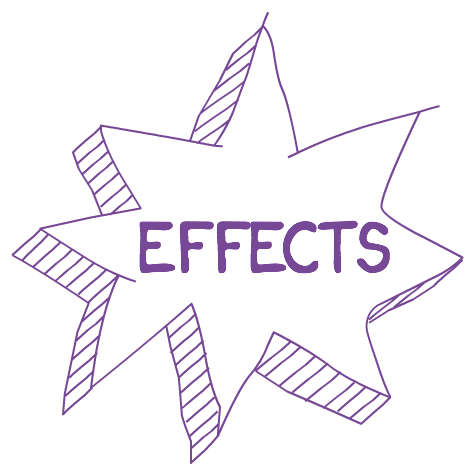

class: center, middle
# 
## By Boris Cherny
### @bcherny - github.com/bcherny
---
class: middle
# Plan
1. Problems with Flux & Redux
2. How Undux solves these problems
3. The Undux architecture
2. What can I do with it?
3. Flux, Redux, Relay: before & after
4. Scaling it
---
class: center, middle
## 1. Problems with Flux & Redux
---
<legend>1. Problems with Flux & Redux</legend>
- Globs of boilerplate
---
<legend>1. Problems with Flux & Redux</legend>
- Globs of boilerplate
- Really hard to type safely
---
<legend>1. Problems with Flux & Redux</legend>
- Globs of boilerplate
- Really hard to type safely
- Actions, creators, types, reducers, callers spread across lots of files
---
<legend>1. Problems with Flux & Redux</legend>
- Globs of boilerplate
- Really hard to type safely
- Actions, creators, types, reducers, callers spread across lots of files
- Makes easy things hard!
---
class: center, middle
## 2. How Undux solves these problems
---
<legend>2. How Undux solves these problems</legend>
- ~~Globs of boilerplate~~ Near-zero boilerplate
- Really hard to type safely
- Actions, creators, types, reducers, callers spread across lots of files
- Makes easy things hard!
---
<legend>2. How Undux solves these problems</legend>
- ~~Globs of boilerplate~~ Near-zero boilerplate
- ~~Really hard to type safely~~ 100% typesafe
- Actions, creators, types, reducers, callers spread across lots of files
- Makes easy things hard!
---
<legend>2. How Undux solves these problems</legend>
- ~~Globs of boilerplate~~ Near-zero boilerplate
- ~~Really hard to type safely~~ 100% typesafe
- ~~Actions, creators, types, reducers, callers spread across lots of files~~  Do everything right in your view
- Makes easy things hard!
---
<legend>2. How Undux solves these problems</legend>
- ~~Globs of boilerplate~~ Near-zero boilerplate
- ~~Really hard to type safely~~ 100% typesafe
- ~~Actions, creators, types, reducers, callers spread across lots of files~~  Do everything right in your view
- ~~Makes easy things hard!~~  Makes hard things easy.
---
class: center, middle
## 3. The Undux architecture
---
class: center, middle
<legend>3. The Undux architecture</legend>

---
class: middle
<legend>3. The Undux architecture</legend>

- `React.Component`
- Reads from the store
- Writes to the store
---
class: middle
<legend>3. The Undux architecture</legend>

- `createStore()`
- Updated by the view
- Re-renders the view
---
class: middle
<legend>3. The Undux architecture</legend>

- Subscribe to changes to specific fields
- Or, subscribe to a set of fields
- A reactive way to listen to changes

