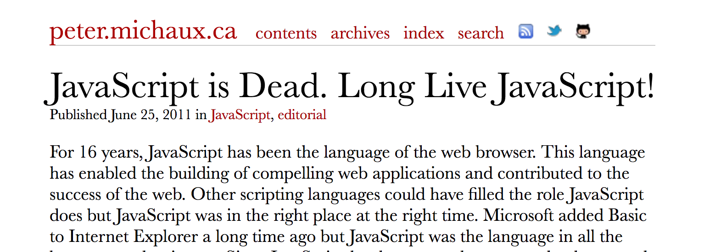
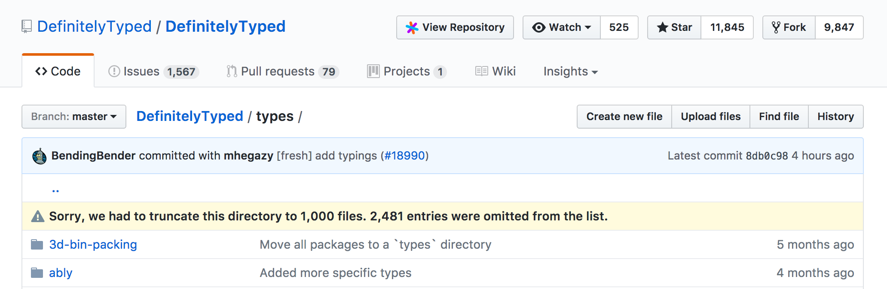

class: center, middle

# ☙ Why  ☙
## (and not JavaScript)

### by Boris
### [boris@lease.ly](mailto:boris@lease.ly)
### [github.com/bcherny](https://github.com/bcherny)

---
class: center, middle
# 1

---
class: center, middle
# 2
## Atwood's Law

> "Any application that can be written in JavaScript, will eventually be written in JavaScript."

<small class='right'>https://blog.codinghorror.com/the-principle-of-least-power/</small>
---
class: center, middle
# 3

---
#### 1 js is dead

### Because of: TypeScript, Flow, Dart, Kotlin, GopherJS, ScalaJS, Elm, PureScript, GHCJS, Fable, Reason, ClojureScript, CoffeeScript, Emscripten, LiveScript, Kaffeine, MoeScript, Ki, Jisp, Ham, GorillaScript, RedScript, LiteScript, TaJaS, JavaScript++, Mascara, Roy, Swym, ActionScript, BuckleScript, Opal, RubyJS, Pyjamas, Shen, LuvvieScript, ElixirScript, Perlito, P2JS, GWT, STJS, Ceylon, JSC, Script#, Wisp, Fargo, Whalesong, ESLisp, Ralph, Amber, Clamato, Haxe, Nim