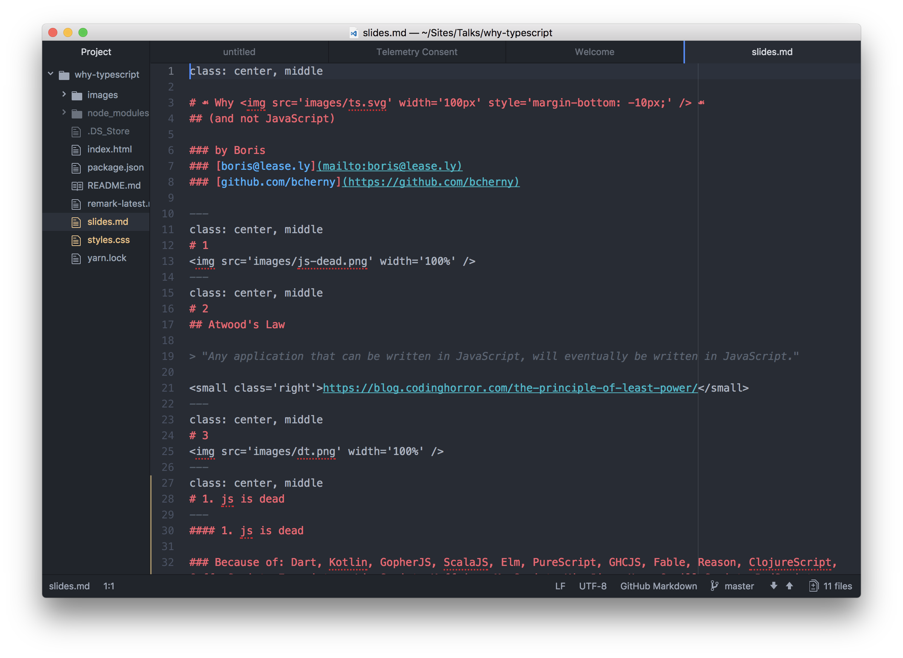
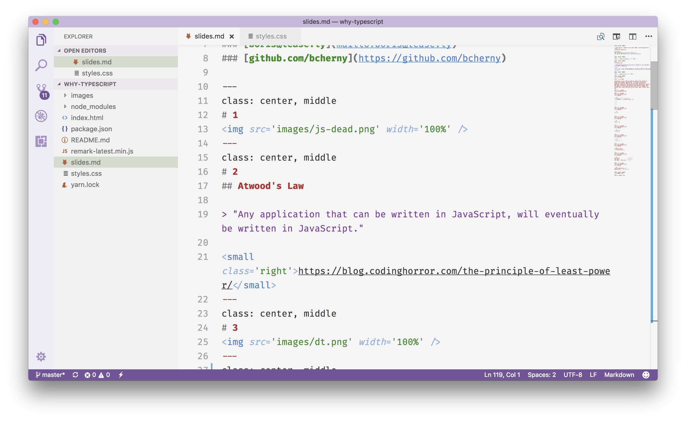
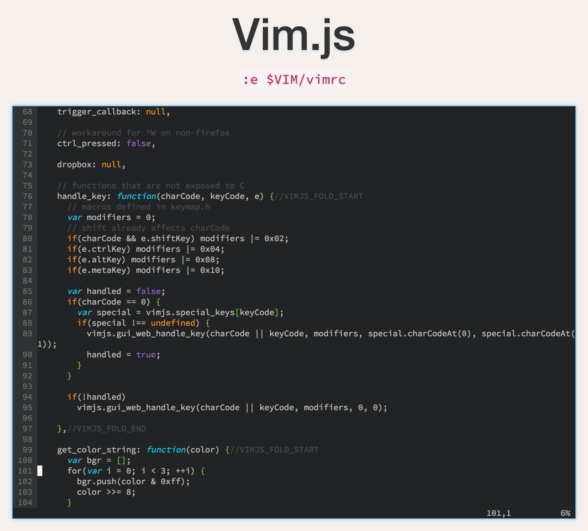
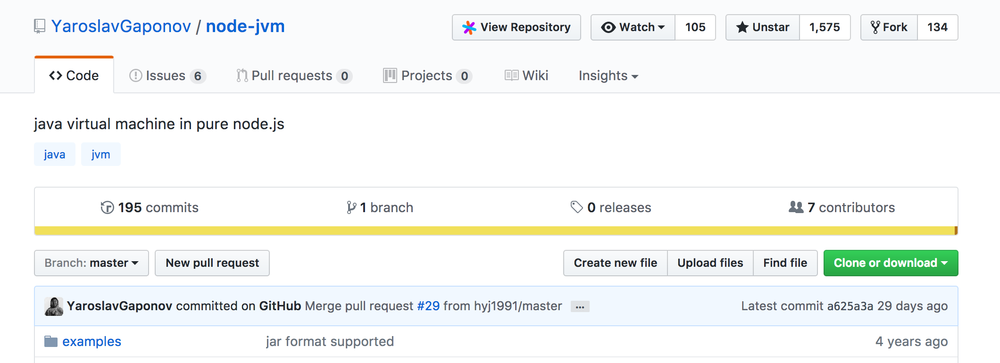
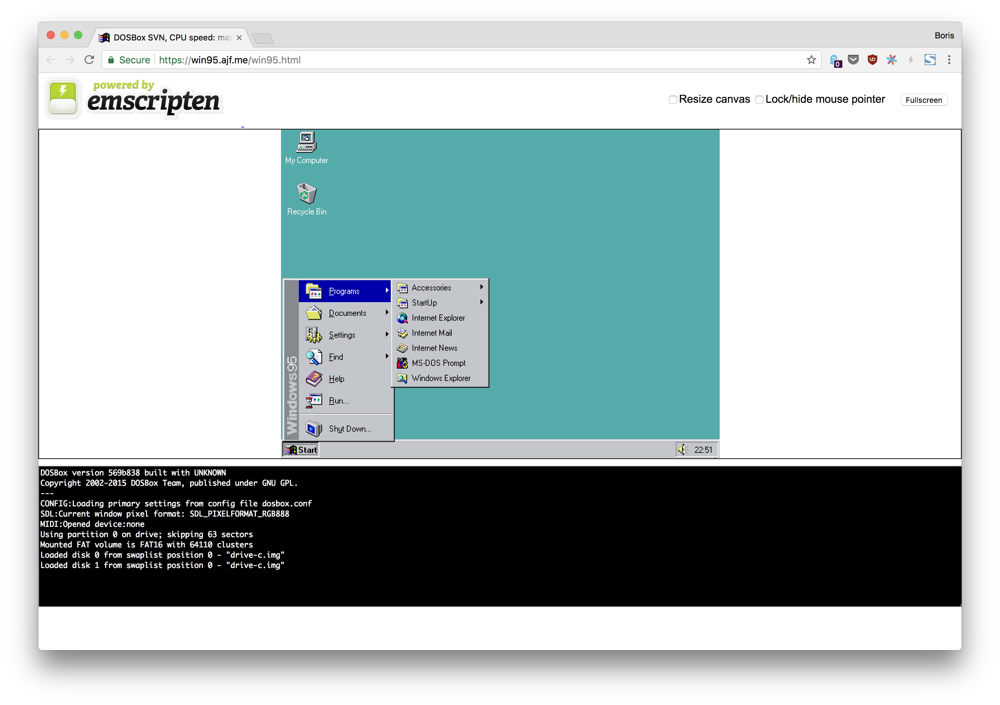
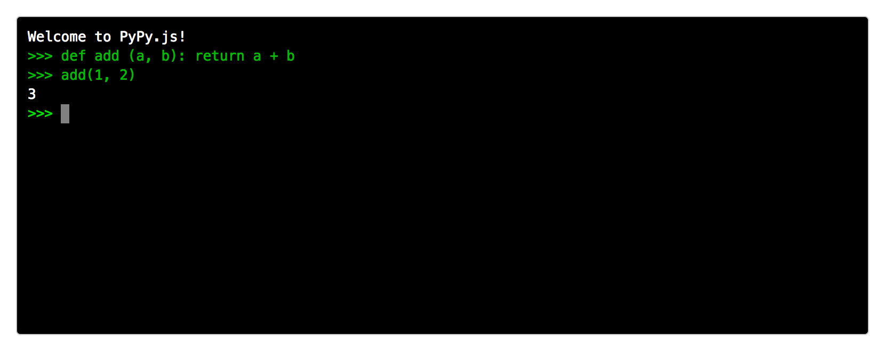

class: center, middle

# ☙ Why  ☙
## (and not JavaScript)

### by Boris
### [boris@lease.ly](mailto:boris@lease.ly)
### [github.com/bcherny](https://github.com/bcherny)

---
class: center, middle
# 1
## Atwood's Law

> "Any application that can be written in JavaScript, will eventually be written in JavaScript."

<small class='right'>https://blog.codinghorror.com/the-principle-of-least-power/</small>
---
class: center, middle
# 2

---
class: center, middle
# 3

---
class: center, middle
# 1. atwood's law
---
#### 1. atwood's law



---
#### 1. atwood's law


---
#### 1. atwood's law


---
#### 1. atwood's law



---
#### 1. atwood's law


---
class: center, middle
# 2. js is dead
---
#### 2. js is dead

### Because of: Dart, Kotlin, GopherJS, ScalaJS, Elm, PureScript, GHCJS, Fable, Reason, ClojureScript, CoffeeScript, Emscripten, LiveScript, Kaffeine, MoeScript, Ki, Jisp, Ham, GorillaScript, RedScript, TypeScript, Flow, LiteScript, TaJaS, JavaScript++, Mascara, Roy, Swym, ActionScript, BuckleScript, Opal, RubyJS, Pyjamas, Shen, LuvvieScript, ElixirScript, Perlito, P2JS, GWT, STJS, Ceylon, JSC, Script#, Wisp, Fargo, Whalesong, ESLisp, Ralph, Amber, Clamato, Haxe, Nim
---
#### 2. js is dead
## Q: Why compile-to-JS?
---
#### 2. js is dead
## Q: Why compile-to-JS?
## A: Because:

```js
for (var i = 0; i < 4; i++) {
  setTimeout(() => console.log(i), 0)
}
// 4
// 4
// 4
// 4
```
---
#### 2. js is dead
## Q: Why compile-to-JS?
## A: Because:

```js
[] + []
// ""
```
---
#### 2. js is dead
## Q: Why compile-to-JS?
## A: Because:

```js
[42] == 42
// true
```
---
#### 2. js is dead
## Q: Why compile-to-JS?
## A: Because:

```js
typeof null
// "object"
```
---
#### 2. js is dead
## Q: Why compile-to-JS?
## A: Because:

```js
.1 + .2 === .3
// false
```
---
#### 2. js is dead
## Q: Why compile-to-JS?
## A: Because:

```js
9999999999999999
// 10000000000000000
```
---
#### 2. js is dead
## Q: Why compile-to-JS?
## A: Because:

```js
Math.max()              // -Infinity
Math.min()              // Infinity
Math.max() > Math.min() // false
```
---
#### 2. js is dead
## Q: Why compile-to-JS?
## A: Because:

```js
function myFunction() {}
myFonction() // runtime error
```
---
class: center, middle
# 3. Typings
---
#### 3. typings
BuckleScript: 29
---
#### 3. typings
BuckleScript: 29

Flow: 304
---
#### 3. typings
BuckleScript: 29

Flow: 304

Elm: 558 ish
---
#### 3. typings
BuckleScript: 29

Flow: 304

Elm: 558 ish

ScalaJS: 662
---
#### 3. typings
BuckleScript: 29

Flow: 304

Elm: 558 ish

ScalaJS: 662

**TypeScript: 3,481**
---
#### 3. typings
BuckleScript: 29

Flow: 304

Elm: 558 ish

ScalaJS: 662

**TypeScript: 3,481**

Dart: Use DefinitelyTyped
---
#### 3. typings
BuckleScript: 29

Flow: 304

Elm: 558 ish

ScalaJS: 662

**TypeScript: 3,481**

Dart: Use DefinitelyTyped

Kotlin: Use DefinitelyTyped
---
#### 3. typings
BuckleScript: 29

Flow: 304

Elm: 558 ish

ScalaJS: 662

**TypeScript: 3,481**

Dart: Use DefinitelyTyped

Kotlin: Use DefinitelyTyped

Reason: Use DefinitelyTyped or FlowTyped
---
#### 3. typings
BuckleScript: 29

Flow: 304

Elm: 558 ish

ScalaJS: 662

**TypeScript: 3,481**

Dart: Use DefinitelyTyped

Kotlin: Use DefinitelyTyped

Reason: Use DefinitelyTyped or FlowTyped

(NPM: 537,436)
#😵😵😵
---
